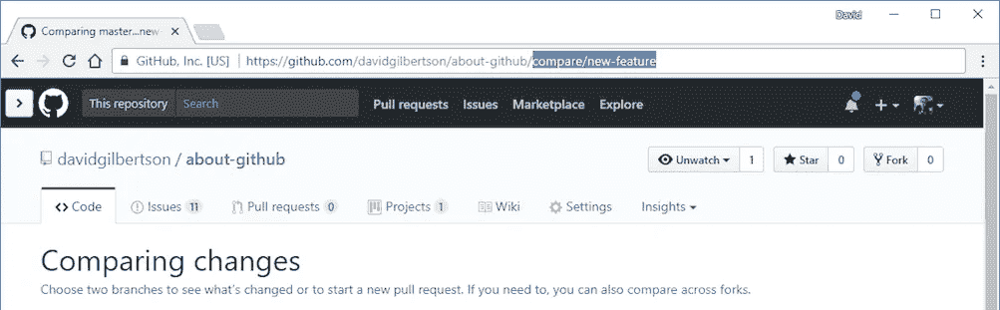

# 14 必须阅读的科技故事

> 原文：<https://medium.com/hackernoon/14-must-read-tech-stories-c58bc66b561>

Heyo [黑客正午](http://hackernoon.com)读者们！到目前为止，我们已经在[9 月](https://hackernoon.com/archive/2017/09)发表了 216 篇报道，我整理了这份 14 篇不被看好的报道。它们涵盖了整个科技行业，如何打造优秀产品的趋势，一篇关于技术的指数增长如何影响我们未来的文章，风险投资的状况，一个通过雇佣“商务人士”扩大规模的案例，以及几个人担保他们的城市是亚马逊新总部的所在地。

## 关于技术的前景👨‍💻 👩‍💻

[**听不见的语音命令可以黑掉 Siri，Google Now & Alexa**](https://hackernoon.com/inaudible-voice-commands-can-hack-siri-google-now-alexa-3ebc654e0ad6) 作者[费宾约翰詹姆斯](https://medium.com/u/75a616711f4e?source=post_page-----c58bc66b561--------------------------------)

[**物联网:万物互联？**](https://hackernoon.com/iot-the-internet-of-every-thing-c87be8dc0e47) 由 DVT 公司工程主管[丽贝卡·弗兰克斯](https://medium.com/u/3f9b9c30bec7?source=post_page-----c58bc66b561--------------------------------)

[**乳齿象和 W3C**](https://hackernoon.com/mastodon-and-the-w3c-f75f376f422) 乳齿象开发者[欧根·罗奇科](https://medium.com/u/afd8065f3f77?source=post_page-----c58bc66b561--------------------------------)

[**混合现实的黎明(holo lens Apps)**](https://hackernoon.com/the-dawn-of-mixed-reality-hololens-apps-9070a9800c26)**软件工程师 [Francesco Pallotta](https://medium.com/u/2ad524c3dcd2?source=post_page-----c58bc66b561--------------------------------)**

## **为您的业务编码**

****

**[**拉请求的艺术**](https://hackernoon.com/the-art-of-pull-requests-6f0f099850f9)Viacom Android Crafter[Danny Preussler](https://medium.com/u/1331e67af4e1?source=post_page-----c58bc66b561--------------------------------)**

**[**超越项目的思考**](https://hackernoon.com/thinking-beyond-projects-71998e2524e7) 由 Zendesk 高级产品经理 [John Cutler](https://medium.com/u/4c3f4fe11e6b?source=post_page-----c58bc66b561--------------------------------)**

**[**你可以用 GitHub 做的 12 件很酷的事情**](https://hackernoon.com/12-cool-things-you-can-do-with-github-f3e0424cf2f0) 作者:Web 开发人员 [David Gilbertson](https://medium.com/u/f735d3b0f2f3?source=post_page-----c58bc66b561--------------------------------)**

## **从教授的桌子上🎓**

****

**[**我们已经生活在未来**](https://hackernoon.com/we-are-already-living-in-the-future-c69443606805) 由蒂尔堡大学商学教授&金融法[埃里克 P.M 维穆伦](https://medium.com/u/9eaa7a0096d3?source=post_page-----c58bc66b561--------------------------------)**

## **投资其他业务📈 📈 📈**

****

**[**恐惧与风险资本家**](https://hackernoon.com/fear-and-the-venture-capitalist-7c7a1f3fbc04) 由开源风险资本家[弗雷德·德斯坦](https://medium.com/u/9f7fd5254814?source=post_page-----c58bc66b561--------------------------------)**

**[**我从投资大师那里学到的五件事**](https://hackernoon.com/five-things-i-learned-from-master-investor-chris-dixon-8b7be39f30fc) [**克里斯·迪克森**](https://medium.com/u/a8e3741de9e2?source=post_page-----c58bc66b561--------------------------------) 作者、工程师和连续创业者[丹尼尔·杰弗里斯](https://medium.com/u/618a7c78c957?source=post_page-----c58bc66b561--------------------------------)**

**[**为 Juicero 和其他真正愚蠢的食品初创公司**](https://hackernoon.com/in-defense-of-juicero-and-other-really-dumb-food-startups-29a5a754eb1a) 辩护作者[尼克·帕克](https://medium.com/u/60d19fe1de7b?source=post_page-----c58bc66b561--------------------------------)，他正忙着让 3d 打印机不要吸。**

## **扩展您的业务⚖️**

****

**你的“前沿科技”创业公司应该雇佣商务人士。统计。 由[创始人集体](https://medium.com/u/f49435c6fa9?source=post_page-----c58bc66b561--------------------------------)旗下[帕鲁尔辛格](https://medium.com/u/d40238e5eaf8?source=post_page-----c58bc66b561--------------------------------)。**

## **亚马逊将在哪里建立他们的新总部？？🌴 🌴**

****

**[**由骄傲的布里奇波特&纳特梅格**](https://hackernoon.com/an-open-letter-to-jeff-bezos-34d396f18072)**[罗文凯恩](https://medium.com/u/d9959f617da1?source=post_page-----c58bc66b561--------------------------------)写给杰夫·贝索斯**T21 的公开信**

**[**致贝索斯:请考虑一下塔努加**](https://hackernoon.com/to-mr-bezos-please-consider-chattanooga-for-hq2-f66fd509ab9c) 由挂架的[迈克·塔图姆](https://medium.com/u/aa934b54743e?source=post_page-----c58bc66b561--------------------------------)**

**直到下一次，不要把世界的现实想当然。**

**亲切的问候，**

**[大卫·斯穆克](http://www.davidsmooke.net/)，[阿米](http://twitter.com/ami)**

****P.S.** *通过浏览* [*最新*](http://hackernoon.com/latest) *、* [*趋势*](http://hackernoon.com/trending) *，以及* [*存档*](https://hackernoon.com/archive/2017) *，为自己发现更多伟大的科技故事。***