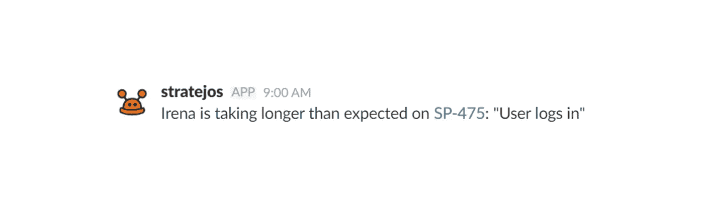
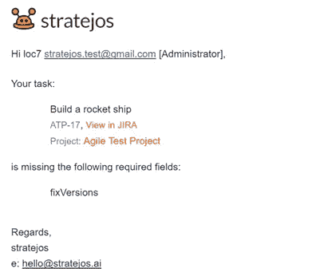
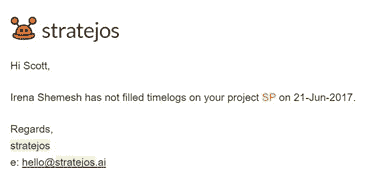
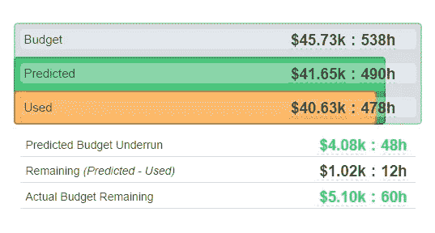
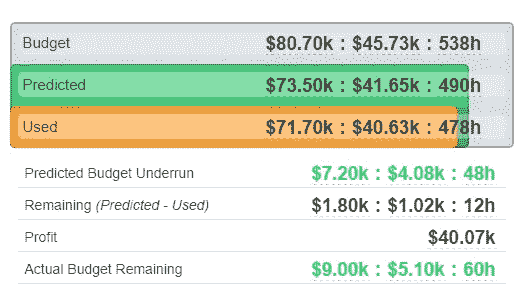
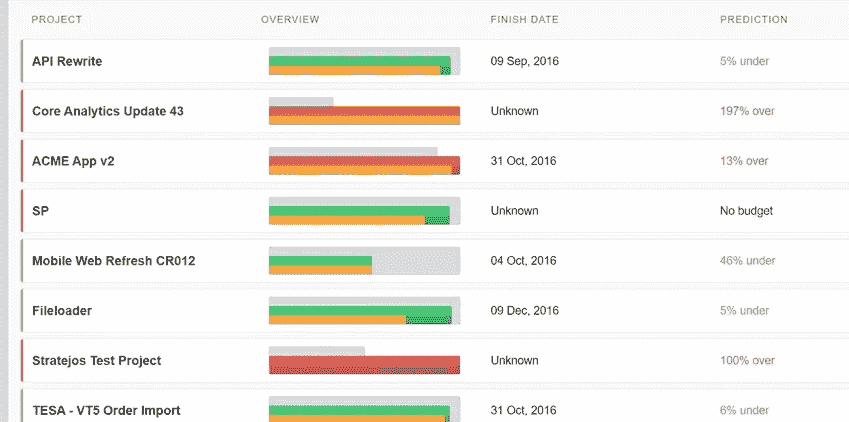

# 项目管理人工智能能为你做的 16 项具体任务

> 原文：<https://medium.com/hackernoon/16-specific-tasks-a-project-management-ai-can-do-for-you-4606eea7059c>

人们经常说“stratejos，什么是项目管理 AI？”然后我会回复类似这样的话:“这就像有一个项目管理助理坐在你旁边，一直检查你所有的任务数据，注意丢失或不正确的信息，然后给你漂亮的报告，给你的团队友好的提醒。”

然后他们说“太好了！但是……你能不能更具体地说一下项目管理人工智能实际上是做什么的？”

这是这个问题的答案。一个项目管理人工智能今天可以完成的 16 项任务的非常具体的列表(基于我 stratejos 可以做的一些事情)。

* *实际上，我并没有为此进行对话或写这些帖子。我(还)没有达到奇点。*

## 给团队成员和项目经理的警报列表

## #01:任务中缺少字段时发出警报

## #02:缺少评估时发出警报

## #03:当缺少评估但工作已经开始时发出警报

## #04:当预期的时间表缺失时发出警报

如果你使用时间表，那么 stratejos 将检测到这一点，或者你可以告诉 stratejos 寻找时间表。然后你设置你期望人们工作的时间，如果人们没有输入你期望的时间，stratejos 就会发出警报。

## #05:任务“进行中”时间过长时发出警报

## #06 当任务比预期时间长时发出警报

## 敏捷项目管理警报

## #07:当 sprint 有太多任务时发出警报

## #08:当 sprint 没有足够的任务时发出警报

## #09:当单个团队成员在本次冲刺中超负荷时发出警报

## #10:当单个团队成员在本次冲刺中没有足够的工作时发出警报

## 项目预算预警

## #11:当项目预算预计会超出时发出警报

## #12:超出项目预算时发出警报

## 报告项目预算

## #13:实时报告项目预算和成本

## #14:(对于服务公司)实时报告项目收入和利润

## #15:提供项目组合的概述

## #16:在项目报告中报告风险、辅导机会和不确定领域

这有助于突出团队的风险、缺失数据或改进领域。

## 这还不是全部

还有更多[项目管理 AI](https://stratejos.ai) 能做的，这只是冰山一角。在接下来的几周和几个月里，我会分享更多这样的列表。很快我将与大家分享我们在后台运行的算法所带来的特性。

希望这个列表能让你对项目管理助理的能力有所了解。

> [黑客中午](http://bit.ly/Hackernoon)是黑客如何开始他们的下午。我们是 [@AMI](http://bit.ly/atAMIatAMI) 家庭的一员。我们现在[接受投稿](http://bit.ly/hackernoonsubmission)，并乐意[讨论广告&赞助](mailto:partners@amipublications.com)机会。
> 
> 如果你喜欢这个故事，我们推荐你阅读我们的[最新科技故事](http://bit.ly/hackernoonlatestt)和[趋势科技故事](https://hackernoon.com/trending)。直到下一次，不要把世界的现实想当然！

