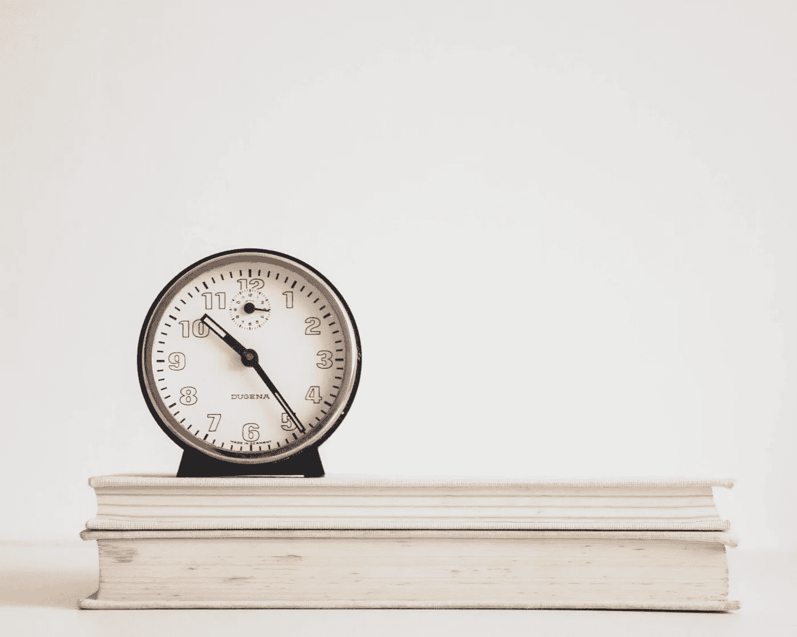

# 每周整整 168 小时

> 原文：<https://medium.com/hackernoon/168-whole-hours-in-every-week-motivational-speaker-6177c482b3bd>

我刚才说的是显而易见的吗？

我可以想象你们中的一些人会计算出一天 24 小时乘以一周 7 天是多少。是的，你一周有 168 个小时。我已经检查了三遍了。

时间对我们所有人来说都是一个巨大的均衡器，然而胜利者似乎能够用他们的时间取得更多的成就。

正如我的朋友曾经说过的，减去 56 个小时的睡眠时间和几个小时的浴室时间，一个人有 110 个小时可以控制如何最好地利用它。

我讲述这个真相的目的只是让你意识到你的 110 个小时。

你不去健身房的理由是什么？创业？扩大你的知识基础？培养你的人际关系？为了成功与人交往？

没有。

胜利者知道没有借口。为什么？

因为他们知道什么对他们来说是重要的，并首先为之付出所有他们需要的时间。他们不会用无聊的事情填满他们的时间，然后说他们没时间了。他们把自己的时间安排在对他们来说最重要的事情上，然后，做一些无关紧要的事情(我说的无关紧要是指没有任何结果的耗时活动)。

算出你在哪里度过了 110 个小时。

你有整整 110 个小时。

然后问自己以下问题:

我能最好地利用我的时间来实现我的目标吗？

我需要在哪些方面花更多的时间？我需要削减什么？

我承诺什么？如果我花时间去做的事情不能让我得到我想要的，我还要疯狂多久？

答案很简单，充分利用 110 个小时的决定也很简单。

你现在知道了。没有借口。

凯文·阿卜杜拉赫曼是激励数百万人的人。他是一系列书籍的国际作者，多哈 公共演讲培训 [**的抢手专家和全球思维营养专家。**](http://www.kevinspire.com/public-speaking-training-doha-qatar/)

> [黑客中午](http://bit.ly/Hackernoon)是黑客如何开始他们的下午。我们是 [@AMI](http://bit.ly/atAMIatAMI) 家庭的一员。我们现在[接受投稿](http://bit.ly/hackernoonsubmission)并乐意[讨论广告&赞助](mailto:partners@amipublications.com)机会。
> 
> 如果你喜欢这个故事，我们推荐你阅读我们的[最新科技故事](http://bit.ly/hackernoonlatestt)和[趋势科技故事](https://hackernoon.com/trending)。直到下一次，不要把世界的现实想当然！

