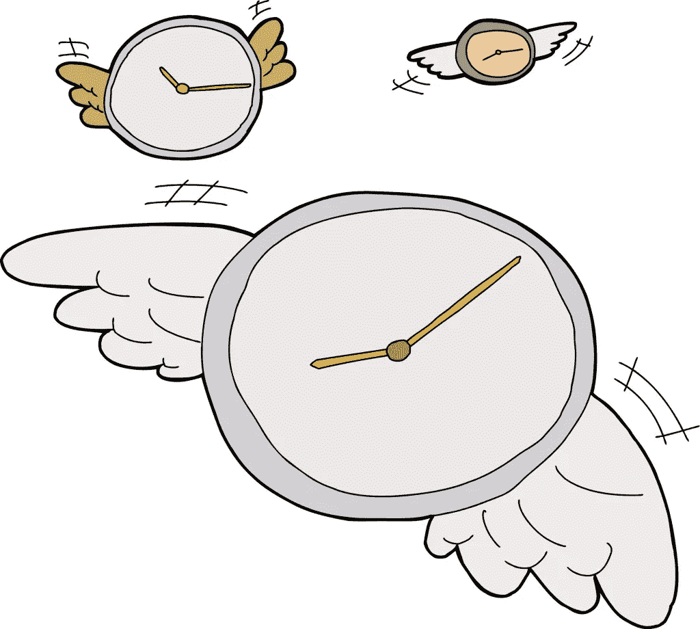

# 詹姆斯·阿尔图彻关于企业家精神的 18 句励志名言

> 原文：<https://medium.com/hackernoon/18-inspirational-quotes-from-james-altucher-about-entrepreneurship-296c8200aed8>

詹姆斯·阿尔图切在他的一生和职业生涯中身兼数职。他目睹了自己创业过程中的成功和失败，并从每一次经历中吸取教训。他现在已经参与创建了 20 家公司，作为对冲基金经理和企业家，他的工作得到了广泛认可。作为多本畅销书[和一个广受欢迎的](http://www.jamesaltucher.com/books/)[博客](http://www.jamesaltucher.com/)的作者，Altucher 的建议和专业知识对全球其他生活黑客产生了影响。甚至[马克·库班](http://sumohacks.com/inspirational-quotes-from-mark-cuban)也声称从阅读阿尔图切的博客文章中“总能学到一些东西”。在这里，我收集了这位终极生活黑客关于创业的 18 句最励志的名言。

> “每个人都是企业家。作为一名企业家，你需要的唯一技能是失败的能力，拥有想法，出售这些想法，执行这些想法，并坚持不懈，这样即使你失败了，你也能学习并继续下一次冒险。”

他让这听起来很容易。但他说的是真的；如果我们能正确地定位和利用这些技能，每个人都有一个企业家。

> “要过上好日子，绝对最好、最可靠的方法是帮助别人过上好日子。”

创业者应该时刻牢记这一点。找到一种方法来帮助其他人和其他企业成功，这将使你成功。想想看，如果不考虑客户的最佳利益，你将如何销售你的产品？

> 企业家不能用“我没时间，我在做生意”这样的借口。“这是你的事。”

说得好，阿尔图切。别再找借口了。

> “社团主义(与资本主义相对)的兴起迫使人们走进小隔间，而不是外面的世界，去探索、发明和展现。”

我认为他在这里暗示的是“探索、发明和展现”会比我们在盒子里埋头苦干走得更远。所以让我们作为企业家来做这件事。让我们走出去发现。

> “机器人是新的中产阶级。其他人要么成为企业家，要么成为临时工。”

这里的另一个提示是出去*做*一些事情。否则你的选择看起来很残酷。

> "如果你不允许自己去创造一个新世界，很可能别人也不会。"

做企业家就是要冒险，但是没有风险=没有回报，对吧？给自己一个机会，相信自己能承担最终会带来最终回报的风险。只有你自己才能让自己成为企业家。

> "当正规教育结束时，精通就开始了."

我不认为阿尔图切是在抨击教育。我认为他的意思是，我们必须停止把我们的学习视为一种正式的、强迫的教育。相反，我们可以学习那些让我们在我们选择的学科中成为大师的东西。你看待学习机会的方式能让你在工作中变得熟练。

> “当你受别人的摆布时，任何事情都不会成功。不管你是企业家还是员工。一旦有人贿赂你做某事(如果你只是为了钱而不是为了工作的意义而工作，那么薪水就是一种贿赂)，那么你就成了一名囚犯。”

这很重要。没有一个企业家成功地为钱而工作。你必须热爱你所做的事情，并为你影响的意义而努力。

> 一栏是想法列表。另一栏是“第一步”列表——只是第一步，因为你不知道第一步会把你带到哪里

如果这还不能激励你，我不知道还有什么能。想到一个企业家已经迈出了惊人发现的第一步，这是多么令人兴奋。你必须坚持迈出第一步，直到有所收获。

> “成功来自于不断向各个方向拓展你的疆域——创造力、财力、精神和体力。总是问自己，我能改进什么？我还能和谁谈？我还能去哪里找？”

基于不断发现的想法:这里有一些让你继续前进的方法。生活黑客每天都要问这些问题才能有所作为。

> “你能做的唯一真正安全的事情就是一遍又一遍地尝试。去争取，去拒绝，去重复，去奋斗，去希望。没有拒绝就没有前沿，没有激情，也没有魔力。”

成为一名成功的企业家没有秘诀。那些成功的人是在一次又一次的尝试之后才获得成功的。

> 对我来说，“成功”的定义是:“今天成功了吗？"

你所能指望的就是现在，就是今天。如果你尽你所能让今天成功，你正朝着正确的方向前进。

> 我称之为“许可网络”。我的关系网不是我认识多少人的名单。我的关系网的优势在于我认识的人名单上的每一个人互相了解的程度。大多数人不知道这个重要的原则。”

我总是试图在我自己的网络中记住这一点，因为强大的网络是强大企业家不可或缺的一部分。如果你鼓励你网络中的人互相了解，他们都会从这些联系中受益，因此你网络中的人无论是个人还是集体都会变得更强大。

> "在你职业生涯的任何时候，你要么是恒温器，要么是温度计."

作为企业家，我们努力成为恒温器。

> “我有很多想法。我如何选择正确的？尽可能多地执行。正确的想法会选择你。”

如果你不尝试，你永远不会知道。这与他的另一个建议相一致，即列出第一步的清单——你必须让每个想法都有机会成为正确的想法。

> “做一个工作中的企业家。一个“企业家”。“控制你向谁汇报，你做什么，你创造什么。或者副业创业。向某人、任何人传递某种价值——任何价值，然后看着这种价值融入职业生涯。”

成为一名企业家的一个方法是停止如此刻板地思考这个头衔。你可以在你工作的任何公司成为企业家。这是关于在你的工作中承担责任和激情，并每天寻找方法来改善你自己和你的企业。

> “思想是生活的货币。不是钱。钱会耗尽，直到你破产。但是好的想法会给你带来好的体验，给你带来更好的想法，给你带来更好的体验，给你带来更多的时间，挽救你的生命。”

你不能否认这种说法的真实性。调整你的思维以符合这个想法，而不是为你的钱工作，你将为你的想法工作-这将感觉更满足。

> "在这一秒钟里，我现在能做什么来继续前进？"

我把这个留给你，作为詹姆斯·阿尔图切的一个提示。当你点击离开阅读这篇博文时，你现在能做些什么来继续前进呢？去做吧！

以下是该网站上的相关文章:

[来自马克·库班的 8 句励志名言](http://sumohacks.com/inspirational-quotes-from-mark-cuban) [蒂姆·费里斯可以教你的 9 种生活黑客心态](http://sumohacks.com/tim-ferriss-quotes)