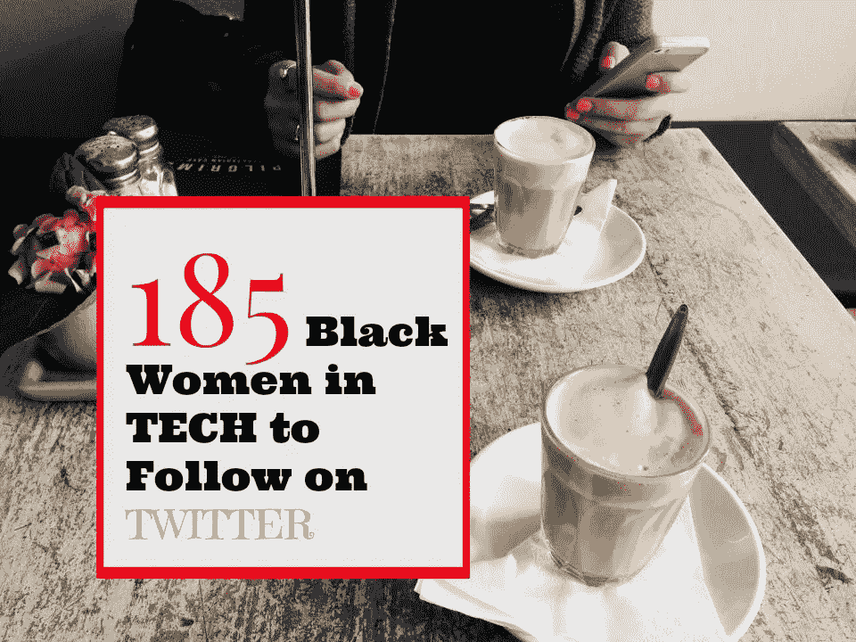
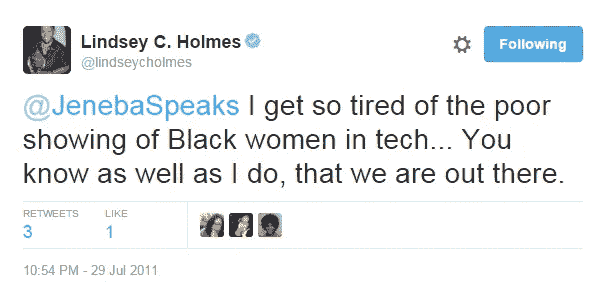
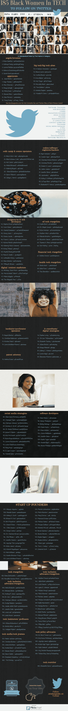

# 185 名科技领域的黑人女性在推特上关注

> 原文：<https://medium.com/hackernoon/185-black-women-in-tech-to-follow-on-twitter-4d98397775a0>

2011 年，某科技杂志贴出了一份长长的科技女性名单，其中明显没有黑人女性。我注意到了这一点，并在推特上发了这条微博。

作为回应，林赛·霍尔姆斯，一位技术领域的资深人士，现在是一位生产力战略家，他这样说道:

但这是真的。这些名单上没有黑人女性。我们每次看到他们都摇头。

除非是由一个像 NACCP 这样的有意识的组织制作，否则科技行业的多样性通常缺乏有色人种，并且很少包括黑人女性。正如前谷歌员工**艾丽卡·贝克**所说，种族多元化很难，所以你更容易在舞台上看到“[无色多元化](/this-is-hard/ffffff-diversity-1bd2b3421e8a#.u6t7yfyjq)”。

在招聘中，对口头招聘的过度依赖，像“[模式匹配](http://observer.com/2013/02/race-tech-media-silicon-valley-pattern-matching-jamelle-bouie-jason-calacanis/)”和一个孤立的内部圈子网络促成了铁板一块的工作场所。在这幅图中加入适量的“[无意识偏见](http://www.fastcompany.com/3036627/strong-female-lead/youre-more-biased-than-you-think)”，我们就有了今天暗淡的多样性数字。

而且……这不一定是因为缺乏“有才华、有资格”的棕色皮肤和黑色皮肤的女性，但是，正如通常所说的那样，有时她们“根本找不到”。

就在 2011 年，著名科技记者迈克尔·阿灵顿公开告诉 CNN，“我不认识一个黑人企业家。”

他后来撤回了他的声明。

在一篇关于多样性的文章中，我记得有一个人回答说，也许黑人和棕色人种对科技不感兴趣。唉，这句话让我目瞪口呆，但我想，可能有很多人也有同样的感受。

自 2011 年以来，情况并没有太大变化。

但是，唉，为了帮助弥合这种由幸福的漠不关心或缺乏努力造成的“无意识差距”，我收集了一份 185 名活跃在 Twitter 上的科技行业各个领域的黑人女性的名单！(这份名单是根据最近的 161 份名单更新而来的

这份名单是科技记者下一次做综述的资源；或者一个组织或公司正在组织一个技术或技术多样性小组、研讨会或会议，并寻找发言人；或者当招聘委员会希望扩大员工或顾问的才能，并希望包括来自代表性不足的群体的人时。

此外，因为这个名单上的女性活跃在 Twitter 上，你会发现她们在 Twitter 上发布文章，讨论邻里黑客马拉松，并编写大量的代码。他们真的是你应该考虑关注的人，或者至少创建一个 Twitter 列表。

要获得每个账户及其 Twitter 简历的可点击链接，请查看我的个人网站[的这篇文章，Jenebaspeaks.com 在这里](http://jenebaspeaks.com/2016/01/updated-185-black-women-in-tech-to-follow-on-twitter/)。

> [黑客中午](http://bit.ly/Hackernoon)是黑客如何开始他们的下午。我们是 [@AMI](http://bit.ly/atAMIatAMI) 家庭的一员。我们现在[接受投稿](http://bit.ly/hackernoonsubmission)并乐意[讨论广告&赞助](mailto:partners@amipublications.com)机会。
> 
> 如果你喜欢这个故事，我们推荐你阅读我们的[最新科技故事](http://bit.ly/hackernoonlatestt)和[趋势科技故事](https://hackernoon.com/trending)。直到下一次，不要把世界的现实想当然！

