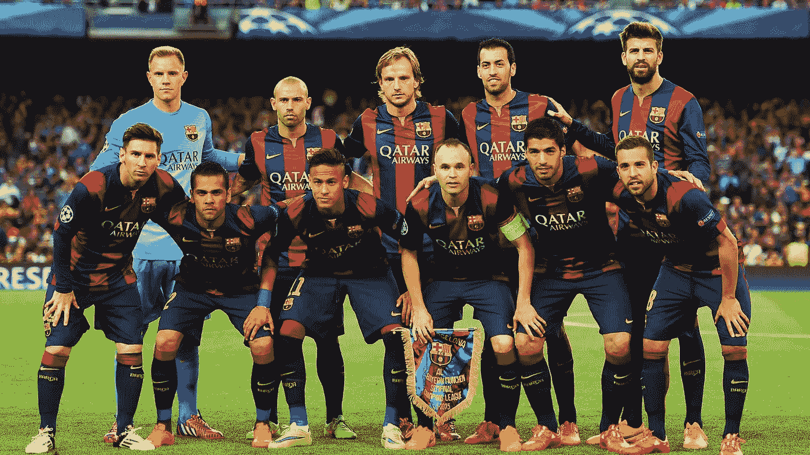

# 激励团队的两种不同方式

> 原文：<https://medium.com/hackernoon/2-different-ways-to-motivate-your-team-b26f60758572>

## 两种相反的策略如何在不同的场景中导致不同的结果

参加竞赛和体育运动的好处之一是，你可以学习和发展适用于生活许多领域的有用技能。

有趣的是，教练用来训练和激励运动员的两种经典策略，可以直接应用于领导和管理你的同事。

这篇文章是关于何时、为什么以及如何实施这两个策略来激励你的团队。

## 前两个关键点

个性化是关键。每个人都是不同的，所以要达到最佳效果，你必须始终为你团队中的每个人实施个性化的策略。

当然，你实施个性化策略的唯一方法是了解你的每一个队友。

作为一名领导者，你的成功与你对同事的了解程度直接相关。

你越了解你的团队，就越容易开发其潜力并取得成果。

## 胡萝卜(或积极奖励)策略

第一个策略的灵感来自于教练对努力工作的运动员所做的事情，这些运动员天生就有动力和激情。

它包括在运动员训练良好时表扬他们，同时修改训练以给予他们必要的款待，以避免精疲力竭(努力工作最终会导致糟糕的表现和更高的受伤风险)。

当然，在一个公司里，这些运动员的对等物是 A 级运动员(和一些 B 级运动员)。

如果你的团队大部分是由一流的球员组成的，那就以这个策略为基线开始吧。

一旦你确立了积极的奖励(你的选择),并且每个人都意识到了这一点，就开始观察你的团队成员的消极反应(冷漠也是消极的)。

*场景 A*

如果你只看到一些消极的反应，而大多数人对积极的奖励策略反应良好

接下来你应该做的是和那些消极回应的人交谈，更好地了解他们的感受和想法。

根据你从他们那里听到的，对每个没有回答的人单独调整策略，要么改变奖励，要么直接采用消极的奖励策略。

*场景 B*

大多数人对积极的奖励不屑一顾，但你的小部分队友反应良好。

在这种情况下，首先通过选择一个大多数人都不在乎的狗屁奖励，通过(再次)与团队中的每个人交谈，来评估这是不是你的错。

如果问题是奖励，那就换一个，重新开始。别再搞砸了。

如果你发现大多数消极反应的另一个原因(很可能是懒惰)，那么你必须立即改变为消极奖励策略。

只要确保把积极的奖励留给最初反应良好的少数人。

## 大棒(或负奖励)策略

硬币的另一面显然与之前的策略相反。

教练对缺乏动力或有时容易懈怠的运动员使用这种策略。

它包括批评运动员的错误，在其他队友面前揭露他们的糟糕表现，并用惩罚来威胁他们(如做额外的工作或不参加比赛)。

大多数公司直接采用这种违约策略(而且大多数公司甚至也不认为有其他选择)。

这背后的原因是，它通常对大多数人(B 级和 C 级玩家)都很好。

如果一家公司想要吸引，尤其是留住顶尖人才，这是他们可能犯的最大错误。

换句话说，在这种策略下，A 级选手不可能保持或表现出最佳状态。

由于这种策略非常普遍，并且在任何地方都可以实施，所以没有必要再进一步。

## 创业文化的影响

幸运的是，随着每一个新的成功的创业公司取代旧的现任者，工作文化和团队战略都在慢慢变好。

初创公司的创始人已经认识到，拥有积极的工作环境和快乐的员工是一项卓越的长期战略。

它为员工带来更多的满足感和更好的工作生活平衡，为公司带来更高的生产率和更满意的客户。

改变大多数公司的工作动态需要一些时间，但我们最终会实现的。

改善结果的需要(更多的利润)、竞争(创业)和社会压力(更知情的客户)，将迫使他们改变或消失。

## 无论你的策略是什么，永远记住这一点

不管你必须做一场有趣的“表演”，支付一个非常昂贵的假期或当场解雇某人，无论你说你会做什么，你都必须兑现你的诺言。一直都是。

仅仅一次未能兑现你的承诺，你肯定会失去整个团队的尊重。

一旦你失去了团队成员的信任，你就不再适合继续领导他们，这给你留下了两个选择:改变角色/部门，或者离开公司。

所以请记住，在与团队沟通之前，一定要三思而行。

作为一个团队领导，你不能因为自己的错误而责怪别人。

## 关闭

*   了解你的团队，倾听他们的心声。
*   根据你的团队特点调整策略。
*   个性化是关键，交流也是关键。
*   快乐的员工转化为快乐的顾客。
*   无论发生什么事，都要信守诺言。

.

觉得帖子有意思？请点击“❤︎”来帮助传播这个词。

.

阿德里亚·埃尔南德斯

> [黑客中午](http://bit.ly/Hackernoon)是黑客如何开始他们的下午。我们是 [@AMI](http://bit.ly/atAMIatAMI) 家庭的一员。我们现在[接受投稿](http://bit.ly/hackernoonsubmission)，并乐意[讨论广告&赞助](mailto:partners@amipublications.com)机会。
> 
> 如果你喜欢这个故事，我们推荐你阅读我们的[最新科技故事](http://bit.ly/hackernoonlatestt)和[趋势科技故事](https://hackernoon.com/trending)。直到下一次，不要把世界的现实想当然！

