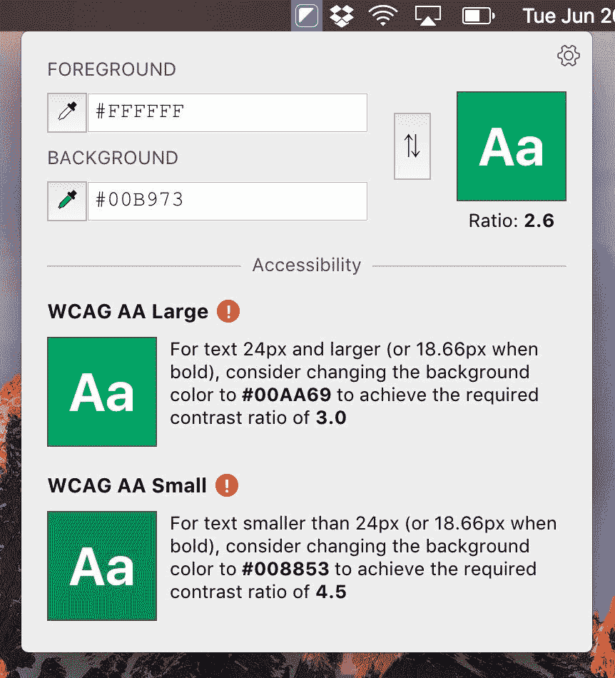
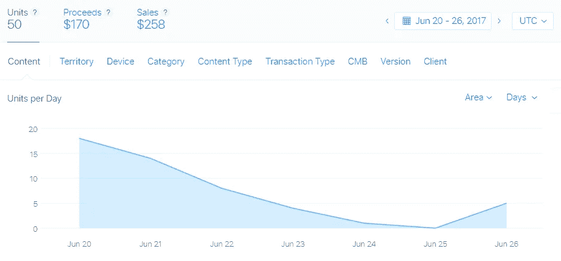

# 20 小时的工作，258 美元的销售额——第一周的阴影

> 原文：<https://medium.com/hackernoon/20-hours-of-work-258-in-sales-the-first-week-of-shade-e0fff99f797b>

2017 年 6 月 20 日，我推出了一款名为 [Shade](http://halogensoftworks.com/shade/) 的色彩对比[工具](https://hackernoon.com/tagged/tool)，这是一款小应用，位于你 Mac 的菜单栏中，如果你的色彩对比不够好，它会对你大喊大叫。

事情是这样的(**TL；他们一切顺利！)**

C’mon Medium, let’s work on that green.

# 改变现状

2017 年 4 月，我离开了我在[可汗学院](https://www.khanacademy.org/)的职位——这是我做过的最好的工作([他们正在招聘](https://www.khanacademy.org/careers)！)—去追求一些副业，搞清楚自己的动力来源。我收拾好行李，向北走了大约 1.2 英里，搬到了我过去几年居住的新泽西同一个镇上的公寓(汗学院❤s 分校，我有没有提到[他们正在招聘](https://www.khanacademy.org/careers)？).

在花了几个星期的时间补上一些旧的视频游戏，花时间与朋友和家人在一起，重新调整自己的生活，不用担心视频页面破裂后，我决定是时候挠痒痒，开始编码了。首要任务:**我一直想要的对比工具。**

—

与这一部分的标题相反，我是一个习惯性的生物，事情通常保持不变。我还是七点半就醒了。仍然做同样一杯普通的福尔杰速溶咖啡，奶精只有它的一半重。仍然穿着我每天穿的黑色卡尔文·克莱恩 t 恤(别担心，我有 20 件)。我仍然试图离开我的公寓，仍然不知道我想做什么。

但我不需要计划，我只想做点什么。

因此，在接下来的 4 周里，我每天花大约一个小时坐在我的文本编辑器前，尽可能多地将技术塞进一个小的菜单栏应用程序。

# 技术和流程

我不擅长过程，但我对这个项目(或者更确切地说，“实验”)的原则如下:

*   做些又快又便宜的东西
*   如果人们愿意给你钱，你要想出一个艰难的方法

所以我花了第一天的时间得到了一个简单的 React 应用程序，并在一个电子菜单栏应用程序中运行(对 [nwb](https://github.com/insin/nwb) 大喊，让它变得没有痛苦)。

大约一个小时后，它开始运行。我不知道这项技术是否能经受住时间的考验，坦率地说，我真的不在乎(剧透:今天的设置基本相同，运行良好)。动力是我的首要任务。

我为这个“实验”准备了十亿个未知数，并在 Trello board 上把它们分类，灵感来自 Rich Hickey 的[吊床驱动开发](https://www.youtube.com/watch?v=f84n5oFoZBc)。我把我的棋盘分为**我不知道的事情**和**我知道的事情**，我的过程如下:

*   如果一个想法突然出现在我的脑海中(例如“如何从构建中移除开发依赖”)，我会把它添加到**我不知道的事情中。**更概念性的东西，比如“这能是菜单栏 app 吗？”也进了这个专栏。
*   然后我会继续我的工作一个小时，然后休息一段时间(通常是散步——再一次,[离开你的公寓](/@jdan/my-best-advice-for-working-remote-6455b5e36043))。
*   当手头的当前任务，不管是什么，完成后，我会重新组织我不知道的事情和我知道的事情。我可能会对之前的问题有一个答案(也许通过思考或者通过代码)，或者我会发现更多的未知。
*   久而久之**我知道的事情**越来越多，而**我不知道的事情**逐渐萎缩。这是一种很好的感觉，我一定要尽情享受。

这种情况持续了大约三周，在此期间，我在 twitter 上征集了一些测试者，并发出了两波邀请来试用这款应用。我还决定了一个名字和标志，但这并不重要。贝塔反馈去了，你猜对了，那个**我不知道的事情**列**。**

这项工作总体来说非常轻松。几个粗糙的 bug 在这里和那里冒出来，但大多数情况下**我在我的办公桌或沙发上持续工作**(我的首要任务)观看 [Arcus87 在 Twitch7](https://www.twitch.tv/arcus87) 上——一个来自亚利桑那州的牛仔，他试图尽快击败 NES 游戏(我不是开玩笑，Arcus 的流是惊人的，所以非常放松)。总的来说，我在电脑前工作了大约 20 个小时，但实际上，如果你把我“把工作带回家”的时间考虑在内，我花的时间是这个时间的两倍或三倍。

# 释放；排放；发布

最终，我觉得我知道了我需要知道的一切，除了“人们真的会为这个东西付钱给我吗？”一张名为 just that 的卡片独自坐在**Things I Know**里，是时候一探究竟了。

接下来的一周，我为苹果填写了一些税务表格，做了一些收尾工作，[做了一个登陆页面](http://halogensoftworks.com/shade/)，为 app store 设计了一些截图，还有几十件我没有考虑到的事情。我没有用特雷罗，但这并不重要。动量动量动量。

2017 年 6 月 20 日早上，我收到了苹果公司的电子邮件，称 Shade 准备出售(我将该应用程序的价格定为 4.99 美元)，并在与我哥哥一起在父母的游泳池中跳跃之前发出了以下推文。

# 回应、反思和超越

与我之前“发布”的项目相比，对 Shade 的回应是…好吧。黑客新闻(Hacker News)和 Reddit 没有上钩，产品搜索(Product Hunt)只在顶部附近出现了一次，消息主要是通过我的网络传播的(感谢除了我最初的推文❤).之外的一些很棒的人分享了它就销售而言，没什么特别的，但仍是我非常自豪的。

I’m no growth expert, but I believe this is what’s known as “Great Potential For Hockey-Stick Growth.”

对我的不存在的投资者来说，Shade 的销售额“以一个充满希望但不断下降的速度增长”，而且“第四季度的预测让我们达到了 8 或 9 位数。”

一周后，我卖出了价值 258 美元的产品，扣除苹果的分成后，对我来说总共是 170 美元。足以支付我建立有限责任公司的费用，但不足以支付苹果的许可或我的任何其他费用。

但这是我赚的钱。不是我上班时得到的钱，而是人们为我创造的东西给我的钱。

**那是一种非常酷的感觉，我正在尽力不忘记这一点。**

—

另外，从个人角度来说，拥有一个人们正在使用的东西感觉很好。回复支持邮件，为我的下一个版本的 Shade 排列 bug 和特性的优先顺序，以及想办法让更多人看到这些都是令人兴奋的挑战，但我却不知道该如何解决。

有很多时候，我不确定 Shade 是否会卖出去，或者我是否有勇气为这个东西收费，而不是卖给 GitHub stars，但我试图信守我的诺言:**快速制作一些东西，并找出人们是否会为此付费的艰难方式**。结果发现至少有 50 个人会。

最重要的是，我玩得很开心。如果在某个时候，我可以使用这个应用程序或其他程序来帮助支付我的一些费用，那就更好了。现在，我将继续尝试各种想法，并尝试在我的袖子里的其他几个技巧上重复和完善这个过程。

—

*随意* [*在 twitter 上关注我*](https://twitter.com/jdan) *在那里我主要是发一些糟糕的笑话和抱怨技术。请考虑* [*买遮阳*](http://halogensoftworks.com/shade/) *，我的房租很贵。*