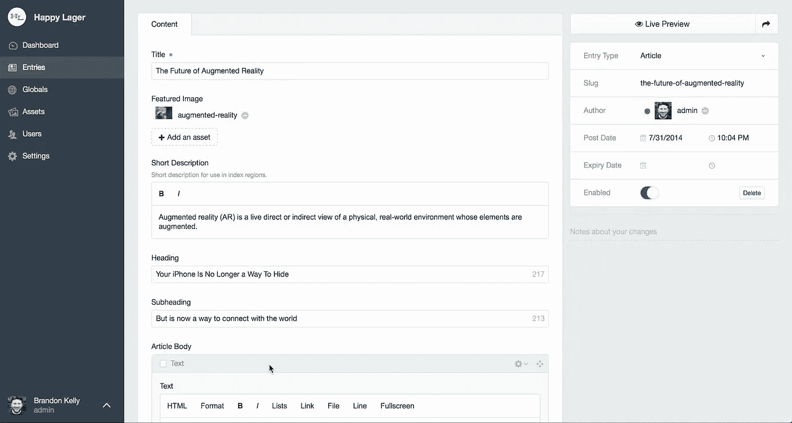

# 职业 CMS 的 20 个原则

> 原文：<https://medium.com/hackernoon/20-principles-for-craft-cms-ae08d80c17de>

With great flexibilty comes great responsibility.

*做网站时的经验之谈精彩* [*手艺****C****ontent****M****管理* ***S*** *系统*](https://craftcms.com) *。基于两年来为客户开发基于工艺的网站。*

这是我们自以为是的职业 CMS 原则清单。有些当然是有争议的，有些只是常识，有些是试错的产物。这些原则包括从项目管理、代码结构到工艺控制面板中的字段和部分结构。

1.从设置开发人员、试运行和生产[环境](https://github.com/vlucas/phpdotenv)开始项目。这将使发射方式不那么紧张。

2.从信息架构开始。与将要编写内容的人一起工作，设置部分和字段。这将允许您处理真实的内容，并尽早发现对功能的需求。

3.不要追逐[瀑布](https://en.wikipedia.org/wiki/Waterfall_model):尽量做到平面设计、内容和前端[开发](https://hackernoon.com/tagged/development)同步进行。

4.如果您觉得需要矩阵块中的矩阵块，请重新考虑您的信息架构。你可能做错了。

5.如果你做一个“内容”矩阵块，避免超过六种类型的块，保持简单。

6。从模块中构建模板。保持 HTML 格式的灵活性和一致性。用它们来制作页面模板。保持[干燥](https://en.wikipedia.org/wiki/Don%27t_repeat_yourself)并记住默认变量。

Example of a module

7.如果你最终写了很多 twig 来解决这个问题，考虑做一个[插件](https://pluginfactory.io)来代替(这并不像看起来那么难)。

8.确保每 40 个项目小时至少向另一个开发者讨论、回顾、展示你的工艺项目一次。

9.花时间为你的领域写好描述。你不会“以后再做”。

10.使用图像变换。想想你的用户的带宽。

11。尽可能限制富文本编辑器。不要在里面放图片，因为这会产生更复杂的代码，通常会导致糟糕的布局决策。

12.窗格是用来隐藏不太重要的东西的。

13.调试技巧:你是否在设置中引入了 PHP 错误？你设置了必要的。环境变量？是否安装了所有的依赖项？您的开发、试运行和生产环境有什么不同吗？日志怎么说？你把缓存搞乱了吗？您是否试图访问一个不存在的字段？你*真的*看过错误信息了吗？你看过文档了吗？有没有搜过[栈溢出](https://craftcms.stackexchange.com/)或者在[工艺懈怠](https://craftcms.com/community)里问过？

*14。Singles* 是有自己模板的独特页面，其内容不会在其他地方使用——通常是列出频道条目等的 frontpages。

*15。频道*用于结构化内容，这些内容可以是流，也可以是一组相似的内容(如新闻或产品)。频道也适合于在多种上下文中重用的内容。

*16。如果你想拥有一个灵活的内容层次结构，结构*会很有用，层次结构对于管理内容很重要。

*17。类别*主要用于纯元数据和跨部分连接内容。

18.主要使用独特和渠道部分。避免结构。我们倾向于不使用结构，因为我们更喜欢[非常浅显的信息架构](https://alistapart.com/article/the-core-model-designing-inside-out-for-better-results)并且它倾向于内容熵。

19.一些插件让任何工艺项目变得更简单:[管理栏](https://github.com/wbrowar/adminbar)、 [CP 字段链接](https://github.com/mmikkel/CpFieldLinks-Craft)、[元素 API](https://github.com/craftcms/element-api) 、 [Kint](https://github.com/mildlygeeky/craft_kint) 、 [Linkit](https://github.com/fruitstudios/LinkIt) 、[萌芽字段](https://sprout.barrelstrengthdesign.com/craft-plugins/fields) / [表单](https://sprout.barrelstrengthdesign.com/craft-plugins/forms/)，以及 [Retour](https://github.com/nystudio107/retour) 。([还有一堆关于牛逼工艺的](https://github.com/chasegiunta/awesome-craft))。

20。无论你做什么，都要考虑你的选择将如何影响客户在管理他们的内容时做出正确选择的能力，以及将来你自己解决问题和进一步开发你的代码的难易程度。

与其说是原则，不如说是好建议:通过订阅[工艺链接列表](http://craftlinklist.com)时事通讯和收听[工艺来保持更新。播客](http://craftpodcast.com)。

***你对 Craft CMS 上的项目有什么原则？***