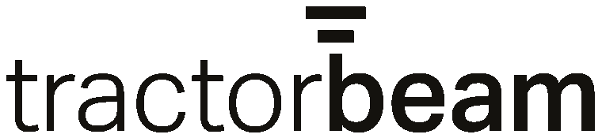
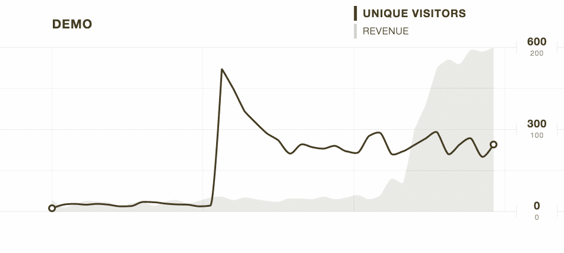
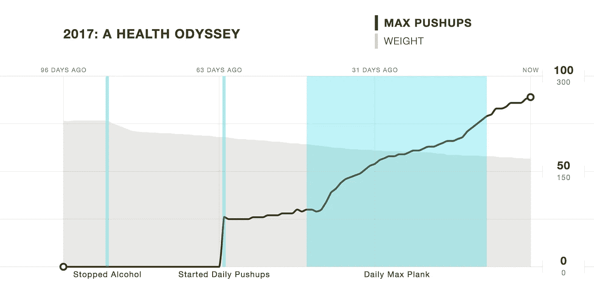

# 2017:数据之旅

> 原文：<https://medium.com/hackernoon/2017-a-data-odyssey-bfc0e63af787>

在过去的十年里，我一直在设计、开发和营销网络上的东西。在那段时间里，我可能参与了 50-100 个项目。我最大的挫折是我们与分析和数据的集体关系。

说到数据，我观察到人们分成两个意识形态阵营:

1.  **本能驱动的阵营**——“我凭直觉知道什么是好什么是坏。我会用我的直觉来推动这个项目。”
2.  **数据驱动阵营**——“我们不可能知道什么会成功，什么会失败，所以我们不要做任何假设，一切都要 A/B 测试。”

这两种方法都有优点，但如果将另一方排除在外，就会有缺陷。直觉通常会推动创新和思维。数据聚焦并引导我们朝着既定目标前进。我们两者都需要。我们需要自信来坚持我们的信念，也需要谦虚来适应我们的学习。

大多数分析[工具](https://hackernoon.com/tagged/tools)和框架支持一个阵营，而冷落另一个阵营。我一直在思考一种方法，通过比较他们“直觉驱动”的计划和他们“数据驱动”的 KPI(关键绩效指标)，来鼓励团队进行富有成效的实验。

[Tractorbeam](https://www.tractorbeam.io/) 是我的数据奥德赛。这是一次旅程，看看我们能否将这两个阵营联合起来。这个概念是在我参加 [Techstars 云计划](https://hackernoon.com/dane-of-knowtify-goes-to-techstars-a2e17b407e1d#.npfgcx8on)期间开始形成的。我们过去常常在晚上 9:09 开每周例会，聚在一起，喝啤酒，讨论公司的关键绩效指标。我们都发现，不仅要展示我们的 KPI，还要清楚地说明我们要做些什么来推动进展，这都是一项挑战。

Tractorbeam 的 V1 现在直播。这是一个里程碑和运动跟踪工具。尝试一下，让我知道你的想法。

您的团队如何使用 Tractorbeam 的示例:

**启动和发展应用**

没有正确的方法来构建一个成功的应用程序。但是这里是许多应用程序都要经历的几个阶段。

1.  **设计原型** —在这个阶段，你并没有真正的 KPI。做用户访谈和调查可以给你一些信号，影响你如何看待你的 MVP。我建议在这个阶段不要太深入地跟踪度量标准。运用你的直觉，大胆假设，大胆行动。
2.  启动 MVP —现在你需要开始考虑 KPI。不要陷得太深，因为你的产品可能有点不可靠，你说服支付的少数用户不太可能具有代表性。相反，更多地关注漏斗的顶部。你能吸引人们对你的想法感兴趣，并让他们把自己的名字写在一个列表上，表示他们对此感兴趣吗？我在这里主要关注流量和注册，同时开始考虑漏斗中更深层次的 KPI。
3.  **迭代产品**——开始更多地关注漏斗的中部。人们是否超越了基本的注册并实际使用你的产品？每日或每周活跃用户是衡量成功的重要标准，但不要害怕跟踪更具体的使用指标。
4.  **成长**——一旦你的产品得到真正的使用，开始更认真地对待漏斗的底部。最终，大多数应用程序会希望将收入作为主要的 KPI 来跟踪。

使用 [Tractorbeam](https://www.tractorbeam.io/) ，每个图表允许您查看 2 个指标。这里的目的是让您查看基于当前优化阶段的主要指标。次要指标旨在显示更深层次的基础指标。因此，假设您处于第 3 阶段，您可能希望将“每周活跃用户”作为主要指标，将“收入”作为次要指标。

随着时间的推移，您可能会发现不同的阶段 3 指标与阶段 4 指标有更强的相关性。在这种情况下，也许“创建的文档”是一个更好的衡量活动的方法，所以你应该专注于优化“创建的文档”而不是“每周活跃用户”。

**个人分析**

Tractorbeam 不是专门为个人分析或量化自我而设计的。但是我认为这是一个很好的例子来展示另一个用例。考虑到我在 2017 年 1 月 2 日写这篇文章，这也是非常相关的。

所以你有一个新年决心要变得更健康。你如何让这个目标不那么模糊？减掉 25 磅，腰围再减几英寸？更具体的描述给了你努力的方向，但是你怎么知道什么是有效的，什么是无效的呢？你打算每天跑 1 英里并希望减掉 25 磅吗？如果是这样的话，你可能会有一个好的开始，在一个月内每天都跑步。然后你会掂量一下自己，发现进步不大，就泄气了。

我推荐一种更具实验性的方法。列出 4-5 件有可能影响你体重的事情:

1.  每天锻炼一小时
2.  停止喝汽水
3.  停止饮酒
4.  将零食 X 替换为零食 Y
5.  晚餐后不吃甜点

现在每天称体重，并绘制体重线图。现在开始运行 2 周以上的运动，旨在影响你的体重。也许第一个运动是每天锻炼一个小时。你承诺这样做 2-3 周，然后回来把这个活动覆盖在体重指标上，看看数字是如何变化的。也许你会发现你只减了 1-2 磅，虽然这是积极的方向，但还不够好。所以，然后开始一个新的运动，停止喝苏打水，看看几周后对你的体重有什么影响。

现在你有了一个反馈回路。通过发起新的活动来不断尝试，看看什么对移动你关心的数字最有影响。坚持一年，我敢打赌你会取得真正的进步！

tractor beam 总部还处于早期阶段。我希望 TB 能帮助你的团队探索一个新的领域。如果没有，祝你找到自己的数据之旅。

—戴恩·莱昂斯

> [黑客中午](http://bit.ly/Hackernoon)是黑客如何开始他们的下午。我们是 [@AMI](http://bit.ly/atAMIatAMI) 家庭的一员。我们现在[接受投稿](http://bit.ly/hackernoonsubmission)并乐意[讨论广告&赞助](mailto:partners@amipublications.com)机会。
> 
> 如果你喜欢这个故事，我们推荐你阅读我们的[最新科技故事](http://bit.ly/hackernoonlatestt)和[趋势科技故事](https://hackernoon.com/trending)。直到下一次，不要把世界的现实想当然！

