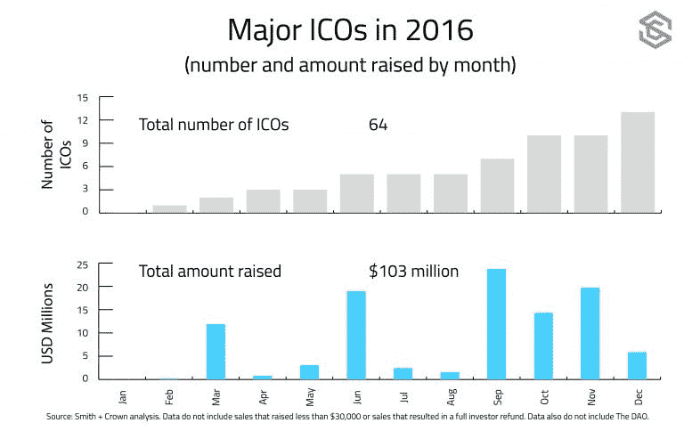
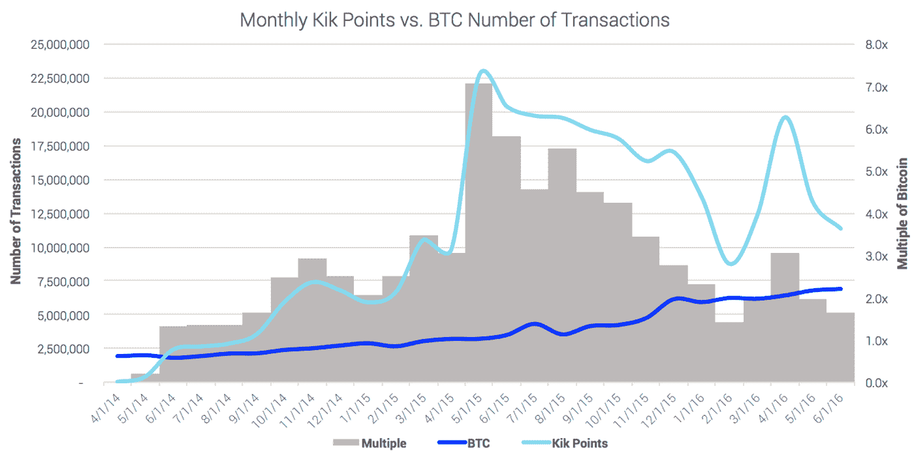
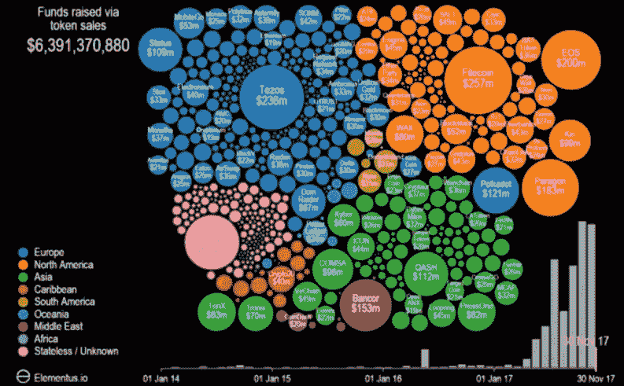
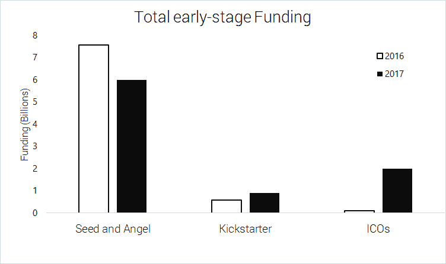
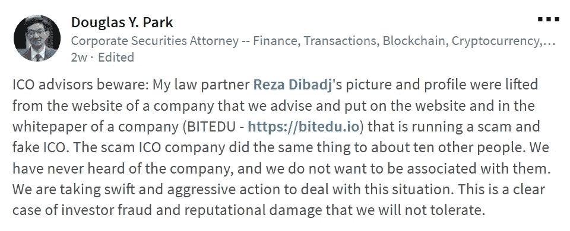

# 2017:回顾一年——首次发行硬币

> 原文：<https://medium.com/hackernoon/2017-a-year-in-review-initial-coin-offerings-91ec1c7367a5>

Please read our Disclaimer found at the bottom of this page or [here](https://thebestoficos.com/disclaimer.html).

## ico 的好、坏、丑以及未来

# 介绍

每年这个时候，我都会去墨西哥城，在 2010 年搬到加拿大之前，我就是在这个城市长大的。我通常乘出租车或优步在城市里转转，和司机聊聊天。我发现这是从他们的角度了解这座城市以及它是如何发展的好方法。谈话通常会变成对我们各自职业的讨论。

这次旅行与往年不同的是，我交谈过的每个司机都有所了解，或者至少听说过**加密货币**。这既令人惊讶又令人不安。每个人的普遍想法是，投资加密货币或比特币是快速赚钱的方法。没有人对钱包或使加密货币令人兴奋的底层技术有深刻的理解，但他们都隐约熟悉这个想法。

这种情况令人不安的原因是，在不了解为什么这是一项好投资，或者需要多长时间才能收回投资的情况下做出投资决定，很快就会损失很多钱。虽然合格的投资者可能有资本承担这些风险并接受打击，但对墨西哥或世界上任何地方的绝大多数人来说，这都不是真的。

今年，通过首次发行硬币筹集资金的公司数量达到了历史最高水平。现在每月有 50 多家公司进行 ICO。根据 [Coinschedule](https://www.coinschedule.com/stats.html) 和 [Coindesk](https://www.coindesk.com/ico-tracker/) 的数据，我们也看到了有史以来通过 ico 筹集的最大金额的资金，超过 40 亿美元。我们也看到了数量最大的丑闻，与 ico 相关的黑客攻击，以及数亿美元的诈骗和集体诉讼。

这篇博客的目的是揭开这个领域的神秘面纱，揭示 ico 的好、坏、丑。在这篇文章中，我们将看看过去，现在和未来的技术。我们的个人目标是教育公众投资 ico 的收益和风险。

# 2013–2016:ICOs 的前 4 年

我们认为，为了解释和总结 2017 年，我们必须解释区块链应用的历史和背景，以及这些应用如何自然演变为 ico。

Youtube Video: What the ICO market looked like in 2014–2017, by Justin Wu, [Elementus](https://www.linkedin.com/company/27115859/?lipi=urn%3Ali%3Apage%3Ad_flagship3_profile_view_base_recent_activity_details_all%3BX7qWFp1CSbGN3NrhzIisCQ%3D%3D&licu=urn%3Ali%3Acontrol%3Ad_flagship3_profile_view_base_recent_activity_details_all-mention), Blockchain Growth ([LinkedIn](https://www.linkedin.com/feed/update/urn:li:activity:6347162775692861440))

# 背景—先驱者

2013 年，一家名为 [Mastercoin](http://www.omnilayer.org/) (现名为 Omnilayer)的公司成为首批建立在比特币区块链之上的应用之一。这是一项努力，旨在创造在区块链上执行更复杂的金融交易的能力，也是 ICO 的第一个项目。

就像种子阶段或众筹投资一样，Mastercoin 的创始人相信他们的代币会随着时间的推移而升值，因此允许为期一个月的“筹款活动”，人们可以使用比特币购买 Mastercoin，从而创造了现在所谓的 ICO(首次硬币发行)。Mastercoin 筹集了当时价值**50 万美元**的资金，因此在当时成为一个非常成功的 ICO。到 2014 年，Mastercoin 的价值已经升值，最初的投资价值**550 万美元**，证明了投资模式的有效性，并为进一步的 ico 铺平了道路。

# 2014 —以太坊

2014 年，一位名叫 Vitalik Buterin 的 20 岁滑铁卢大学学生开发了一种新的加密货币和图灵完整框架。这一新框架使其他人能够轻松快速地部署加密货币。这个框架的名字叫做**以太坊**。

全面披露:ICOs 的一名员工是 Vitalik 2012 年在滑铁卢大学的同学。我们希望通知我们的读者，以防他们认为本节中代表的某些观点似乎不中立。

由于区块链中新技术的结合，最初的硬币发行成为可能。更具体地说，我们来看看以太坊的引入使 ico 成为可能。

同年，以太坊平台的首次实现及其相应的代币销售出现。这是 ICOs 未来的一大步，因为以太坊提供了一种更简单的方式来创造代币并提供给大众销售。

在其最简单的形式中，以太坊不同于比特币，因为它也有一个内置的脚本语言，比比特币自带的脚本语言强大得多，因此有人可以更容易地在以太坊区块链而不是比特币区块链上创建令牌。允许多家公司采用区块链技术的一大步。

# 2015–2016:扩展 ico

Image originally from: [https://www.coindesk.com/2016-ico-blockchain-replace-traditional-vc/](https://www.coindesk.com/2016-ico-blockchain-replace-traditional-vc/)

这些事件并没有被忽视，许多公司开始注意以太坊，并筹集了大量资金。从 2014 年到 2016 年，ico 筹集了超过 3 亿美元，包括:

*   ****:**$ 1800 万**
*   **1060 万美元**
*   **[**假人项目**](https://golem.network/)**:**$ 1000 万**
*   **单曲电视:750 万美元**
*   **[**数字刀**](https://digix.global/dgd/):550 万美元**

**这些 ico 并没有被忽视；许多公司注意到 ICO 的影响，并开始尝试创造自己的货币(不是加密货币)，以测试 ICO 在其平台上的影响。**

# **2017:好的，坏的，丑陋的**

**2017 年，滑铁卢公司 Kik 决定，他们创造自己令牌的实验取得了成功，他们将推进加密货币。其结果是最令人兴奋的 ico 之一，KIK 的亲属。**

**我们发现 KIN 令人兴奋的原因是创造者“KIK”有机会测试他们自己版本的令牌，称为 KIK Points。这些积分通过他们的平台进行交易，并使人们能够创建应用程序并通过它们接收支付。他们还允许用户购买积分，或者通过应用程序或观看广告来赢取积分。**

**他们在 2014 年至 2016 年期间进行了这项实验，并能够证明比比特币更高的交易量(每单位)。说服他们创建一个区块链/经典令牌的混合体会给他们带来最好的结果。**

****

**KIK Points v. BTC Number of Transactions, from the KIN White Paper found [here](https://www.kinecosystem.org/static/files/Kin_Whitepaper_V1_English.pdf).**

**由于 KIK 已经拥有超过 3 亿用户，这使得它成为第一批来自已经成立的公司的 ico 之一，拥有数亿用户，使 ico 具有合法性，但也有真实用户的游戏场，以及良好的测试环境。KIK 通过他们的 ICO 筹集了超过 1 亿美元。这为更多的 ico 打开了大门，创造了我们今天看到的令人难以置信的健康环境。**

****

**What the ICO market looks like, by Justin Wu, Elementus, Blockchain Growth ([LinkedIn](https://www.linkedin.com/feed/update/urn:li:activity:6347162775692861440))**

# **2017 年最大 ico**

**2017 年一些最大的 ico 是:**

1.  **[**Filecoin**](https://filecoin.io/) :约 2.57 亿美元**
2.  **[**特佐斯**](https://www.tezos.com/) :约 2.36 亿美元(诉讼)**
3.  **[**EOS**](https://eos.io/) :约 2 亿美元**
4.  **Bancor:~ 1.53 亿美元(损失了大部分价值)**
5.  **[**典范**](https://paragoncoin.com/login) :约 1.2 亿美元**

# **好人**

**除了大量通过 ico 产生大量金钱的人。ico 的信息量、技术、服务和总体生存能力，是今年众筹领域一个非常积极的变化。**

**事实上，ico 在众筹中的作用如此之大，以至于今年种子阶段约 30%的资金来自 ico。**

****

**如果我们看一下投资环境，许多有前途的公司在最初的种子期很好，但完全基于投资者的观点很难筹集到 A 轮和 B 轮资金，即使他们的网络效应非常强，他们有机会盈利。(投资者寻求非常大的投资回报率，不希望一家公司只是成为一家小型盈利企业)。**

**这造成了相当多的公司已经筹集了一些种子资金，但由于缺乏信任和机构投资者的资金，难以继续在市场上增长，这种情况使最初的投资者没有任何投资回报，公司慢慢地烧钱和崩溃。**

**然而，ico 彻底解决了这个问题，是弥补两轮融资缺口的完美解决方案。如果公司能够证明其产品能够产生销售，那么他们的客户将只会从投资于公司执行的 ICO 中受益，因为他们不仅从产品中受益，而且还从他们对公司货币的投资中受益**

# **坏事**

**区块链技术仍然有很多问题和疑问。这项技术仍然有一系列的缺陷，使得任何大规模的现实世界的实施难以置信的不切实际。最常见的问题是:**

*   ****昂贵的交易费用:**网络上的矿工越多，你就要为他们的电费支付越多**
*   ****缓慢的事务**:随着网络的增长，持续的吞吐量很难跟上事务验证**
*   ****51%攻击**:随着区块链的增长，越来越少的人可以开采，所以越来越多的总池被少数拥有开采池的人控制**
*   ****不可逆性**:如果你被诈骗，被黑，或者误买了东西，钱就没了**
*   **技术要求:目前的钱包对用户非常不友好，它们没有通过祖母测试:我的祖母能使用这项技术吗？**

**这些只是对这项技术的一些批评。许多人也批评了区块链技术在市场中的实际可行性。Medium 作家“Kai Stinchcombe”写了我们在 medium 上读到的对区块链技术的最佳批评之一:**

> **十年过去了，没有人想出区块链的用途**
> 
> **作者:Kai Stinchcombe**

# **丑陋的**

**虽然区块链技术的上述问题相当糟糕，但有一些计划和战略可以解决这些技术问题，然而还有另一层困难。ICO 领域充斥着专门针对他人实施恶意攻击的人。这些攻击中的大部分被认为是由数十个 ico 实施的黑客攻击、诈骗和证券欺诈，这促使我们撰写了我们的第一篇文章，“[为什么大多数 ico 都是骗局](https://techburst.io/why-most-icos-are-scams-17785f16980d)”。**

****

**From LinkedIn User Douglas Y. Park via [LinkedIn](https://www.linkedin.com/feed/update/urn:li:activity:6346930888915451904)**

**诈骗的数量以及声称销售非证券的公司也呈指数级增长。情况变得如此糟糕，以至于两个月前，美国证券交易委员会成立了一个新的网络部门，专门调查 T4 的 ico 和区块链公司。**

# **2018:未来**

## **解决问题**

**我们目前在区块链技术中看到的许多问题目前正在通过各种努力得到解决:**

*   ****昂贵的交易费用和缓慢的交易**:Raiden Network、Raiblocks 和反事实是目前正在实施的三项主要工作，旨在通过建立链外交易来解决昂贵的交易费用和缓慢的网络时间问题，这些交易可以在链上结算，而不会阻塞整个网络。这三个实现之间有微小的差别，但是它们都基于状态通道和链外事务。**
*   ****51%的攻击:**以太坊和以太坊区块链上的许多其他令牌都在寻求转向不同的信任算法，即与工作证明相反的利益证明。这将使任何基于计算能力的攻击不可用，从而有效地解决 51%的攻击，因为它们目前被定义为今天。**
*   ****不可逆性:**比特币和以太坊协议已经允许多重签名(通常是 3 选 2 交易)，这使得仲裁员能够解决交易纠纷(从而有效地逆转不良交易)。目前，我们不知道任何加密货币在其交易/钱包方案中将这些协议作为默认选项来实现。然而，由于这个问题的解决方案已经存在，因此改进该技术以使其易于使用并不是主要的绊脚石。**
*   ****其他技术要求:**许多拥有 ICOd 的公司正在不断努力提高加密货币和相关产品的用户友好性，他们致力于开发更好的钱包、更具可扩展性的成熟方案，如混合令牌模型，其中加密货币由产生它们的公司半控制，以及加密货币爱好者的其他努力，以提高对加密经济产品的利弊的认识和教育。**

## **走向**

**一系列服务、法律要求和技术目前也正在开发中，以保护用户免受黑客、诈骗和卑鄙行为的侵害。正如我们之前提到的，美国证券交易委员会已经建立了一个网络单位，目的是揭穿诈骗 ico。此外，世界各地的政府也开始描述 ico 在每个管辖区必须满足的要求，以及对其作为证券、公用事业或两者的地位的更好描述。**

**为用户提供 ico 相关信息的网站也在遍地开花。**

**这些服务的典型例子包括:**

*   **[**ICOIndex**](http://icoindex.com/) :旨在让最初的币供透明、易懂、人人可用。**
*   ****:一个让用户能够安全存储和购买加密货币的交易所****
*   ****[**Coinlist**](https://coinlist.co/) :一家希望帮助 ICOs 扩展，并为令牌销售提供一系列协议和服务的公司****

****所有这些服务都希望让 ico 的制作和购买变得更容易、更透明、更安全、更公平。****

# ****结论****

****2013 年以来的每一年都是 ICOs 最伟大的一年。2017 年也不例外，创造一个有辨识度的市场，最重要的是，给行业带来足够的恶名，让它成为主流。****

****随着更多的加密货币被添加到列表中，帮助用户确定购买哪些 ico 的服务、指数和网站的数量将继续增加。我们不仅看到了 ico 数量的激增，还看到了人们购买、交易和阅读 ico 的选择。****

****正如我们在“[关于管理加密投资你需要知道的事情](https://hackernoon.com/what-you-need-to-know-about-managing-crypto-investments-b5d0852f9b91)”中提到的。任何有兴趣参与市场的人都必须采取正确的预防措施来保护他们的投资。****

****我们也做一个预测。我们预测，2018 年将是 ICOs 有史以来最大的一年，至少会有一家独角兽(十亿美元的公司)从这场革命中诞生。****

****2018 年还将带来该领域最大数量的平台、技术和服务。我们认为，这些产品的激增将有望创造一个更关心他们投资的公司和产品的社会，作为回报，将权力赋予用户，并让公司承担更多责任。****

****想帮忙吗？
**在 Bountey 上支持我们！**[【https://www.bountey.com/bestoficos】](https://www.bountey.com/bestoficos)****

****想在 ICOs 中保持最新？
**访问我们在**[**https://thebestoficos.com**](http://thebestoficos.com/)****

****有一个有趣的故事？
**写我们在 info@bestoficos.com******

# ****放弃****

****本网站及其包含的信息无意成为投资、金融、技术、税务或法律建议的来源。本网站不能代替专业建议和独立的事实验证。在没有首先评估你自己的个人财务状况，也没有咨询财务专家的情况下，千万不要使用这个网站上的想法和策略。本网站的所有内容仅供参考，按“原样”提供，不保证完整性、准确性、及时性或使用本网站所获得的结果。这只是一个存根，您对本网站的访问和使用取决于您是否接受并遵守[全部免责声明。](https://thebestoficos.com/disclaimer.html)免责声明适用于所有希望访问或使用本网站的访问者、用户和其他人。****