# 2017:我的一年回顾

> 原文：<https://medium.com/hackernoon/2017-my-year-in-review-d05aa3f48446>

## “生活就是水桶”——Ted

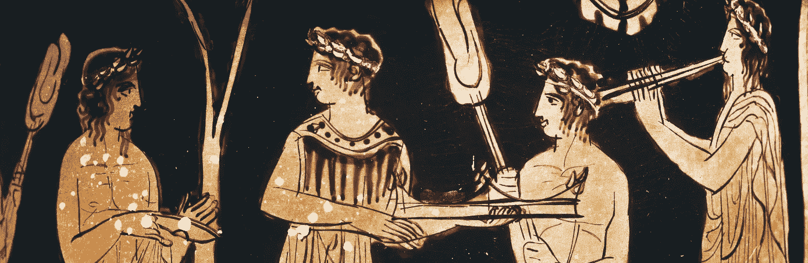

当我们接近 2017 年的时候，我， [*又一次，*](/@jordangonen/2016-a-year-in-review-eb2bc05a44e9) ，进入了沉思状态。

## **我写这份年度回顾是为了:**

*   记住 2017 年好的和坏的部分
*   为我的生活提供一个透明的账户
*   欣赏那些小时刻
*   反思我的选择并分析结果
*   **衷心感谢**

> **免责声明:**我绝不意味着这是一篇规定性的文章。今年的一些时候，我真的很幸运，事情似乎进展顺利。然而，我失败的次数也许并没有被完美地表现出来。我失败了很多次。我搞砸了很多。我绝不是那个例子。我犯了很多公开的错误。但是我不后悔。永远向前。
> 
> 此外，我想认识到生活中没有参与奖杯。没人在乎我是否努力。没人在乎我可能睡不着。谈论大量工作并不能完成任何事情。我只**得到输出补偿，不算输入。**量无奖。我这样说只是为了强调我写作的目的——它与自我无关。我真的不是想用这篇文章来吹嘘我的相对成就。

**谢谢大家**——我的家人、(新&老&朋友、敌人、导师、同事、同辈——大家**。虽然生活在很大程度上是一场单人游戏《T21》，但我知道我正站在巨人的肩膀上。我非常感谢那些帮助我走到今天的人。谢谢你。**

**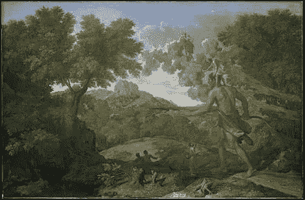**

**[Cedalion standing on the shoulders of Orion](https://en.wikipedia.org/wiki/Standing_on_the_shoulders_of_giants)**

**2017 年是个人、社会和职业成长的又一年。从探索我的个人品味和偏好，到获得新技能，再到走出我的舒适区，这又是一年的极限学习。**

***(整篇帖子大约 12 分钟阅读)(另见* [***2016 年回顾***](/@jordangonen/2016-a-year-in-review-eb2bc05a44e9) *)***

## ****个人总结(这些是外部和内部指标 ):****

*   ****有感而发。**使用社交媒体/电话明显较少。开始真正欣赏生活中的小事。**
*   **结识了 100 多位新朋友(许多来自 Twitter 的网友)。最重要的是，**加强了与我最关心的人的关系。****
*   **[365](/@jordangonen) 天的每日博客。40 万次浏览。(总计=连续 675 天)。**
*   **玩得非常开心。住在 PHX，旧金山和旧金山。进行了大量的公路旅行。开始拍更多的照片。参加体育运动(差点赢得校内足球赛)。与全新类型的人互动。用新的方式挑战自己。**
*   **尝试了很多新食物。喜欢大部分。**
*   **在[产品搜寻](https://medium.com/u/b8b4445269d0?source=post_page-----d05aa3f48446--------------------------------)中运送 [11 件新产品](https://www.producthunt.com/@jrdngonen/made)。成千上万的联合用户。百万总页面浏览量。从企业工具到消费者工具，我都做过。实践了**与用户共情**，解决现实问题，建立团队。**
*   ****创办了一份名为“[下一步是什么](http://www.jordangonen.com/newsletter)”的** [**每周简讯**](http://www.jordangonen.com/newsletter) ，订户已经增长到 1700 多名。人们似乎真的很喜欢它。还贴了一个[新的个人网站](http://jordangonen.com/)。**
*   **创造了[一个产生收益的产品](https://www.indiehackers.com/businesses/disrupt-cards) ( [倍数](http://jordangonen.com/))。(任重而道远)。**
*   **在几个地方实习过(更多的在下面)。甚至开了几家有限责任公司。[练习了很多](https://github.com/jordangonen)SQL，Python，Javascript，PHP，Arduino C，Java 等等。**
*   **在[学院](https://wustl.edu/)过了一半。我的金融/计算机科学专业快完成了。我去年退出了大部分学生团体。**
*   **读/听了 [11 本书](http://gonen.blog/reading-list)。我最喜欢的是[乡下人的悲歌](https://www.amazon.com/gp/product/0062300547)。我也听了大量的播客(T4 修正主义历史和许多来自 Gimlet 媒体的播客)。**

**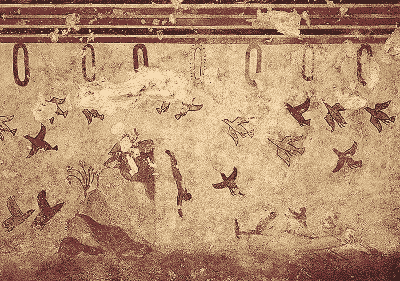**

***我想再次强调，谈论行动，写下行动，宣传我的行动！=在做。忙碌没有奖励。***

# **2017 年 1 月**

*   **我在家(在亚利桑那州)开始了新年。我和朋友一起度过的。我踢了很多场足球。吃了一堆鹰嘴豆泥。另外，我记下了[家庭聚会](https://houseparty.com/)已经像病毒一样传播开来。**
*   **1 月 10 日，我飞往山景城，在那里我遇到了文斯·宁，他帮助我攀登。这个团队(Vince + [Michael Paris](https://medium.com/u/81a64d7b94a6?source=post_page-----d05aa3f48446--------------------------------) )刚刚成立[Y Combinator](https://medium.com/u/cb8adc841a29?source=post_page-----d05aa3f48446--------------------------------)——所以这是一个非常令人兴奋的成长时期。我学到了很多关于如何建立一家公司的知识。**
*   **[扰乱卡](https://disrupt.cards/) ( [杰瑞米](https://medium.com/u/78a4fb4fcfe7?source=post_page-----d05aa3f48446--------------------------------)、[丹尼尔](https://medium.com/u/cb4da2f08c8d?source=post_page-----d05aa3f48446--------------------------------)和我的宠物项目)终于开始出货了。不知何故，在没有营销费用的情况下，我们上了 CNN 和 Justin Kan 的快照。甲板在卖！**
*   **快到月底的时候，我回到了[学校](https://wustl.edu/)，开始了大二的第二学期，申报了金融和计算机专业。**
*   **新总统宣誓就职。我吃了一堆韩国烧烤。另外，[我的一篇文章](/@jordangonen/moonshots-deae66181800)被放在媒体主页上。**
*   **成立了一个名为 [Moonshots](/p/moonshots-the-blog-e3eab2aa982b) 的非正式学生团体。基本上，我们召集了一群学生——跨越工程、商业、医学预科和艺术——来讨论未来的不同方面(自动驾驶汽车、加密等)。).很有帮助。**
*   **参加[下班时间](https://www.outofofficehours.com/)遇到了一些很厉害的导师。**

**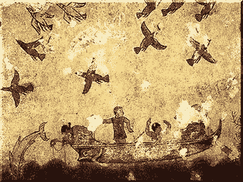**

# **2017 年 2 月**

*   **我的“网友”亨利·考夫曼(Henry Kaufman)直到今天，我都没有和他通过电话，有一天晚上，我决定熬夜创建一个“庆祝移民”的网站(T10)——一个移民创始人的目录(T12)。尽管它只是一张简单的单页纸，却获得了成千上万的浏览量，并被写进了 Mashable 和 The Independent。最重要的是，我认为它对 T21 产生了影响。**
*   **大学非常有趣！探索我以前从未去过的圣路易斯地区，经常和朋友出去。还吃了一顿[的好菜](http://www.seoultaco.com/menu-stl.html)。**
*   **同一周，我的另一个朋友加文·迪努比洛(Gavin Dinubilo)和我推出了 Gmail 的[模板。little chrome 扩展现在拥有超过 4000 名用户，并获得了 1200 多张赞成票。](https://www.producthunt.com/posts/templates-for-gmail)**
*   **那个月晚些时候，我随机给一个在推特上看到的罗马尼亚小孩发了信息。他的名字叫[塞巴斯蒂安·多布林库](https://medium.com/u/d109800de2ba?source=post_page-----d05aa3f48446--------------------------------)，在亨利的帮助下，我们决定创建一个 IPO list——一个公开上市的科技公司的精选名单。放在一起非常有趣。这是一个伟大伙伴关系的开始(后面会有更多)。**
*   **给我想在夏天去工作的公司发了几十封冷冰冰的电子邮件/直接信息。我的标准是:找到“最独特的机会”, a)加速我的学习，b)产生切实的影响。(我知道这是一个非常宽泛的标准，但我并不十分关注领域/领域)。**
*   **连续发表我的 [**第 366 篇博文**](https://hackernoon.com/just-start-5db3b8057b2f) 。[刚刚开始。“学到了很多东西。](https://hackernoon.com/just-start-5db3b8057b2f)**

****

# **2017 年 3 月**

*   **开始了我的每周简讯**，从三月开始每周一出。我发送了一些有趣的链接和摘录，帮助好奇者思考未来。这里是[档案馆](https://medium.com/whats-next)。从那时起，已经有机增长到 1700 多名用户。****
*   ****试着发射[扰乱卡](https://disrupt.cards/)’[扩展包](/p/disrupt-cards-series-a-3aefbacaa0e)。失败了。****
*   ****春假→回 AZ 了。徒步一吨(像每天一样)。我喜欢和家里最好的朋友一起出去玩。****
*   ****当我们接近 YCombinator 的结尾时，继续工作。我们发展得非常快！****
*   ****塞巴斯蒂安和我推出了一个全新的项目，这次有了更大的野心。**我们测试推出了** [**Storyheap**](https://storyheap.com/) :一种管理、跟踪和自动化你的 Instagram/Snapchat 故事的简单方法。****
*   ****努力思考在不同的项目/想法上“全力以赴”。致力于*聚焦*。提醒[日子长，人生短](https://twitter.com/jrdngonen/status/897670091546005505)。****
*   ****开始吃“超级健康”没有碳水化合物，没有面包，什么都没有(后来证明这对我来说是不可持续的，但我当时瘦了一吨)。****

****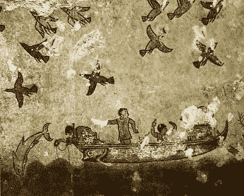****

# ****2017 年 4 月****

*   ******去了** [**暴怒的命运**](https://www.youtube.com/watch?v=JwMKRevYa_M) **的午夜首映式。**对于那些很了解我(或者在 Instagram 上关注我)的人来说，你知道这是一件大事。而对于没有的人来说，[这里的](https://www.youtube.com/watch?v=5rGPKIgdV6A) [都是](https://www.youtube.com/watch?v=G76ThtqLvWk) [有的](https://www.youtube.com/watch?v=t83YU-vOwak) [动作](https://www.youtube.com/watch?v=BsTSN_SyU9E) [剪辑](https://www.youtube.com/watch?v=rV4W4rrlIrw)。****
*   ****幸运的是(我强调非常幸运的是)，我在二月份退回的那些冷冰冰的电子邮件中的一封在正确的时间到达了正确的收件箱。4 月份，我发现自己将回到三藩市，在优步工作。这个机会让我超级兴奋。(也遭到了其他一些公司的拒绝)。****
*   ****学校又变得有趣了。课程越来越少，学生们不得不多出去走走，参观圣路易斯的新区。****
*   ****暂停在 Scaphold 的工作，专注于完成学业。****
*   ****将我博客的“大本营”转移到了 Posthaven 。我现在在 [PostHaven](http://gonen.blog/archive) 上发布，它会自动在[上重新发布我的媒体账号](/@jordangonen)。****

****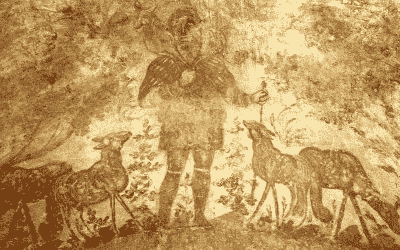****

# ****2017 年 5 月****

*   ****[在](https://www.producthunt.com/posts/storyheap)[产品搜索](https://medium.com/u/b8b4445269d0?source=post_page-----d05aa3f48446--------------------------------)上真实推出 Storyheap 。发布日很吓人/很棒，因为 Seb 和我去了“T4”，全身心投入到故事中得到了 [1100+ upvotes](https://www.producthunt.com/posts/storyheap) 。****
*   ****我们也开始让真正的客户使用我们的产品，包括环球音乐工作室、几个专业运动队等等。然而，不仅如此，我们还学到了很多关于销售企业软件的知识。在这个过程中，我们不得不做出一些非常非常艰难的决定。这一经历极大地促进了学习。****
*   ****读完了大二第二学期。课程安排很繁重(快速原型和网络开发、数据结构和算法、一些商学院课程和哲学)，但还过得去。****
*   ****开始为《黑客月刊》和其他一些大型媒体出版物撰稿。发表一些[更长的](https://hackernoon.com/the-stupid-idea-we-shipped-to-20-countries-and-40-states-6134dce40e7f) [形式](https://hackernoon.com/how-to-find-people-to-work-on-projects-with-8e41f056fcbf) [内容](https://hackernoon.com/how-to-find-the-tools-to-scale-your-startup-cec80d5e5657)。****
*   ****2018 年春季被香港留学录取。****
*   ****五月的最后几周，我在亚利桑那州与朋友和家人一起度过。****

****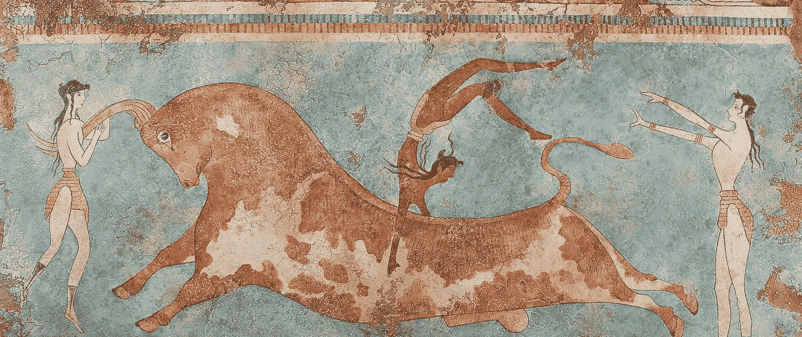****

# ****2017 年 6 月****

*   ****我搬到了三藩市(不知何故，我找到了一个地方和我在学校的三个最好的朋友住在一起，多亏了泽斯生活(T21)。这将是我在旧金山的第二个夏天。****
*   ******开始实习******。第一个月过得很棒(在公司度过了一段非常有趣的时光)。结果工作了很多小时。学到了很多关于建造东西和与各种类型的人一起工作的知识。运送真实产品。********
*   ****开始阅读更多关于区块链和加密货币的内容。在我漫长的晨跑中，我还获得了**超级进入** [**有声读物**](/@jordangonen/audiobooks-47fd2965075) 。****
*   ****我遇到了一群住在旧金山的朋友。也认识了很多新的。甚至举办了几次安息日晚宴(h/t [Maddie](https://twitter.com/MaddieM) 和 [Ben](https://medium.com/u/24bbea13727?source=post_page-----d05aa3f48446--------------------------------) )。****
*   ****与加文和亨利一起发起[刀锋签名](https://www.producthunt.com/posts/blade-2)。(现在有超过 2000 名用户)。继续迭代许多不同的项目。****

********

# ****2017 年 7 月****

*   ****在 [IndieHackers](http://indiehackers.com) 上写了[这篇长文](https://www.indiehackers.com/businesses/disrupt-cards)关于我们如何将 Disrupt 卡提升到 1500 美元/月。(感谢[考特兰·艾伦](https://medium.com/u/35d2978e0b2f?source=post_page-----d05aa3f48446--------------------------------))。****
*   ****在工作中花了很多时间[尝试](/@jordangonen/dont-become-a-manager-too-quickly-82511e5ce89) [到](/p/writing-is-under-prioritized-by-nearly-everyone-7246f026bb9d) [了解](/p/empowering-super-heroes-7fbf5acf37)人员动态以及如何激励你的团队。会见了来自整个公司的十几个产品经理，对如何发布大功能有了深入的了解。在工作中也交了很多新朋友。****
*   ****诺亚、本和我创作了一个关于实习和职业的故事集。****
*   ****今年早些时候开始在项目上遇到一些麻烦。他们中的一些人破产了，其他人提供了一些相当被动的收入。****
*   ****参加了更多的安息日晚宴，也探索了旧金山我以前从未去过的新地区。去码头执行任务。在穆尔森林进行了一次非常酷的徒步旅行。而且，重要的是，吃了一吨惊人的食物。****
*   ******推出** [**我的新个人网站**](http://jordangonen.com/) **。******

****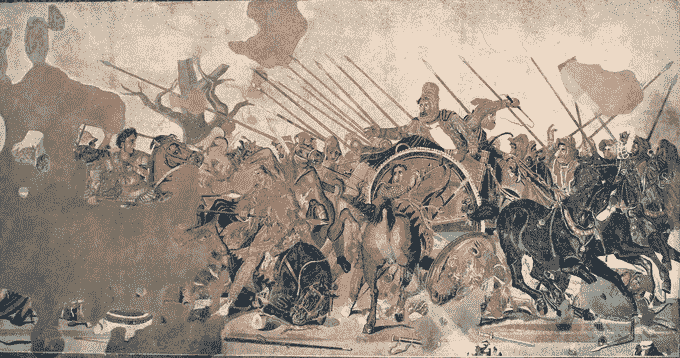****

# ****2017 年 8 月****

*   ****去[火山口湖](https://www.nps.gov/crla/index.htm)露营(求推荐)。****
*   ****我开始和我在网上认识的一些新朋友一起开发神奇机器人。****
*   ********[**extreme fomo**](https://www.producthunt.com/posts/extremefomo)同 [Shiv Kanth](https://medium.com/u/b6485cfd513?source=post_page-----d05aa3f48446--------------------------------) 和 [Mashable](https://medium.com/u/5a319749fb1d?source=post_page-----d05aa3f48446--------------------------------) [写到我们](http://mashable.com/2017/08/29/extreme-fomo-investing/)。继续迭代一些新的附带项目(两者都失去了动力)。********
*   ****成立了一个名为“Startup Sparks”的 slack 小组，这已经被证明是我迄今为止最有价值的资源。本质上是我所知道的一个松散团队中最聪明/最有动力的人的集合。我从与这些人的交谈中学到了很多(其中许多人我从未见过面)。****
*   ****我结束了在优步的实习。在旧金山工作是一次很棒的经历。****
*   ****发表了一篇[吨](http://studenthustle.co/applefb-intern-ycombinator-startup-founder-battling-cancer/)[关于学生喧嚣的访谈](http://studenthustle.co/founding-youthhack-uber-phillipines/)包括[这篇长篇指南](http://studenthustle.co/internshipguide/)。****
*   ****我从 Snapchat 和 Instagram 上休息了一段时间，努力让自己更真实。****
*   ****我回到学校开始我的大三生活。****

****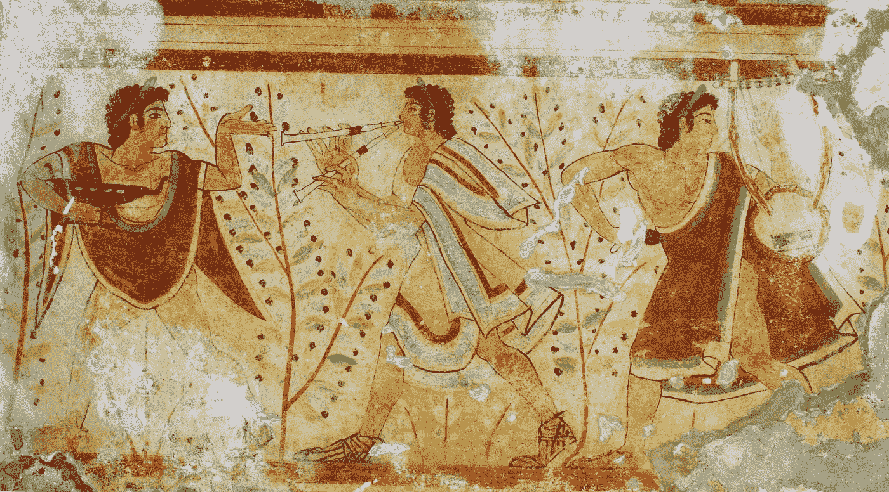****

# ****2017 年 9 月****

*   ****开始了**进一步探索我的** [**个人幸福**](/p/am-i-happier-f39ecf48e88) **和** [**心理**](/@jordangonen/micro-vs-macro-thinking-9f1d039f2e45) **。**开始经常跑步。删除一天中我不满意的部分。****
*   ****受到与 Jd Ross 的一次谈话的启发，他开始研究更多的大型行业。在石油、废物管理、 [3d 打印房屋](/@jordangonen/3d-printing-houses-e369ca83984b)等领域花了大量时间“在杂草中”。还在做这个。****
*   ****[Shiv](https://medium.com/u/b6485cfd513?source=post_page-----d05aa3f48446--------------------------------) 和我[推出](https://www.producthunt.com/posts/cryptotab)和[最终卖出](https://hackernoon.com/introducing-cryptotab-11c2231723eb) [Cryptotab](https://chrome.google.com/webstore/detail/cryptotab-by-99bitcoins/hclmmnnilijgdckihbjbeogomkaegfjo) (拥有~ 700 用户)。想了很多关于如何为现代淘金热制造数字镐的问题。****
*   ****学校很有趣——做了很多新的事情。上课不是很费时间。继续吃美食。****

****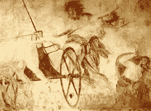****

# ****2017 年 10 月****

*   ****连续发表我的[第 600 篇每日博文](/@jordangonen/600-days-eeb1a6019eb9)。****
*   ****我几乎所有的课都有期中考试。那一周很难熬，但还是挺过来了。****
*   ****夏天又开始申请工作。我想了很多我想去的地方和我想做的事情。我很乐意亲自解释，但我通常专注于在一家“[突破列表](https://breakoutlist.com/)公司找到一个产品管理职位(在工程组织内部)。我也申请了几家大公司。**有效地投掷了一串飞镖。最怀念的。******
*   ****在秋季休假期间，我和我的朋友[诺亚德尔斯坦](https://medium.com/u/a76b250b9304?source=post_page-----d05aa3f48446--------------------------------)心血来潮，乘飞机去费城看望我在宾夕法尼亚大学的朋友。在那里过了一夜后，我们乘公共汽车去了纽约，在那里冲浪了几天。参观了很多公司，见了很多人。我只带了一个背包，但是这次旅行很棒。****
*   ****开始为一些客户承包工程。****

********

# ****2017 年 11 月****

*   ****希夫和我安装了[抖音](https://chrome.google.com/webstore/detail/tik-tok/cdblgebcljjipcpdacjpplcjkopibcad)——一个存在于你的浏览器中的倒计时器。有几百个用户。****
*   ****比特币[过了 10k 美元](/@jordangonen/10k-4cd50f771c6)。****
*   ****与我的朋友雅各布和泰勒一起发起了一个学校项目。我们有将近 500 个用户(在我们的软件工程课上只获得了 A-)🙁).****
*   ******去了美丽的** [**羚羊峡谷**](https://www.antelopecanyon.com/) **。******
*   ****飞到山景城参加一个让我兴奋的现场最后一轮面试。因为“沟通能力差”被拒绝改编。****
*   ****我给一家我非常感兴趣的公司发了一封冷冰冰的电子邮件，并面试了几个星期。今年夏天我会回到旧金山！****

****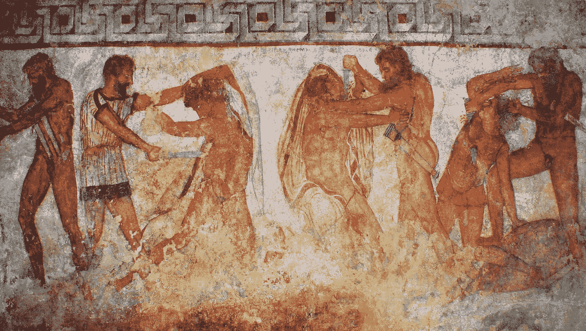****

# ****2017 年 12 月****

*   ****我和[贾斯汀·弗里德曼](https://medium.com/u/c77456d699f7?source=post_page-----d05aa3f48446--------------------------------)为我的物联网课做了一个[智能镜子](https://github.com/jordangonen/IoT_SmartMirror)。不是最漂亮的，但很有效。****
*   ******通过了我的期末考试！** (2 个计算机科学，1 个金融，1 个哲学，1 个分析)。****
*   ******引发了一些非常好的对话**在 slack 小组中，我谈到了“创业火花”我赌这个组。我认为里面的人在他们所做的事情上是世界上最好的。****
*   ****订了去香港留学的机票。在路上(一月份)，我会在纽约呆一周，在巴塞罗那呆一周，在新加坡呆四天，然后在香港结束！如果你有任何建议/推荐，请告诉我。****
*   ****12 月 19 日，我收拾好房间，回到亚利桑那州的家中。在过去的一周左右，我与朋友和家人一起打篮球/踢足球，闲逛。也在做新的项目，发展我的自由职业生意。****

******这让我想到了今天(新年开始的前几天)。******

********

****感谢您的阅读。感谢你让我度过了美好的一年。我有很多人要感谢/感激。我太幸运了。谢谢你。****

****我希望你(和你的家人/朋友)度过健康充实的一年。****

******祝你 2018 年一切顺利。******

# ******如果有什么我能帮忙的，** [**请联系**](https://twitter.com/jrdngonen) **。******

## ****保持联系的最佳方式？****

## ****[我的简讯](http://www.jordangonen.com/newsletter)和我的[推特](http://twitter.com/jrdngonen)。****