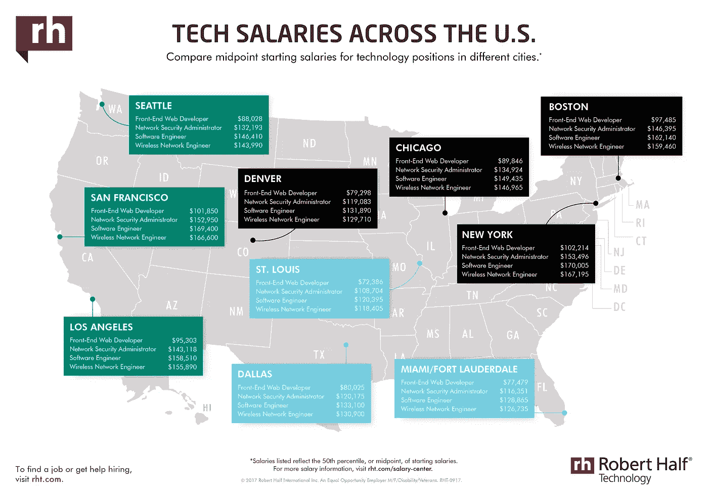
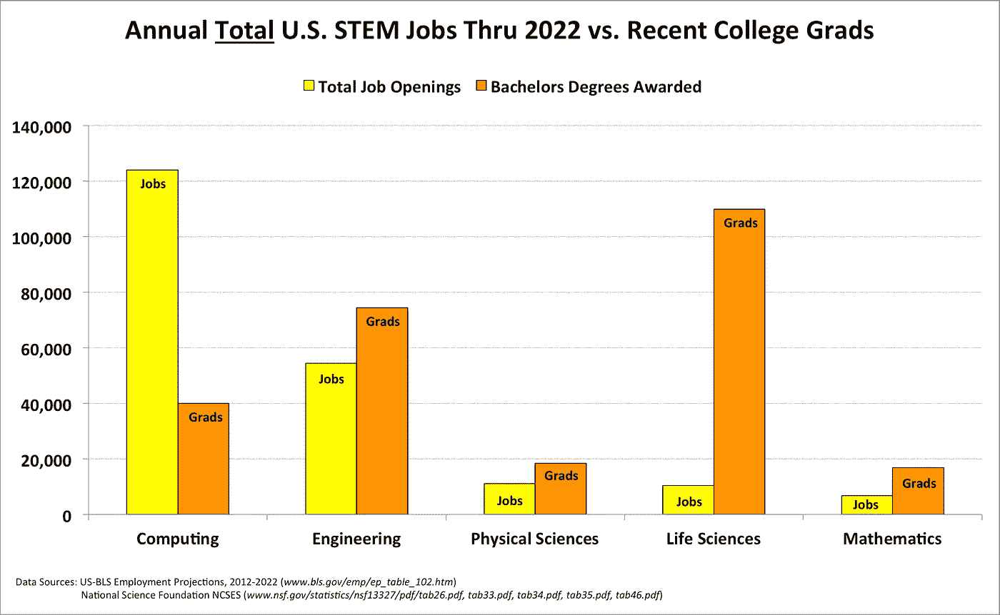
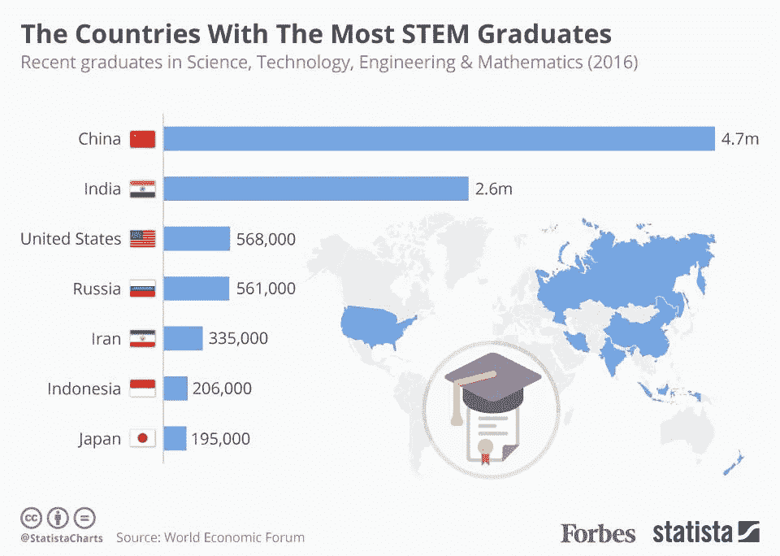

# 2018 年的软件工程人才短缺——这是质量，而不仅仅是数量

> 原文：<https://medium.com/hackernoon/2018s-software-engineering-talent-shortage-its-quality-not-just-quantity-6bdfa366b899>

## Forrester 预测，2018 年，公司将为优质工程人才支付高于市场 20%的费用

在过去的九年里，软件工程师一直处于美国最难找到工作的顶端。我不认为任何人在得知 2018 年不会有什么不同时会感到惊讶。

然而，问题不在于总体数量，也就是那些自称工程师的人。未来的工程师一直在申请空缺职位，但他们要么是 1。)初步不合格，2。)没有被保留。

> 来自市场研究公司 Forrester 的一份[新报告预测，在吸引关键数字人才方面落后的雇主将在 2018 年为具有特别受欢迎技能的新员工支付比市场工资高 20%的工资，这一群体包括数据科学家、高端软件开发人员和信息安全分析师。](https://go.forrester.com/research/predictions/)
> 
> — [人力资源潜水](https://www.hrdive.com/news/forrester-companies-will-pay-20-more-for-in-demand-tech-talent-in-2018/510558/)

软件工程的短缺不是缺乏自称为“工程师”的人，而是缺乏质量——缺乏对软件工程有正式和深刻理解的、学习良好的、有经验的工程师。

这是一张显示地区通胀的地图，反映了对优秀软件工程师的需求:

[Robert Half](https://www.roberthalf.com/sites/default/files/images/RHT_0917_IG_3840x2700_SG2018-SalaryMap_USA_ENG.jpg)

# 什么是软件工程师？

如果你懂一门编程语言，那么你是工程师吗？不，懂一门语言并不能让你成为工程师。就像知道如何说初级西班牙语不会自动让你成为一名好的西班牙语老师一样。

虽然这是一个宽泛的头衔，但是软件工程师是一个问题解决者。你通过系统应用计算机科学解决问题而获得报酬。

你必须深刻理解将你的想法翻译成机器可以理解的东西所需的逻辑语法。你不仅要实现别人的想法，而且要成为新想法的鼻祖。

此外，这些想法不仅仅需要在您的本地开发环境中工作——它们需要在大范围内具有高性能。

> 受欢迎的软件工程师是问题解决者，而不是编码者。

# 招聘和教育挑战

雇主正面临着合格申请人的短缺，而不一定是总体申请人的短缺。五大招聘挑战包括:

1.  缺乏经验
2.  缺乏艰苦的工作技能/技术技能
3.  薪水要求太高
4.  缺乏软技能/工作能力
5.  缺乏正规的工程教育

[Experis 工程报告](http://www.experisjobs.us/Website-File-Pile/Whitepapers/Experis/engineering-whitepaper.pdf)

在这里，我们看到

[ACM.org](https://cacm.acm.org/blogs/blog-cacm/180053-computing-is-the-safe-stem-career-choice-today/fulltext)

# 留住人才的挑战

在 [TekSystems](https://www.teksystems.com/en/resources/thought-leadership/it-industry-trends/tackling-employee-retention-challenges-head-on) 的一项调查中，40%的 IT 领导者和专业人士表示，他们的组织很难留住顶尖的 IT 人才。这是为什么呢？

1.  他们招聘的是角色，而不是职业
2.  将软件工程视为基于任务的工作
3.  没有将保留作为明确的优先事项
4.  项目停滞不前
5.  缺乏增长机会
6.  缺乏志同道合的人才

# 缓解质量短缺

强迫每个未来的工程师参加 4 年的正规计算机科学教育不是一个现实的答案——最终它甚至不能解决问题。正式的 comp sci 教育是基础，但将 comp sci 应用于解决问题是一项通过经验和指导学习的技能。

现代技术非常复杂。有各种不同的框架、反应式体验、人工智能、机器学习、集成测试等。这些通常不会在正规教育中教授，除非你找到一个教你专攻某个特定领域的独角兽项目。

国际工程和 IT 招聘公司 Kyyba 的 Ganesan 告诉 GoodCall，“例如，许多中小型公司不提供在职培训，而是希望员工立即投入工作，但不幸的是，学校里没有教授让他们以这种方式完成工作的技能组合。这是一个全球性的问题，不仅仅是在美国。”

那些需要能够“立即投入工作”的软件工程师的公司正在加速人才短缺和薪资飙升。

最终，这些公司可以做一些事情来加强他们的工程人才库:

1.  **招募可以指导和培养的新兴人才，正式提供内部或外部的指导计划**
2.  **向需要额外正规培训的新人才提供教育激励**

也就是说，还有一个更广泛的问题在起作用。尽管工作需求在增长，但在美国攻读计算机科学学位的学生越来越少:

最后，美国的 STEM 专业毕业生占总人口的比例正在下降。例如，中国的人口大约是美国的 4 倍，但 STEM 毕业生的数量却是美国的 9 倍。

当然，STEM 毕业生的总体数量确实会影响人才短缺，但这并不能说明全部情况。整个故事是一个雇主的期望，缺乏指导计划，日益复杂的书库，脱节的正规教育，以及整体缺乏解决问题的经验。