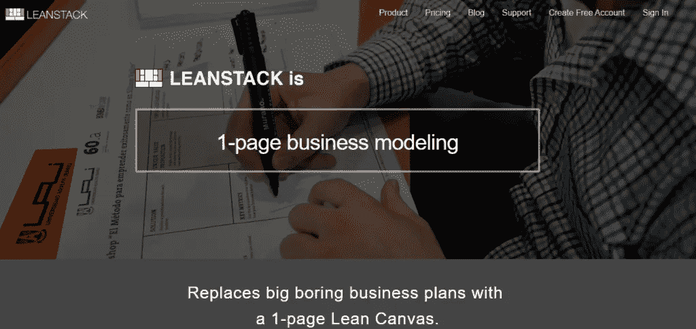
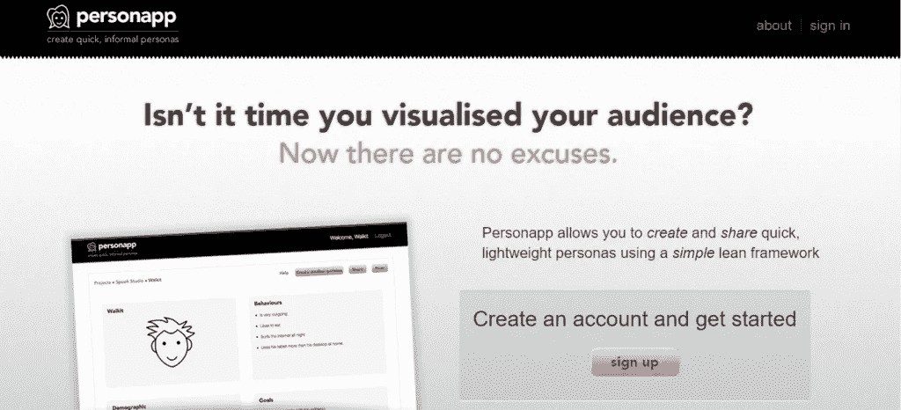
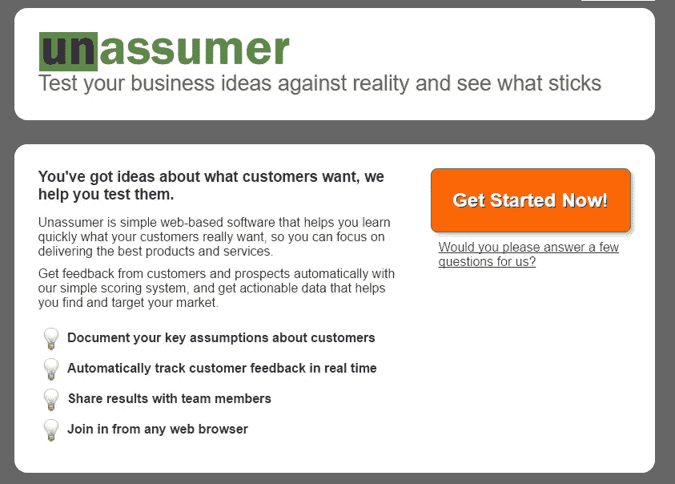
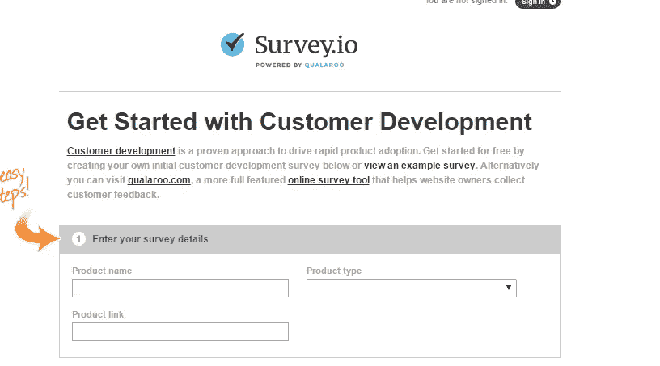
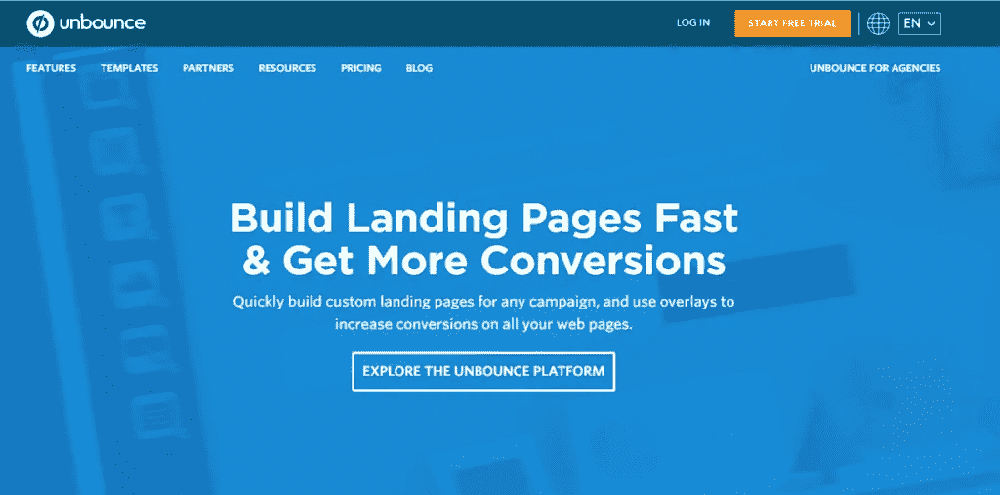

# 精益创业的 21 个基本工具

> 原文：<https://medium.com/hackernoon/21-essential-tools-for-a-lean-startup-8f364119d226>

如果你正在构思一个产品，你可能已经使用了大量的工具。但是，这里有一个很酷的工具列表，我们认为可能对你有用。

> 我在 Ontoborn.com 工作，是一名软件工程师。这是最酷的地方之一。我们帮助初创公司构建他们的 SAAS 平台、移动应用和手表应用。如果你正在运营一家初创公司，需要任何软件开发方面的帮助，请随时给我们写信，地址是 contactus@ontoborn.com。我们以极具竞争力的价格提供极高质量的产品。

# [精益画布](http://leancanvas.com/)

如果你是一家早期创业公司，你最不想做的事情就是写一份 30 页的商业计划书。如果你把你的商业模式记录在一页纸上，那不是很好吗？它会让你专注于实际建立你的业务？这个伟大的工具让您通过一个简单的 web 界面来采用业务模型画布的原则。如果您喜欢，可以创建多个画布，与其他人协作和共享，并在以后再次访问。它改编自[商业模式工具箱](http://www.businessmodelgeneration.com/)，这是 Ash Maurya 的创意，Ash Maurya 是 [Running Lean](http://www.runningleanhq.com/) 和[成功博客](http://www.ashmaurya.com/)的作者。我们在工作的每个项目中都使用这种方法，你也应该这样做。这是一个救命稻草，因为它让你从一开始就专注于重要的事情。

# [个人应用](http://personapp.spookstudio.com/)

好吧，这是一个无耻的插件，但由于没有解决方案，我们决定自己建立一些东西。我们喜欢创建快速、非正式的用户角色来帮助我们(&我们的客户)开始考虑我们为之设计的人。在许多项目将手写的人物角色、word 文档、Fireworks & Balsamiq 模型拼凑在一起之后，挫败感太大了，于是 Personapp 诞生了。为每个项目创建多个角色，并导出以供共享或打印。它仍处于测试阶段，但你可以注册一个邀请。

# [取消用户](http://www.unassumer.com/)

这是精益创业工具的一个新的补充，但仍然很有价值。Unassumer 由客户开发专家兼作家 Brant Cooper 创建，帮助您快速了解客户真正想要的是什么，这样您就可以专注于提供最好的产品。通过简单的评分系统自动获得客户和潜在客户的反馈，并获得可操作的数据，帮助您找到并锁定市场。

# [接吻感悟](http://www.kissinsights.com/)

KISSinsights 为您的客户提供了一种告诉您他们需要什么的方式。问一个(或两个)问题，你的客户会看到它从你网站的右下角滑上来。对反馈空间的一个巧妙的小补充。

# [Survey.io](http://survey.io/)

通过客户开发调查测试产品/市场适合性的一个很好的工具。使用他们的标准模板在几秒钟内创建一个调查(或使用 KISSinsights 创建您自己的调查)。

# [谷歌应用程序](http://www.google.com/apps)

精益创业有这么多(免费或非常便宜的)工具。文档(电子表格、演示文稿、页面、表格等)。你可以像使用 Office 或 iWork 一样使用它们，但你也可以根据不同的需要来修改它们。例如，我们使用[谷歌表单进行用户调查](http://www.spookstudio.com/blog/customer_surveys_-_free__easy/?strUniqueID=321BE58B-C4DA-7B58-E1DD61827C729D32)。

# [解锁](https://www.unbounce.com/)

Unbounce 让您…..[继续阅读](https://ontoborn.com/blog/essential-tools-for-a-lean-startup/)

# 参考

[Inc42](https://inc42.com/resources/15-essential-tools-for-every-lean-startup/)

[调试](http://blog.debugme.eu/essential-startup-tools/)

> [黑客中午](http://bit.ly/Hackernoon)是黑客如何开始他们的下午。我们是 T21 家庭的一员。我们现在[接受投稿](http://bit.ly/hackernoonsubmission)并乐意[讨论广告&赞助](mailto:partners@amipublications.com)机会。
> 
> 如果你喜欢这个故事，我们推荐你阅读我们的[最新科技故事](http://bit.ly/hackernoonlatestt)和[趋势科技故事](https://hackernoon.com/trending)。直到下一次，不要把世界的现实想当然！

