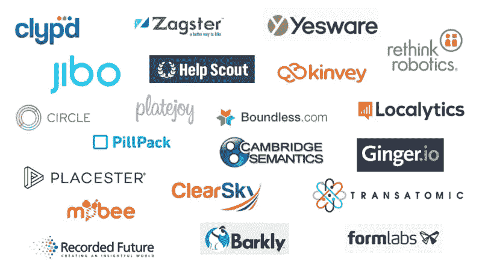

# 21 家顶级波士顿创业公司

> 原文：<https://medium.com/hackernoon/21-top-boston-based-startups-58e2575aa5f5>

## 为什么通用电气要搬到波士顿

美国最富传奇色彩的公司之一的通用电气公司，将离开其位于康涅狄格州郊区的总部，在波士顿建立工厂。通用电气搬迁的一个主要原因是为了更好地“吸引那些喜欢在城市生活和工作的人才”通用电气也在采取行动，以便为自己定位于一个“新的工业时代，这个时代将围绕着软件创新和弯曲金属。”毫无疑问，通用电气希望从波士顿快速增长的创新经济中获益。

城市是文化和创新的中心，波士顿是一个典型的例子。波士顿大都会区是 40 多家博物馆和 85 所私立学院和大学[的所在地](http://www.bls.gov/opub/mlr/2009/06/regrep.pdf)，吸引了来自世界各地的 36 万多名学生。哈佛和麻省理工等学校毕业了一些最优秀和最聪明的学生，如果学生决定留下来，波士顿有充足的人才供应。

此外，波斯顿获得了美国所有城市中第四高的[风险投资金额](http://mashable.com/2013/02/21/top-cities-startups/#2GOlFHFsjmqW)。同样重要的是要注意到[“相似公司的聚集比以往任何时候都更重要”](http://www.economist.com/news/business/21688385-bostons-biotech-hub-surviving-challenge-silicon-valley-clusterluck)并且杰出的科技生态系统往往会吸引顶级人才(就像硅谷一样)。随着科技行业的持续扩张，波士顿正在努力成为领先的创业中心。以下是一些带头冲锋的公司。

## 21 家顶级波士顿创业公司:

1.  [**Jibo**](https://www.jibo.com/)——全球首款家用社交机器人
2.  [**Rethink Robotics**](http://www.rethinkrobotics.com/)-开发了世界上第一个具有常识的机器人，以提高制造环境中的生产率和效率
3.  [**Localytics**](http://www.localytics.com/) -将应用营销&分析整合到用户生命周期中
4.  [**跨原子能源**](http://www.transatomicpower.com/)——开发先进的熔盐反应堆，产生清洁、安全、防扩散、低成本的核能
5.  [**圈**](https://www.circle.com/en) -免费收发钱
6.  [**Platejoy**](https://www.platejoy.com/)——个性化膳食计划&购物清单帮你吃得健康，感觉棒极了
7.  [**Barkly**](https://www.barkly.com/) -为您的最终用户设备提供对现代、零时差和鲜为人知的攻击的免疫力
8.  [**剑桥语义**](http://www.cambridgesemantics.com/) -企业分析和数据管理软件公司
9.  [**记录未来**](https://www.recordedfuture.com/) -实时威胁情报公司
10.  [**form labs**](http://formlabs.com/)——高分辨率 3D 打印。专为您的台式机设计
11.  **-为世界领先的大学、企业、酒店和住宅社区设计、建造和运营自行车共享项目**
12.  **[**Yesware**](http://www.yesware.com/) -直接从 Gmail 或 Outlook 收件箱中跟踪电子邮件并更有效地工作**
13.  **[**clear sky Data**](http://www.clearskydata.com/)-全球存储网络，可简化整个数据生命周期，并将企业存储作为完全托管的服务提供**
14.  **[**Kinvey**](http://www.kinvey.com/) -任何 app 的云后端即服务**
15.  ****-提供更好、更简单体验的全方位服务药房****
16.  ******-通过云技术支持的教育资源，改善数百万学生和教育工作者的教育******
17.  ******[**ginger . io**](https://ginger.io/)——app 使用通过手机收集的传感器数据和自我报告的信息来识别可能需要帮助的人******
18.  ******-购买路径中的众包市场情报******
19.  ******[**Clypd**](http://clypd.com/) - 平台，自动化电视广告的数据增强销售方法******
20.  ****[**帮助侦察**](http://www.helpscout.net/) -客户支持软件，被 60 多个国家的 5000 多家企业使用和信任****
21.  ****[**Placester**](https://placester.com/)-**通过美观、搜索引擎优化的网站和在线营销工具，帮助房地产专业人士增加销售额和利润******

# ******加入一家突破性的科技公司******

******500 英里是一个免费的移动应用程序，让你能够发现、评估并被高增长公司聘用(下载: [iOS](http://ios.500miles.io) | [Android](http://android.500miles.io) )。对 Sprout Social 等公司和 1000 多家公司的洞察包括过去一年的新员工和投资轮数、员工人数增长、人才质量、H-1B 招聘、提供的薪资、员工招聘和离职数量以及性别多样性比率。******

## ******下载 app:[iOS](http://ios.500miles.io)|[Android](http://android.500miles.io)******

*   *******通用电气自 1907 年以来一直是道琼斯工业平均指数***的成份股********

******************************************

> *******[黑客中午](http://bit.ly/Hackernoon)是黑客如何开始他们的下午。我们是 [@AMI](http://bit.ly/atAMIatAMI) 家庭的一员。我们现在[正在接受投稿](http://bit.ly/hackernoonsubmission)并乐意[讨论广告&赞助](mailto:partners@amipublications.com)机会。*******
> 
> *******如果你喜欢这个故事，我们推荐你阅读我们的[最新科技故事](http://bit.ly/hackernoonlatestt)和[趋势科技故事](https://hackernoon.com/trending)。直到下一次，不要把世界的现实想当然！*******

**************