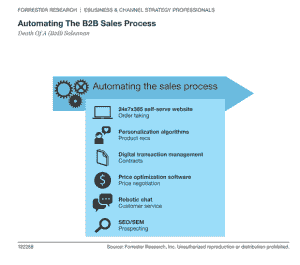
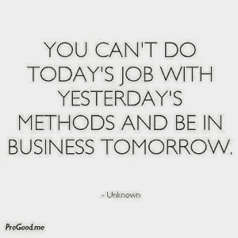
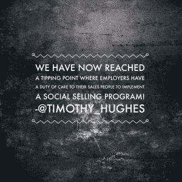
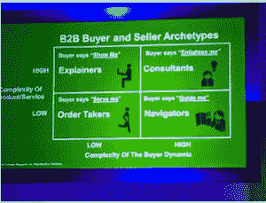
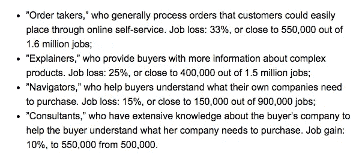
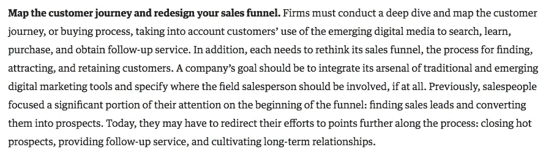

# 到 2020 年，22%的 B2B 销售人员将被搜索引擎取代

> 原文：<https://medium.com/hackernoon/22-of-b2b-salespeople-will-be-replaced-by-search-engines-by-2020-socialselling-da2697536e31>

# B2B 销售人员的出租车？

在 Forrester 的[美国 B2B 电子商务预测:2015 年至 2020 年](https://www.forrester.com/US+B2B+eCommerce+Forecast+2015+To+2020/fulltext/-/E-RES115957)中，他们引用了“74%的 B2B 买家研究，至少一半的工作是在线购买。此外，今天 30%的 B2B 买家在网上完成至少一半的工作采购。到 2017 年，这一比例将翻一番，达到 56%，未来几年，B2B 卖家将会看到大量线下[业务](https://hackernoon.com/tagged/business)转移到线上。”

更进一步，在最近的 Forrester Sales Enablement Forum 上，[Forrester](https://www.forrester.com/Andy-Hoar)的首席分析师 Andy Hoar 的一项研究显示，他预计到 2020 年将有 22%的 B2B 销售职位流失。随着企业采购在网上进行，这意味着传统的 B2B 销售人员正在被搜索引擎、YouTube、网站等所取代。左上角的图是福雷斯特对什么将取代 B2B 销售人员的看法。

# 事情真的那么糟糕吗？

最近和我的一个在“企业”云技术公司工作的朋友聊天时，他们转述了这个故事。一个内部销售电话，是这样的:

**来电者:**“我们想买你们的产品，请问多少钱？”

**销售人员:**“呃，好吧，但是这怎么可能，你不想试玩吗？”

**致电者:**“不，我们已经在网上做了新产品的研究，还在 Youtube 上看了你们的演示。我们已经决定你的是最好的，所以我们只需要检查它是否符合我们的预算，然后我们就会继续下去。”

这意味着 90%的研究是在网上进行的。

这段对话(让我们假设这是一个例外)似乎支持了 Forrester 的研究，但 Forrester 可能低估了事情吗？根据我与公司交谈和合作的经验，我们(在销售方面)已经达到了一个临界点。

# 这对我们 B2B 销售人员意味着什么？

不知道我的朋友是否意识到了这一点，但她已经从一名 B2B 销售人员(在我看来是一名非常受尊敬的人)变成了一名接单员。做一名接单员没有错，但当我们大多数人开始走上销售之路时，这并不是我们想要的。那么，我们该何去何从呢？

# “上移，下移，否则就滚蛋”

我曾经得到过一些关于市场重大变动的建议；“向上走，向下走，否则滚蛋”。你可以把它应用到这种情况。Forrester 左侧的“波士顿广场”展示了随着市场转变为完全以买方为中心，销售人员和销售机构需要如何组织自己。

随着人们越来越习惯于在网上购买(高价值的)B2B 产品，也越来越适应。随着技术细节、定价和产品演示都可以在网上获得，我可以看到购买过程的商品化的继续。

销售人员需要提高他们的水平，虽然不能被认为是领导者，但他们需要成为特定领域或行业的“灯塔”。

如果你从事销售，这里有一些好消息，或者至少是一个解决方案。

# B2B 销售人员需要做些什么才不会变得无关紧要？

让我们更详细地看看来自 Forrester 的数据(请记住，这是美国的数据，因为我是为全球读者写的，你可以质疑这在你的地理位置上是相同的，但是在我居住的英国，美国领先，英国将跟随)。参见下面的面板。除了一个地区之外，都是一片灰暗。

让我重复一下福雷斯特说的话…

**顾问，他们对买方公司有广泛的了解，帮助买方了解她的公司需要购买什么。工作增加:10%，从 50 万份增加到 55 万份。**

公司需要对他们的销售队伍进行重大改革。其中一个策略是在你的整个组织中开展一个战略性的社会销售项目(很明显，从最高管理层开始)和员工宣传项目。

**《哈佛商业评论》说得更有说服力**

# Forrester 报告的更多细节

Forrester 表示，最大的影响将是批发商和分销商的销售代表，但高科技制造商和医疗技术提供商等行业的影响较小。

Forrester 指出，随着越来越多向企业和政府机构销售产品的公司越来越多地涉足电子商务，越来越多的自助式在线研究和订购的趋势很可能会增加。霍尔说，在许多情况下，对于 B2B 买家来说，电子商务“已经消除了与人交谈来解释事情的需要。”

# 将每笔销售交易的成本从 24.48 美元降低到 1.50 美元…

Forrester 表示，向自助式电子商务转变的另一个趋势是在线订单给卖家带来的效率提高——例如，通过降低员工成本和整体运营支出。“我们采访的一家公司估计，它通过销售人员驱动的纸质订单系统将每笔订单的成本从 24.48 美元降低到了 1.50 美元，”报告称。

Forrester 还指出，在某些情况下，B2B 购买者将继续通过销售代表购买，例如大型企业采购的复杂产品和系统。霍尔说，即使在这种情况下，买家和销售代表之间的沟通也越来越数字化。“他们越来越多地通过电子邮件、[实时]聊天和协作软件等数字手段与销售人员进行谈判，而不是通过传统的电话，”报告称。例如，我知道有一家公司通过 Skype 购买了一件价值 35 万美元的产品，但没有进行面对面的会谈。

 [## 订阅我的媒体帖子

### 请在下面输入您的电子邮件地址，以便接收自动更新。

powered.by.rabbut.com](https://powered.by.rabbut.com/77b57529-cb9f-49fe-9be7-198b73f40fe9?c=0) 

我的书《社交销售——影响购买者和变革者的技巧》可以在亚马逊网站上预订

## 延伸阅读:

[汤姆·皮塞罗:《投资回报率的家伙:推销员之死》？如果你还没有关注的话，汤姆有一个很棒的博客。](http://blog.alinean.com/2015/03/death-of-salesman-forrester-says-yes.html)

哈佛商业评论: [B2B 销售人员可以生存，如果他们重新想象自己的角色](https://hbr.org/2015/04/b2b-salespeople-can-survive-if-they-reimagine-their-roles)

为什么联想 CEO 要你在 Twitter 上关注他[http://www . biz journals . com/triangle/blog/tech flash/2015/04/Lenovo-CEO-袁青-杨-twitter.html？ana=twt](http://www.bizjournals.com/triangle/blog/techflash/2015/04/lenovo-ceo-yuanqing-yang-twitter.html?ana=twt) via @TriangleBIZJrnl

非常渴望得到你的评论，同意或不同意，帮助形成辩论。在你的客户和潜在客户中，你自己有什么经验？请在下面留下任何建议或评论。

Tim Hughes 是社交销售的革新者和先驱，他的博客已经成为全世界销售人员获得进入社交销售的提示和技巧的参考点；新手和有影响力的人都一样。蒂姆做了 27 年的配额销售人员，这意味着他会减少废话，说话也不会废话。这个博客不是关于口号，而是关于你如何利用社交来让你更快地超额完成你的配额。

蒂姆·休斯是社交销售方面的演讲者和博主，可以联系@蒂姆·休斯或 Tim_Hughes1@hotmail.com，或者通过 LinkedIn 联系我

*原载于 2015 年 5 月 11 日*[*【socialsellinglounge.com】*](https://socialsellinglounge.com/2015/05/11/22-of-b2b-sales-people-will-be-replaced-by-search-engines-by-2020/?utm_campaign=shareaholic&utm_medium=twitter&utm_source=socialnetwork)*。*

> [黑客中午](http://bit.ly/Hackernoon)是黑客如何开始他们的下午。我们是 [@AMI](http://bit.ly/atAMIatAMI) 家庭的一员。我们现在[接受投稿](http://bit.ly/hackernoonsubmission)并乐意[讨论广告&赞助](mailto:partners@amipublications.com)机会。
> 
> 如果你喜欢这个故事，我们推荐你阅读我们的[最新科技故事](http://bit.ly/hackernoonlatestt)和[趋势科技故事](https://hackernoon.com/trending)。直到下一次，不要把世界的现实想当然！

