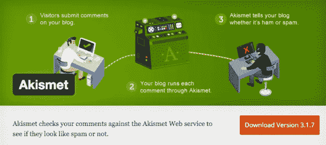
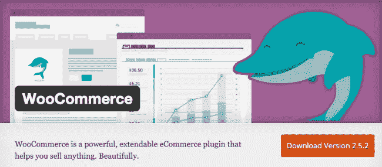
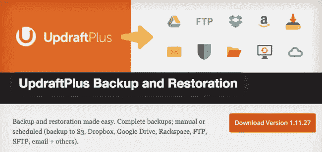
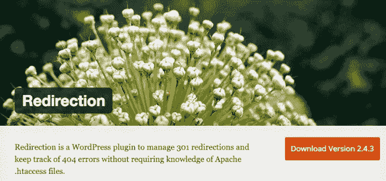

# 22 个排名靠前的免费 WordPress 插件来启动一个网站

> 原文：<https://medium.com/hackernoon/22-top-rated-free-wordpress-plugins-to-start-a-website-c43ad6da9a2e>

建立一个新网站？WordPress 已经有很好的功能来建立令人惊叹的网站，但是有了这些插件，你可以对你的新网站充满信心。从 SEO 工具到安全和内容创建，这个列表包括了你应该考虑添加到你的站点的 22 个插件。

# [Yoast SEO](https://wordpress.org/plugins/wordpress-seo/)

用这个插件在你的 WordPress 站点上获得更好的 SEO。Yoast 通过帮助您选择焦点关键词并在您的文章中使用它们来创建更优化的内容。该插件还具有页面分析功能，可以检查我们有时会忘记的小细节，如关键字标签图像和元描述。

# [重复贴](https://wordpress.org/plugins/duplicate-post/)

这听起来就像是——你实际上可以克隆你的任何帖子或页面。当您创建想要重用的页面模板时，这很有用——每次需要时，只需创建同一页面的新草稿。您可以选择哪些页面角色可以访问克隆页面。

# [阿基斯梅特](https://wordpress.org/plugins/akismet/)

Akismet 会检查您的评论，并让您查看那些看起来像垃圾邮件的评论。你可以选择清除那些你认为是垃圾的评论，插件会保留一个状态历史，这样你就可以跟踪变化。该工具还将扫描任何评论网址，寻找断开的链接或垃圾邮件。

# [联系方式 7](https://wordpress.org/plugins/contact-form-7/)

以前的用户说这是一个必需品，非常容易安装和使用。这是一个简单的插件，允许你管理和定制多个联系方式。有很多像这样的插件，但是为了简单和高效选择这个。

# [WP 超级缓存](https://wordpress.org/plugins/wp-super-cache/)

WP 超级缓存从你的动态博客中生成静态 html 文件。它服务于这个较轻的 html 文件，而不是处理更重的 WordPress PHP 脚本。这个插件将帮助你的服务器处理社交网站的首页外观。

# [文字围栏安全](https://wordpress.org/plugins/wordfence/)

Wordfence 将检查您的网站感染，保护您的网站，并使其更快。该插件可以保护您的网站免受黑客攻击，阻止攻击，并帮助从以前的黑客攻击中恢复。Wordfence 使用来自它保护的每个网站的数据，使插件每天都更好、更有效。

# [WooCommerce](https://wordpress.org/plugins/woocommerce/)

WooCommerce 让你能够以无缝的方式将电子商务整合到你的网站上。它是为与 WordPress 网站完美配合而设计的，30%的在线商店都在使用它。如果你想在你的网站上销售、运输和收款，不用再找了。

# [谷歌 XML 网站地图](https://wordpress.org/plugins/google-sitemap-generator/)

这个插件通过创建一个 XML 站点地图来帮助搜索引擎更好地索引你的内容，以便引擎更有效地检查你的站点。当你发布索引内容时，它会通知所有主要的搜索引擎，并且不会降低你网站的速度。双赢！

# [禁用注释](https://wordpress.org/plugins/disable-comments/)

这可以用来禁止整个网络的评论，或者只禁止某些帖子类型的评论。有利于避免垃圾邮件问题的内容，评论是不必要的。

# [iThemes Security(以前更好的 WP Security)](https://wordpress.org/plugins/better-wp-security/)

如果没有某种保护，你的 WordPress 站点很容易受到攻击。当你安装这个插件时，你将有 30 多种方法来保护你的网站。它修复了安全中的常见漏洞，并允许轻松激活您想要使用的任何功能。

# [升级加备份和恢复](https://wordpress.org/plugins/updraftplus/)

如果需要，Updraft 会安排备份并简化恢复。这样，如果你有一个服务器崩溃或安全漏洞，你有一个可靠的网站和所有相关文件的备份。

# [复印机](https://wordpress.org/plugins/duplicator/)

有了这个插件，你基本上可以把整个网站移动到不同的位置。如果需要，这是创建站点备份的另一种方式。

# [高级定制字段](https://wordpress.org/plugins/advanced-custom-fields/)

如果你想要更灵活的数据，使用这个插件，发现强大的，专业的，直观的领域。您可以从多种输入类型中进行选择，并直观简单地创建新字段。这个插件节省了时间，简化了创建模板的过程，这在你创建一个新网站时是非常重要的。

# [WP 的谷歌分析仪表板](https://wordpress.org/plugins/google-analytics-dashboard-for-wp/)

当你开始你的网站时，你肯定会想用谷歌分析来追踪你的网站的各个方面及其功能。有了这个插件，当你使用 WordPress 时，你的分析统计数据会更容易被访问。就在你的仪表板屏幕上，你会有实时的用户数量和流量来源，关于会话和页面视图的信息，等等。

# [重定向](https://wordpress.org/plugins/redirection/)

重定向可以帮助您清理网站中可能存在的问题。特别是，它跟踪 404 个错误和 301 个重定向，并为所有重定向的 URL 保留完整的日志。

# [WP-优化](https://wordpress.org/plugins/wp-optimize/)

这个插件可以帮助你优化你的网站，不需要太多的手工劳动。您可以选择从评论、引用通告和回复中删除垃圾评论、垃圾评论和元数据。您可以启用或禁用引用通告、注释和自动优化。查看插件的详细信息，获取其能力的完整列表。

# [短码至尊](https://wordpress.org/plugins/shortcodes-ultimate/)

安装 50 多个简短的代码，帮助轻松创建标签，按钮，框，不同的滑块，响应视频和更多。

# [快速安全接触表](https://wordpress.org/plugins/si-contact-form/)

轻松添加、删除和重新排序字段，并创建允许用户向您的网站管理员发送电子邮件的联系人表单。包括多种形式、确认电子邮件和邮件后重定向。

# [back pup Free-WordPress 备份插件](https://wordpress.org/plugins/backwpup/)

为您的网站安排完整的自动备份，并决定将内容存储在何处以及存储哪些内容。您可以使用一个简单的。如果需要，压缩文件(安全总比抱歉好。)在这个插件的专业版中，有很多额外的功能可能会很有用，但是免费版非常棒。

# [WordPress 的 mail chimp](https://wordpress.org/plugins/mailchimp-for-wp/)

有了这个插件，你可以很容易地连接你的 MailChimp 和 WordPress 账户。这样，您就可以在网站上添加注册方法，并为您的 MailChimp 列表获取更多订户。注册表单在视觉上很有吸引力，用户友好，并且经过了移动优化。

# [忍者形态](https://wordpress.org/plugins/ninja-forms/)

Ninja 表单框架提供了一种拖放方法，可以轻松地创建表单和管理提交。使用该工具，您可以管理的表单、字段、电子邮件、操作或提交的数量没有限制。

# [WP Smush](https://wordpress.org/plugins/wp-smushit/)

对降低网站速度的庞大数据说“再见”。使用 WP Smush，通过减少图像文件大小、提高性能和提升 SEO 来减轻负载。你的网站加载速度越快，搜索引擎就越喜欢它。

如果你正在建立一个新的网站或者更新你现有的网站，考虑一下这些插件，让你的工作更加简单有效。请在评论中告诉我们是否有你认为有用的插件没有列在这里——我们很乐意听到你的建议！

> [黑客中午](http://bit.ly/Hackernoon)是黑客如何开始他们的下午。我们是 [@AMI](http://bit.ly/atAMIatAMI) 家庭的一员。我们现在[接受投稿](http://bit.ly/hackernoonsubmission)并乐意[讨论广告&赞助](mailto:partners@amipublications.com)机会。
> 
> 如果你喜欢这个故事，我们推荐你阅读我们的[最新科技故事](http://bit.ly/hackernoonlatestt)和[趋势科技故事](https://hackernoon.com/trending)。直到下一次，不要把世界的现实想当然！

