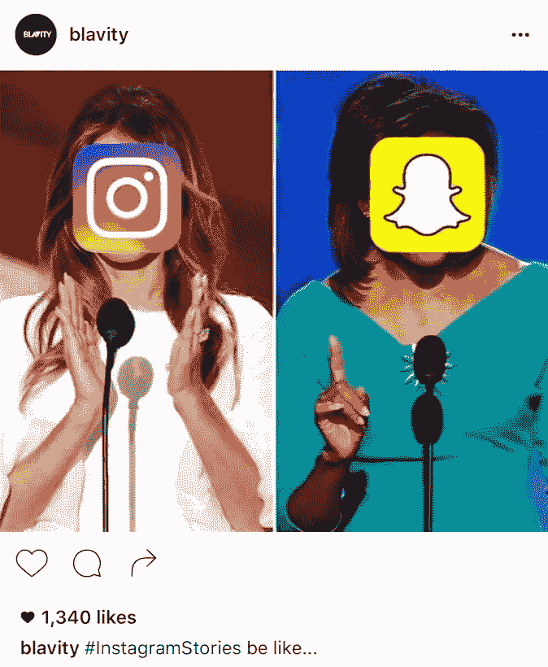

# 24 小时后:我应该在哪个故事上分享这个？

> 原文：<https://medium.com/hackernoon/24-hours-later-which-story-should-i-share-this-on-b2f79929b04f>

昨天的大型社交媒体新闻围绕着 [Instagram 字面上的碳拷贝 Snapchat](https://hackernoon.com/instagram-is-now-officially-haunting-snapchat-b2151d32653b#.y9xoutq2c) 。可以说，围绕“InstaSnap”的讨论在社交网站上引发了精彩而有趣的对话。

This is funny regardless of the side of the aisle you’re on.

虽然许多社交媒体用户正在就是否将 Instagram 作为一个“消失的内容”平台而相互争论，但我从过去 24 小时与人们的讨论中列出了一些想法:

## Instagram 故事的优点

*   **更容易找到人**一些 Snapchat 用户抱怨在平台上很难找到人。自从我们使用 Instagram 多年以来，我们已经与我们经常在 insta gram 上聊天的大多数人建立了联系，所以现在更容易找到和看到更多内容。
*   **非千禧一代会用这个功能**我的一个同事从来不会厌倦 Snapchat，因为她怕自己看不懂。我已经看过她的第一个 Instagram 故事，作为一个千禧一代，我印象深刻:)
*   有些人说，如果 Instagram Stories 真的成为“一件事”，他们真的看不出 Snapchat 有什么意义。这些人说，他们现在会尝试一下，因为他们最喜欢的两个应用程序基本上是一个。
*   **有可能吸引更多的观众**如果你在 Instagram 上已经非常受欢迎，那么使用 Instagram Stories 实际上是一个更好的主意，特别是如果你在那里的粉丝比在 Snapchat 上的多。货币化也可能会更容易。
*   **搞笑故事时长 15 秒**你现在在每张照片中还有 5 秒钟的分享时间。
*   **IG Stories 对学习你的 IG reach 很有帮助**我的第一个 IG story 有 540 次浏览，是我在 Snapchat 上浏览次数的两倍多。看到我的关注者中有多少是平台上的日常活跃用户(这样一个行话短语)也很有趣。
*   **您可以在 Snapchat 上分享您的故事，但忽略联系人**当您向您的故事发送快照时，您的所有关注者都会看到。在 Instagram 上，如果你给你的故事发一张照片，你可以选择你可以隐藏故事的人，这样会很方便。
*   **故事可以直接上传到您的时间线**“捕捉”您故事中的精彩内容？你现在可以直接把它发送到 IG 编辑器，而不必先下载。也可以保存你的个人故事。

## Instagram 故事的缺点

*   一些用户看不到这一点许多用户看不到拥有“做同样事情的平台”的意义然而，这些用户也不了解竞争激烈的市场。我会给人们大约一个月的时间来适应，就像他们对非时间表所做的那样。
*   **担心这会导致更多的广告**一些用户表示，他们希望这不会导致更多的广告，因为他们已经厌倦了在我们的众多平台上看到它们，包括 Instagram。
*   **没有面部滤镜(还没有)**没有小狗狗？没有花冠？我坚持使用 Snapchat。
*   没有前闪光灯(还没有)说真的，没有前闪光灯，我怎么在去酒吧的路上自拍呢？
*   如果一个用户关注了很多人，IG Stories 功能可能会很快让他们感到厌烦。是的，简单地点击取消关注按钮很容易，但是仅仅因为你不想看到一个人的故事并不意味着你不想看到他们的照片。
*   **编辑:允许截图**如果其他用户给你的视频截图，Instagram 不会提醒你。小心了。

*你个人对 InstaSnap 有哪些利弊？分享给我或者发微博到*[*yeahitslex*](http://twitter.com/yeahitslex)*。*

> 黑客中午是黑客如何开始他们的下午。我们是这个家庭的一员。我们现在[接受投稿](http://bit.ly/hackernoonsubmission)并乐意[讨论广告&赞助](mailto:partners@amipublications.com)机会。
> 
> 如果你喜欢这个故事，我们推荐你阅读我们的[最新科技故事](http://bit.ly/hackernoonlatestt)和[趋势科技故事](https://hackernoon.com/trending)。直到下一次，不要把世界的现实想当然！

