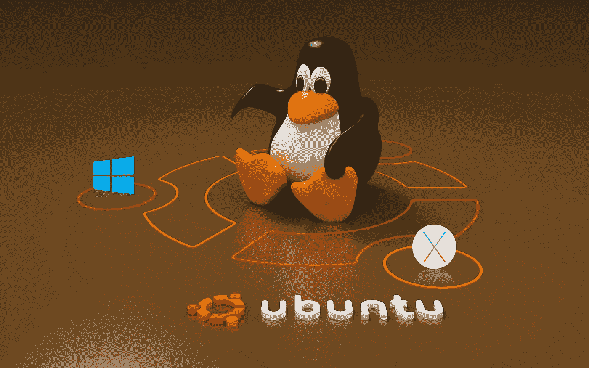
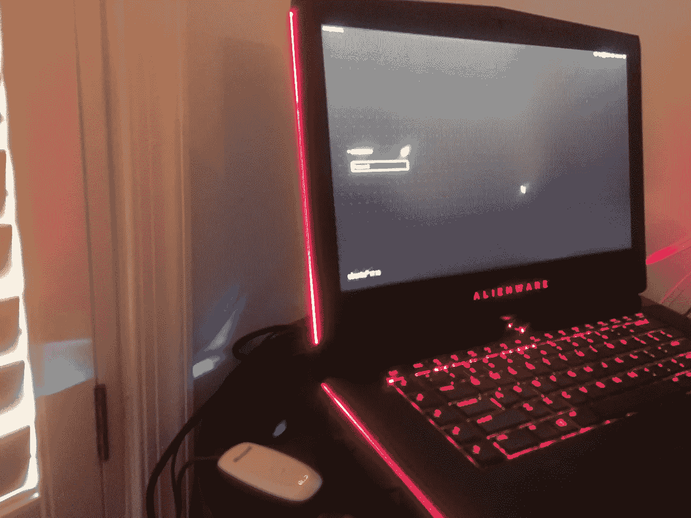
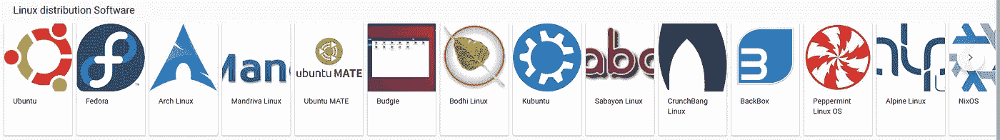
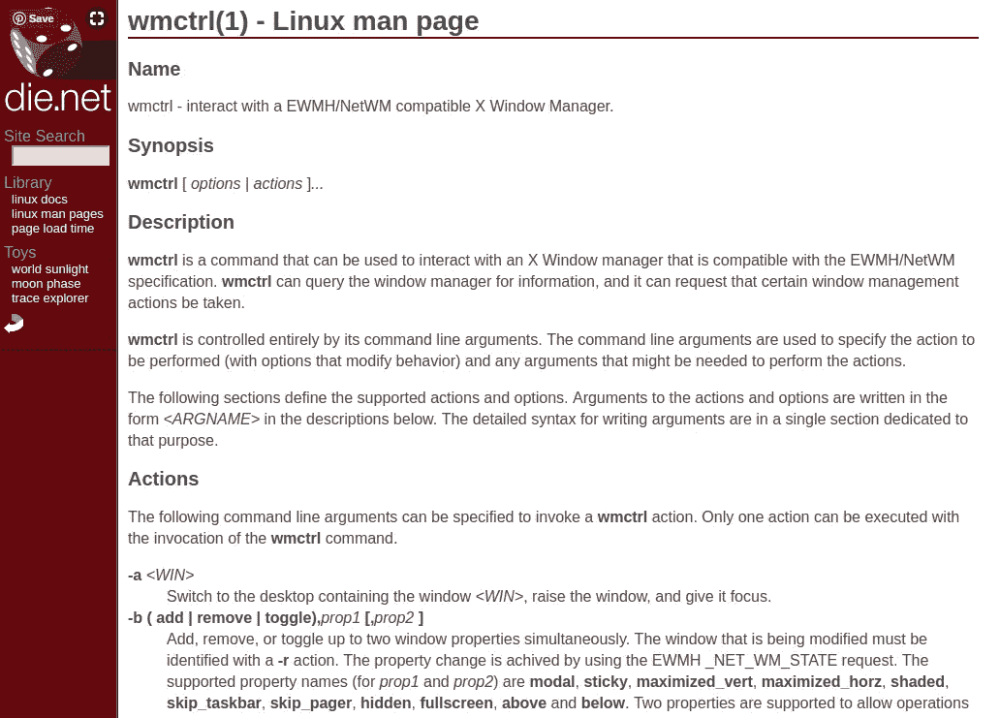
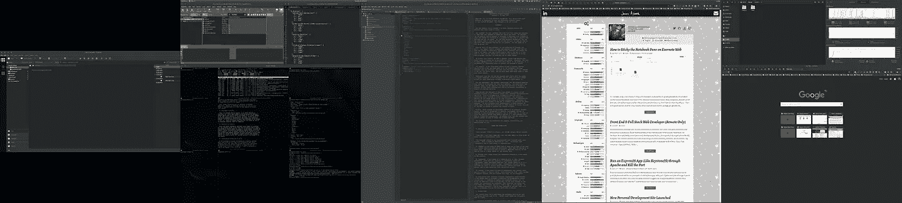
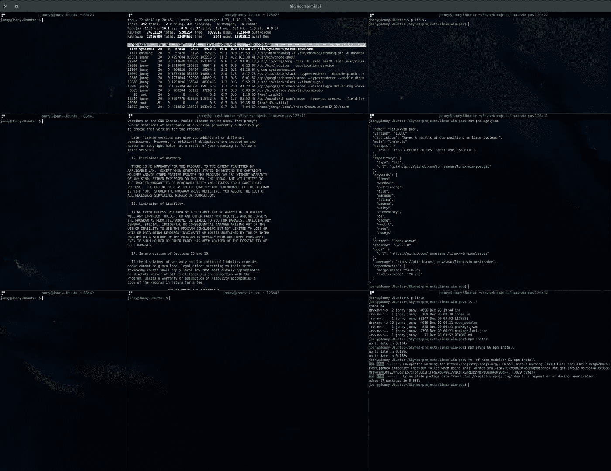

# 作为一名在 Ubuntu 上生活了一周的软件开发人员，我学到了 24 件事

> 原文：<https://medium.com/hackernoon/24-things-learned-as-software-developer-on-ubuntu-for-a-weekish-5b7b0da5d4b5>



我已经做了超过 15 年的网络和软件开发人员。那些年里，我用过 95 年以来的所有 Windows 发行版，也用过所有的 Mac OS X。我运行过台式机设置、移动笔记本设置、台式机替代笔记本设置，以及在多台带有 KVM 交换机、VNC、RDP 和 SSH 的机器上同时运行多达四台外部显示器。我使用了每一件硬件，从 AlphaSmart 到 Palm Pilot 到 Raspberry Pi 再到 iPad 1，我在发布日排队等了 12 个小时。更不用说网关，戴尔，VAIOs，Macbooks，定制钻机，或我闪亮的新外星人 15 R3:)



Courtesy My iPhone and Really Poor Lighting

在所有这些设备上，我都以这样或那样的方式编写过软件，开发过内容，或者在上面进行过黑客攻击。我也几乎玩过每一款游戏——我还记得中学时在我的 TI-83 上登录了数百个小时的 Snake。当然，作为一名游戏玩家，没有什么能与 Windows 相提并论。差距已经如此之大，以至于任何人都要过很长时间才能赶上(尽管这不是绝对正确的，我将在后面详细讨论)。然而，这篇文章不是关于那个的。我只是想让你知道我从哪里来。

这篇文章是关于作为一个软件开发者从主流操作系统(Windows，Mac)到 Linux 的过渡。

作为一名开发人员，为了生存，我必须学会与几乎所有的环境一起工作。在这些环境中，Linux 实际上是不可避免的。不是说我想避免它。这真是一项了不起的技术。我一直认为这可能是有史以来最重要的开源项目。然而，令我惊讶的是，我从未真正在 Linux 环境中工作过&生活过。是的，我可能多年来每天都在云托管的 Linux 机器上运行，或者在 VirtualBox 或 Parallels 上运行 Ubuntu 16.04，或者在我的办公桌下运行一个小的 Raspberry Pi rocking Ubuntu，但是我从来没有真正使用过超过 Apache、MySQL、PHP、Node、SSH、VNC…终端的东西。

CLI。

我以为我*知道* Linux…

因此，当我决定是时候做出改变，运行成熟的——在其辉煌中——Linux 桌面环境(又名 Ubuntu 16.04 w/ Unity)时，我说“没问题。”我妻子说，“你知道会发生什么，对吗？”

我做了个鬼脸…

反正我已经没膝了。在 VM 或 WSL 上的 Node & Docker 中开发非常慢(实际上，I/O 操作最多只有原生 Linux 的 30%)。所以，每当我因为安装 Ubuntu 失败而毁掉主引导记录时，我就继续复活它(感谢上帝有备份)。请注意，我正在安装一个双启动设置，Windows 10 在另一边，NVMe 和 SATA 驱动器混合使用。所以，当我责怪我的妻子让我失望时，这显然是不可避免的。

> 如果你正在尝试这样的设置，一定要验证你的 UEFI 安全启动设置(我推荐谷歌)，否则你将会修复 MBR 不止几次。

不管怎样，一两个不眠之夜之后，我终于成功实现了 Windows 10 和 Ubuntu 16.04 双启动！然后，我做了一个明智的决定，在开始配置我的系统(安装应用程序，配置快捷方式，或者让它变得像我的 Windows & Mac 环境一样舒适)之前，先睡一会儿。这是一个明智的决定，因为这将被证明是一个不小的任务…

写这篇文章的时候，我已经有 7-10 天了。我继续调整我的操作系统…我继续屈服于不眠之夜…我真的不知道什么时候会结束…

然而我微笑着。


Courtesy AMC/Gene Page

你看，尽管我当时对 Linux 知之甚少，但我仍然知道，只要稍加修改，我就可以做任何我需要的事情。我是一名程序员，因此拥有快速/简单的脚本访问系统的优势似乎是一个很棒的概念。

这被证明是完全正确的。

作为一名节点开发人员，我已经用它编写了[一个简单的窗口平铺管理器，在给定一些常见依赖项(wmctrl，xprops)的情况下，它可以在多种风格的 Linux](https://github.com/jonnyasmar/linux-win-pos) 中工作。我已经配置了自定义快捷方式，只需点击一个键就可以智能地启动我的多应用开发环境，或者只需点击鼠标就可以将鼠标指针从一个桌面移动到另一个桌面。我终于完全控制了系统的资源使用！

嗯，所有这些都可以在 Windows & Mac 上完成，不是吗？可以的。我知道因为我做过。但是还是有区别的。Linux 让人身临其境。你需要了解你的机器。终端实际上让你一直盯着操作系统的内部。你住在里面。一定有联系。

> 你一定要做柴可夫斯基。


Tsaheylu: Na’vi word meaning ‘The Bond’; Photo Credit [james-camerons-avatar.wikia.com](http://james-camerons-avatar.wikia.com/wiki/File:Tsahaylu.png)

为此，你与机器融为一体。

你明白吗？因为我没有。差远了。一周过去了，我还是不确定我知道。但是当我决定开始在 Evernote ( [，因为 Linux…](/@jonnyasmar/how-i-stickied-the-notebook-pane-on-evernote-for-the-web-36c4dfa4a4e8) ，我也不得不黑掉它)上记下一些想法时，我意识到我在 5 分钟内想出了 20 多个想法。所以，给你。

作为软件开发人员(和游戏玩家)我学到的(和/或被提醒的)24 件事！)在 Ubuntu 上生活一周:

# 1.你可以做任何事…

是的，我一直怀疑这一点。但这是真的。如果你想定制某样东西，主题化某样东西，自动化某样东西，监控某样东西，简化某样东西，或者以某种方式侵入你的操作系统，你很可能可以！而其他人大概已经有了，那就更好了！GitHub 上托管了这么多 Linux 项目；这是压倒性的。AskUbuntu.com 是一个更有价值的资源，它回答了你能想到的任何问题。不要像我一样被愚弄，相信你看到的资源已经过时了，仅仅因为它已经有十年的历史了。Linux 经受住了时间的考验，许多这些老化的资源仍然是技巧、诀窍和知识的金矿。

# 2.这真的很容易打破

这就是察赫鲁的切入点。您需要对您的系统了如指掌，因为从终端破坏您的安装是毫不费力的。你会看到很多教程，或者 AskUbuntu 的答案告诉你:

```
sudo this thing && that thing
```

不要盲目相信他们！ **sudo** 授予命令“超级用户”权限。换句话说，一旦授予该命令访问权限，它就可以修改系统上的任何内容。所以，在你确切知道这个命令在做什么以及你的操作系统的哪些部分依赖于被影响的文件之前，不要做任何事情。Linux 非常强大，非常安全，并且非常容易监控和维护，但是伴随着强大的能力而来的是巨大的责任。您可以轻松地:

```
sudo rm -rf /
```

就像……****…您的整个文件系统都消失了……***噗** * …所以，像爱护自己的孩子一样爱护您的文件系统。因为一旦你在 sudo 中输入密码，就没有回头路了。关于这一点:**

# **3.一切都是文件！**

**几乎所有负责运行 Linux 操作系统的东西都只是文件系统中的一个文件(一直从终端盯着你)。在很大程度上，这就是为什么知道你的文件系统是如何被使用的如此重要。你的磁盘，你的硬件设备，你的内存，你的应用，配置，任务，一切！它们都是文件。它们都可以被伪造、转换、移动、链接和同步。你用这些知识做什么可能是任何人的猜测，但我已经遇到了无数的场景，在那里这可能是一场灾难或一个福音。然而，从各方面来看，利大于弊。它大大降低了操作系统的复杂性，并使用户与操作系统的关系变得非常直接。我们应该对个人电脑有更低的期望吗？我认为不是。**

# **4.一切都暴露在你面前！**

**类似地，所有不是文件的东西仍然完全暴露在你面前(可能在某个我还没有找到的文件中)。我说的是更短暂的事情，比如运行进程、网络活动和其他类型的资源使用。这些都可以通过最简单的方式获得，只需谷歌或`apt-get install`就可以获得必要的命令(或参见 **#10** )。**

# **5. [~心在何处](https://www.redbubble.com/people/jonnyasmar/works/29806020-is-where-the-heart-is?p=t-shirt&style=mens)**

**这是一个如此简单的概念，我将不得不在这里多费唇舌，只是为了绝对确定我支持这一段足以公正地对待这个至关重要的概念的实际重要性。**

**~(又名**波浪号**；又名 **shift** + **`** )是 Linux 用来表示当前用户主文件夹的字符。通常是:**

```
/home/<username>
```

> **又名**首页****

**你在操作系统上做的几乎所有事情都存储在这里。设置和配置、缓存、应用程序数据、下载、文档、图片等等。这也是机器上的一个目录，默认情况下，它向登录用户授予显式权限。这里不需要`sudo`。所以，要格外小心这些文件！把这些文件弄乱不一定会破坏你的系统，但会让你的日子不好过。**

**现在，您应该熟悉一下文件系统中的其他几个文件夹。像`/usr/bin`、`/etc`、`/var`等地。然而，这些地方更倾向于面向系统。您需要知道这些地方来监控系统日志、更改服务器设置或服务，或者管理硬件设备。我对所有这些还不是很熟悉，但是我已经掌握了窍门。**

# **6.管理您的终端！**

**由于终端是您在 Linux 中所做的一切的一部分(如果使用不当，对您的操作系统来说是致命的)，所以极其精确地管理这些小漏洞是非常重要的。我在 VirtualBox 的日子里在我的 Ubuntu 中发现了 Terminator，它继续作为一个在本地 Ubuntu 中管理 Linux 终端的奇妙软件。我目前已经将它配置为在一个窗口中加载九个终端，所以保持我的任务有组织和独立是轻而易举的。如果你像我一样喜欢修补，它也是完全可定制的，下至用于给每个终端着色的背景或调色板。**

**还要记住，你可以在任何时候通过点击 **CTRL** + **ALT** +其中一个功能键直接进入一个专用终端，就像任何用户一样。**

# **7.快捷方式，别名，& /usr/bin**

**快捷方式对于愉快的 Linux 体验是必不可少的。令人高兴的是，Linux 在很多方面都有义务。创建快捷方式的两个最简单的方法是向用户的 bash 文件(通常是`~/.bashrc` 或`~/.bash_profile`)添加别名(或函数)，或者向`/usr/bin`添加定制的 shell 脚本。除了能够快速将自定义命令与您想要执行的任何操作相关联之外，您还可以轻松地绑定键和组合键来执行这些命令。根据你的喜好定制这些，它会把所有的想法从你的工作流程中移除，让你真正专注于你的工作。**

****编辑**:鉴于我收到的众多回复(包括这里和 Reddit 上的回复)，我觉得有必要指出`/usr/bin`不是你想要使用的目录！我还没有探索这个选项，但是大多数建议似乎是在 **home** 中创建你自己的 **bin** 目录，然后在你的`$PATH`变量中链接它。**

# **8.有一个好的键盘**

**提到所有的终端、命令、快捷方式和别名，您可能会想，“天哪，听起来需要输入很多东西！”**

> **确实是。**

**你必须有一个优秀的键盘来捣鼓。我怎么强调这一点都不为过。尽可能频繁地输入`sudo`命令并键入您的密码，您会希望第一次就正确无误。大多数 Linux 版本在错误输入密码后会强制延迟三秒钟。只需要这样做三次就会花费你超过 10 秒的时间…如果你是一个程序员，你就会知道这样的时间是多么具有破坏性！而且令人抓狂…我们都知道一个在 tilt 上的程序员根本不是一个好程序员。**

# **9.不要放弃！**

**虽然必须输入 11 次密码可能会导致严重的崩溃，但不要绝望！你会找到路的。**

> **生活在 Linux 中需要勇气。**

**这需要毅力。有时候，你只需要把一个问题留到下一天。下次它变得令人讨厌时，再给它一个谷歌。最终，你会把正确的几个词串在一起，AskUbuntu 的答案就会出现，从而扭转局面。妈妈说会有这样的日子，她是对的。Linux 充满了特质、不一致性和看似不可能的事情。但是这个社区是巨大的，而且这个操作系统真的就像你所期望的完美开源软件一样多功能(并且可以被黑客攻击)。**

# **10.有一张小抄**

**为了让你在谷歌上省去很多麻烦和浪费的带宽，给自己留一份备忘单。我仍在努力工作，但我建议您记下您使用的所有常规命令。别名所有更长，更棘手的命令，并消除思维。如果需要的话，把这份小抄打印出来，贴在墙上。在 Linux 中操作时，有太多的命令、文件夹和技巧需要记住，试图记住所有的东西是疯狂的。当然，你最终可能会(虽然你很可能不会…)，但与此同时，省省麻烦吧。**

# **11.这是一个修补匠的乌托邦**

**如果你喜欢修补，你会喜欢 Linux。几乎一切都是可定制的。如果你运行的是像 Unity 或 Gnome 这样的桌面环境，除了这些桌面环境中的内置系统设置之外，还有几个不同的工具，比如 **unity-tweak-tool** 和 **gnome-tweak-tool** 。正如我之前提到的，Linux 中的几乎所有东西都可以简化为一个文件。因此，进一步深入操作系统，你会发现你几乎可以调整一切，包括启动屏幕，窗口装饰，自动化任务，以及应用程序配置或行为。也有大量的资源为很多流行的 Linux 发行版定制了主题。关于这一点，也有无数的 Linux 发行版&供你尝试！每一个都有自己独特的关于操作系统应该是什么的观点。这是 Windows 或 Mac 所没有的。**

**然而…**

# **12.你永远不会测试每一个发行版/版本…**

**也就是说，一生中没有足够的时间来测试每一个 Linux 发行版和版本。在选择你的发行版之前，做好你的功课，研究各种发行版。正如我上面提到的，每一个都是独一无二的，每一个都有一个与之相关的学习曲线。虽然一些桌面环境可以很容易地安装在现有的发行版上——例如 Ubuntu，在 Unity 或 Gnome 环境下运行得特别好——但许多环境却不能，许多发行版需要从头安装才能获得真正的体验。此外，这些都是浑水。像这样篡改一个已经建立的发行版是破解你的系统最简单的方法之一。**

****

**Google’s carousel when you search “linux distros”**

# **13.你会觉得自己生活在 90 年代**

****

**An example of a Linux Man Page; which you will be perusing frequently.**

**有时候生活在 Linux 中会带来一种怀旧的感觉。虽然操作系统本身已经完全跟上了最新的趋势，甚至在许多领域突破了极限，但社区仍然充满了程序员和开发人员。许多人已经知道如何解决小问题，甚至有更多的人已经在完全基于终端的界面中生活了几十年。因此，网络上可用于 Linux 的资源非常老套。文档——即使是官方的——看起来像是 90 年代的东西，你很难在教程或应用程序页面中找到截屏。现在，这并不奇怪，因为很多内容实际上是在 90 年代开发的。请记住，正如我前面提到的，Linux 经受住了时间的考验，这些内容也是如此。如果你能克服审美上的不足，你会毫不费力地找到你想要的任何东西。**

# **14.你会觉得自己来自未来**

**同时，Linux 也会让你感觉你来自未来。这是因为同样的程序员和开发人员社区，对闪亮的文档页面漠不关心，却在幕后开发所有最新、最棒的技术。所以，从很多方面来说，Linux 都处于风口浪尖。**

> **它还经过了重新架构，并定制为适合在无数形式的硬件上工作，并且已经是非桌面计算领域无可争议的世界领导者。**

**当你按照自己的喜好调整操作系统时，它开始拥有自己的生命。与 Windows 或 Mac 不同，操作系统不会被强行灌输给你。这是一个你徒手生的生物。这种人与技术的融合象征着一个我们正在快速接近的世界，一个由于 Linus Torvalds 的努力而成为可能的世界(生日快乐！！)和极具创新性的 Linux 社区。**

# **15.Ubuntu 17.10 + Gnome 3 太牛了！**

**14 分，我提到终端大约 100 次，桌面环境一次也没有提到。然而，真正带来完整体验的是桌面环境。我了解所有的 **vim** 和 **xmonad** 的事情，但我是一名 UI 开发人员…**

> ****我喜欢真实的桌面环境。****

**如果 Linux 不能给我带来这一点，**这将是一个交易破坏者**。**

**幸运的是，在 Ubuntu 16.04 + Unity 的一些成长的烦恼之后，我升级到 Ubuntu 17.10 给 Gnome 3 打了一针，好家伙是不是很神奇！Gnome 3 很快，用户友好，看起来很棒！**

**它还能正确定位桌面上的窗口，这是一大优势。Unity 的窗口位置计算真的很不靠谱，这是任何一个窗口平铺管理者的噩梦。**

**不用说，我还没有测试每个发行版或版本(因为我上面提到的原因)，但是 Ubuntu 17.10 + Gnome 3 肯定是我目前最喜欢的。突出一个黑暗主题，把[红移](http://jonls.dk/redshift/)放在最上面，你就搞定了:**

****

# **16.它能做(大部分)他们能做的一切**

**是的，是真的。Linux 可以做到这一切！不要让任何人愚弄你。如果 Windows 或 Mac 可以做到，Linux 也可以。Linux 甚至在一个叫 Wine 的程序的帮助下运行很多 Windows 应用。不是说你*真的*需要。我不知道。无论您需要什么样的应用程序，都有一个非常可靠的 Linux 模拟版本，随着像 Electron 这样的框架的出现，跨操作系统开发的困难正在成为过去。例如，Slack 是 Windows、Mac、& Linux 之间的直接一对一匹配。**

**当然，有些事情有点复杂，但是我会在稍微赞美一下 Linux 之后再讨论这些问题:**

# **17.有一个恰当的说法**

**如果你运行 Ubuntu，你将可以使用这个叫做 Aptitude 的小工具(又名 **apt** )。这是一个看不见的程序，你可以召唤它飞向广阔的网络世界，为你获取 90%的应用程序，让 Linux 做你想做的事情。它智能地管理所有这些应用程序*和*使它们保持最新(根据您的要求，您应该经常这样做)。如果你学会了如何很好地使用这个工具，那么让 Linux 做你想做的事情是没有问题的。只是在使用 Aptitude 移除包时要小心…很多很多东西依赖于这个家伙管理的包。所以，如果你去掉错误的东西，事情往往会变得不可收拾。**

# **18.你可以在 Linux 上玩游戏！**

**不管人们怎么说，你可以在 Linux 上玩游戏。实际上，在我看来比你在 Mac 上做得更好。Steam 现在甚至原生运行在 Linux 上，这很了不起。我以最大设置运行火箭联盟(除了 4K)，获得了最大 FPS 和八次 ping…(ping 可能是我的千兆互联网的功劳，但仍然…很高兴知道 Linux 正在超越我的以太网)。遗憾的是，4K 游戏的性能仍远不及 Windows，但我预计 Linux Nvidia 驱动程序将很快在这一领域赶上来。**

# **19.自动化**

**自动化在 Linux 上很容易。编写一个 shell、Python 甚至节点脚本来执行一些经常使用的任务就像编写脚本一样简单。在 Linux 中没有开销，crontab(Linux 的主要任务调度程序)需要大约五秒钟来学习。因此，只需编写任务代码，将其添加到 **crontab** 中，就大功告成了！**

# **20.丢失的包裹是皮塔饼**

**正如我前面提到的，删除错误的包真的会很快搞糟你的系统。但是，比事情变得更糟的是，一个不必要的包裹不见了。这些往往会破坏系统中一些微妙的特性，而且很难追踪到。这是我说过的事情之一**

> **不要放弃**

**虽然你最终可能会打破一些东西，完全不知道如何找到解决方案，甚至不知道谷歌搜索什么，但你会成功的！接受这个问题一两天，你就会找到答案。这是你必须与你的操作系统结合的另一部分。对 Linux 有点信心，事情会解决的。**

# **21.硬件很难…(但是软件很容易！)**

**在 Linux 领域，即插即用已经死了。不要指望你购买的任何设备都能立即工作，除非是你在百思买货架底部抓起的 1990 年代的键盘(见 **#8** 和 **#13** )来连接你的树莓派。不，显示器、鼠标、键盘、耳机……它们都需要一点点细心呵护。是的，只是司机，这看起来很简单，对吗？**错了**。这些驱动程序中的大部分都是以自由开源软件(FOSS)的形式开发的，并且是由那些顽固到相信专为 Windows 机器设计的硬件的小团体开发的。这意味着有一百万种硬件排列还没有被考虑进去。因此，通常情况下，您需要挖掘各种解决方案，让您的硬件按照您购买时的期望运行。**

**也就是说，软件很简单！有趣的是，使用 Linux 文件系统伪造硬件实际上比让实际的硬件工作更容易。然而，这最终让我们设计出了一些非常酷的技巧:**

# **22.WebEx 屏幕共享黑客**

**如果您在 Windows 上使用 WebEx for Desktop，您会失望地发现 Linux 版本不支持演示(屏幕共享)。幸运的是，Linux 很容易破解！通过直接访问文件系统——它实际上被操作系统用来表示我们的硬件——和一个名为 **ffmpeg** 的强大程序，我们能够用一个命令(和安装的一些依赖项)解决这个问题:**

```
sudo modprobe v4l2loopback && sudo ffmpeg -f x11grab -r 15 -s 1920x1080 -i :0.0+0,623 -vcodec rawvideo -threads 0 -pix_fmt yuv420p -f v4l2 /dev/video0
```

**这是做什么的？它使用 **ffmpeg** 来捕获我的一个显示器，并将流作为**v 412 环回**(很容易从 Aptitude 安装)输出到位于`/dev/video0`的一个文件，这恰好是我的网络摄像头的文件系统表示。 **v412loopback** 使用与我的网络摄像头相同的编解码器，因此通过运行这一行代码，我有效地将我的网络摄像头变成了一个屏幕共享工具，不管有没有 WebEx 的支持。再加上像 OBS 这样的世界级开源广播应用程序(我还没有完全搞清楚这一点，但我已经有所发现；如有真知灼见，请在评论中分享！)，而且你有了一个比 WebEx 提供的任何东西都更强大的屏幕共享工具。**

# **23.你会想念你的 Windows/Mac 专用应用**

****

**是的，你会的。如果我再听到一个 Linux 瘾君子对我说，“但是，瘸子！”糟糕，我要发脾气了。**

> **GIMP 不是 Photoshop。**

**永远不会。我非常想念 Photoshop。虽然只需要重启一次，但感觉还是很遥远(记住，我用 Windows 10 双重启动，出于这个原因——当然还有游戏——我永远不可能 100%使用 Linux)。除了 Photoshop，你可能还会错过:**

****Office 365** 。Libre Office 相当令人印象深刻，包罗万象。但实际上，这还不够好。然而，如果你和我一样，你的大部分内容都是在谷歌文档/电子表格/幻灯片中完成的，所以你已经有点戒掉 M$乳头了。然而，Office 365 是一套非常棒的产品，知道它在我的 Windows 端积灰有点痛苦。**

****Evernote** 。我经常用 Evernote。而且 Windows Evernote 桌面客户端也很神奇。它是如此的简洁、设计精良、轻巧。不幸的是，经过大量的挖掘和实验，我找不到一个可与 Evernote 媲美的 Linux 客户端。幸运的是，网络客户端非常棒，稍加修改，对我来说几乎一样好用。**

****其他人没有好的 Linux 模拟版本**:(**

**仅举几个例子:**

****Windows Mail** …是的，如果你没用过的话。试试看。在我看来，这确实是迄今为止最好的邮件日历客户端之一。**

****英伟达控制面板**。Linux 驱动程序中有一个伪模拟(nvidia-settings ),但它远不如 Windows 驱动程序强大。**

**阿伯顿。如果你制作音乐或音效，你可能会失望地听到一个 Linux 兼容的 Ableton 的最后一句话是在 2014 年。虽然有可能让它与 Wine 之类的工具一起工作，但获得最佳性能仍然不是一件容易的事。**

**当我想到更多的时候，我可能会编辑它，但可能不会。我太沉迷于 Linux 世界了，以至于开始忘记其他地方是什么样子了。我想你已经明白了。你不可能总是两全其美。然而，作为一名开发人员，仅仅一周时间，我就已经可以说 Linux 可能是桌面操作系统中最完整的包了。作为一名游戏玩家，我建议你确保 Windows 已经为任何严肃的事情做好了准备，但不要犹豫，试试要求不那么高的游戏，如火箭联盟或大多数现有的 Steam 库。**

# **24.应用程序让操作系统成为一个家**

**当然，任何操作系统的好坏取决于它所支持的应用程序和程序。Linux 也不例外。虽然我确实想念我上面提到的 Windows 应用程序，但是 Linux 社区非常友好。在过去的一周里，我把下面的应用程序串在一起，简化了我的工作流程:**

****进化邮件**。在 Linux 上尝试了几个邮件客户端后，我发现 Evolution Mail 是最彻底的。它支持日历，任务，备忘录，&联系人。它有可定制的视图、搜索、签名，以及你需要从一个全面的邮件客户端得到的一切。**

****终结者**。终结者无疑是 Ubuntu 最好的终端管理器。它支持自定义配置文件、标签式终端窗口、平铺式终端窗口和完全可定制的主题。这是绝对必须的。**

****

**Terminator**

****谷歌浏览器**。如果你是人类，并且不是生活在岩石下，你可能会浏览网页。虽然 Ubuntu 发行版预装了 Firefox，但我想我们都知道谷歌 Chrome 在这方面做得比任何人都好。如果你像我一样需要保持另一个完全隔离的会话一直打开，并且不喜欢为此使用扩展，你也可以安装 Google Chrome 的父项目 **Chromium** 并并行运行它们。**

****gnome 系统监视器**。监控系统资源使用情况是保持机器正常运行的关键部分。gnome-system-monitor 预装了基于 gnome 的发行版，它很好地为您提供了资源使用的概览。**

****红移**。不要盯着冷色调的屏幕！过度暴露在蓝光下已经被证明对我们的生理节奏有毁灭性的影响。Redshift 在当天晚些时候智能地加热您的屏幕，以减少眼睛疲劳并防止显示器引发的失眠。**

****脑波**。如果你来自苹果世界，你可能会喜欢 Spotlight。如果你喜欢 Spotlight 并转向 Windows 世界，你可能会喜欢 Launchy。你甚至可能喜欢 Quicksilver (Mac)或者只是 good-ol' Start Menu (Windows)。如果你喜欢这些东西中的任何一个，并且不喜欢 Linux 发行版的各种尝试，试试 Cerebro 吧！它是建立在电子上的，所以它实际上可以在 Windows，Mac，& Linux 上工作。它背后还有一个快速发展的社区和全面的插件架构，已经以一些非常酷的方式投入使用！**

****网络风暴(JetBrains)** 。如果你是使用 JavaScript 的 web 开发人员，WebStorm 是目前最好的 IDE。虽然有 Atom、Eclipse 或 Sublime Text(虽然不是真正的 IDE)等替代软件，但 JetBrains 已经为 Python、Java、JavaScript、Go 和许多其他语言整合了很可能是最好的软件套件。此外，它们中的每一个都以完全相同的方式工作。所以，学习曲线是一次性的。**

****崇高的文字**。上面简单提到作为 WebStorm 的替代品，也是它必不可少的伴侣。像 WebStorm 这样的重量级 ide 对于许多较小的文本编辑任务来说可能是多余的。Sublime Text 是一个很棒的轻量级应用程序，当您需要调整配置文件、shell 脚本或任何其他非面向项目的项目时，可以打开它。**

**如果你知道任何其他伟大的应用程序或替代品，请在评论中分享！**

# **最后**

**如果你还没有尝试将 Linux 作为一个真正的日常操作系统，我强烈推荐它。做好跨栏和学习曲线的准备就行了。这并不容易，但却是值得的。在过去的一年里，Linux 获得了巨大的推动力。我到处都注意到了。在所有的主题网站、讨论区、问答等。，也有同样的模式。5-10 年前有很多谈论。然后沉默。现在，在过去的两年里，这一趋势又有所抬头。在我看来，这不是巧合。Linux 作为一个开源项目，在当今世界处于起飞的绝佳位置。**

> **我已经跟上潮流了，我喜欢它的发展方向。**

**如果你已经开始了，我很乐意在评论中听听你对此的看法。否则，请随意询问或评论您喜欢的任何内容！我对这方面的计算还很陌生，所以我洗耳恭听。**

**我的名字是 Jonny Asmar，我真诚地感谢您花时间阅读我的帖子！**

**15 年前，我开始在记事本上写代码，从未停止过。虽然我主要在 React/Redux & Node 工作，但我对技术的热情远远超出了 UI 开发——这是我一直在努力与您分享的热情。**

***你可以* [*在 JonnyAsmar.com*](http://JonnyAsmar.com)*了解我，在 GitHub* *上查看* [*我的一些代码，或者在*](https://github.com/jonnyasmar)[*jonnyasmar@me.com*](mailto:jonnyasmar@me.com)*联系我。***

******请*** *如果你喜欢这首曲子，一定要分享几个掌声****