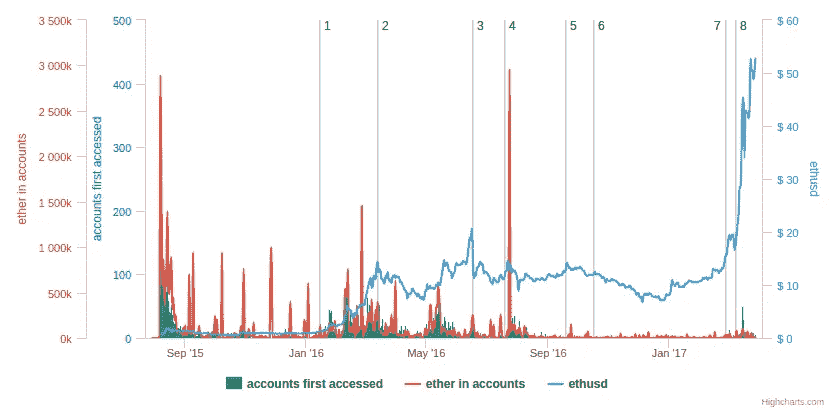
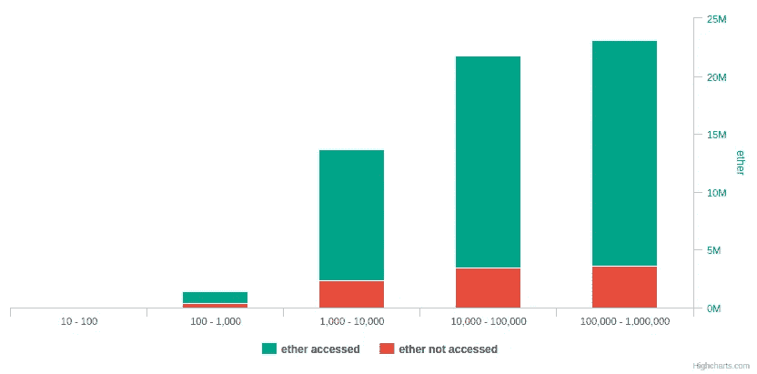

# 25.1%的售前以太网客户从未接触过

> 原文：<https://medium.com/hackernoon/25-1-of-presale-ether-accounts-never-accessed-before-6ea7dc0d7a80>

预售账户总数:
= 8890
=从未访问+已访问
= 2240(25.1%)+6650(74.8%)
预售账户总数:
= 60108506.26 乙醚
=从未访问+已访问
= 9797324.72(16.3%)+50311181.54(83.7%)

这是对之前[文章](/@slacknation/64-1-of-presale-ether-accounts-never-accessed-before-280d381056ca)的更新。

account accessed = having at least 1 outgoing transaction
first accessed = date of 1st transaction, can be incoming or outgoing
ether in accounts = balance at genesis

1.[迈克退出比特币](https://blog.plan99.net/the-resolution-of-the-bitcoin-experiment-dabb30201f7)
2。[宅基地使用权](https://blog.ethereum.org/2016/02/29/homestead-release/)
3。[刀劈](/@slacknation/dao-hack-timeline-823e5a18e894)刀劈
4。[刀叉](https://blog.ethereum.org/2016/07/20/hard-fork-completed/)刀叉
5。[2](https://ethereumfoundation.org/devcon2/)， [geth 速成](https://blog.ethereum.org/2016/09/18/security-alert-geth-nodes-crash-due-memory-bug/)6
。 [Hardfork 由于垃圾邮件](https://blog.ethereum.org/2016/11/18/hard-fork-no-4-spurious-dragon/)
7。[企业以太坊推出](http://entethalliance.org/)
8。[比特币 ETF 被拒](http://fortune.com/2017/03/10/sec-bitcoin-etf/)

ether never accessed = sum of balance at genesis of accounts that have no outgoing transaction

All presale accounts are separated into 5 categories (x-axis) according to their purchase size.

进一步看，

在 ETH
= 2，240
=从未访问+在 ETC
= 2，232 (99.6%) + 8 (0.4%)

ETH 中从未访问的总以太:
= 9797324.72 以太
=从未访问 ETC 中已访问
= 9295269.6(94.9%)+502055.11(5.1%)

在 ETH 中访问的账户
= 6650
=在 ETC 中从未访问过+访问过
= 200 (3%) + 6450 (97%)

ETH 中访问的总以太
= 50，311，181.54 以太
= ETC 中从未访问+已访问
= 6，484，054.51 (12.9%) + 43，827，127.03 (87.1%)

我的其他作品[在这里](http://slacknation.github.io/medium/)。

> [黑客中午](http://bit.ly/Hackernoon)是黑客如何开始他们的下午。我们是 [@AMI](http://bit.ly/atAMIatAMI) 家庭的一员。我们现在[接受投稿](http://bit.ly/hackernoonsubmission)，并乐意[讨论广告&赞助](mailto:partners@amipublications.com)机会。
> 
> 如果你喜欢这个故事，我们推荐你阅读我们的[最新科技故事](http://bit.ly/hackernoonlatestt)和[趋势科技故事](https://hackernoon.com/trending)。直到下一次，不要把世界的现实想当然！

