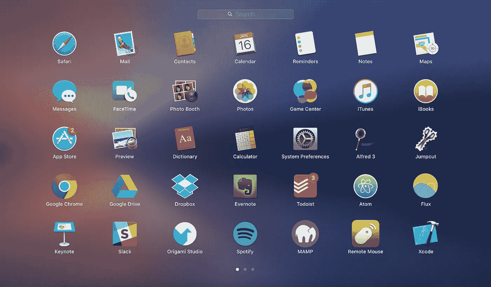

# 25 个 Chrome 扩展、应用和黑客，让您的工作效率提高两倍

> 原文：<https://medium.com/hackernoon/25-chrome-extensions-apps-and-hacks-to-2x-your-productivity-dd4b13e95443>

Some of my apps on my launchpad

在过去的两年里，我尝试和测试了数百个应用程序、Chrome 扩展和生产力黑客，以使自己成为一名更有效和高效的学生。我是通过阅读专家和朋友的其他生产力工具列表偶然发现这些工具的，但是我想写一个列表，列出我使用的所有工具。

这篇文章就是那个的产物。如果你能找到比这更长更好的生产力黑客列表，请随意与我分享！否则，这应该是你可以分享的最好的生产力工具列表。

所以，如果你想把一天的工作量增加一倍，这里有 25 个提高效率的工具和窍门，你可以用它们来做到:

# 第 1 部分:Google Chrome 扩展

Google Chrome 扩展是最容易设置和使用的，所以我最喜欢的一些生产力技巧来自这一部分。

1.  脸书新闻订阅根除者——它做了它所宣传的:根除你的新闻订阅，并用一个引用来代替它。每个人都应该用这个。
2.  [**气势**](https://chrome.google.com/webstore/detail/momentum/laookkfknpbbblfpciffpaejjkokdgca?hl=en)——每次你打开一个新标签，它都会打开一幅美丽的图画。令人难以置信的放松和平静。
3.  [**Adblock Plus**](https://chrome.google.com/webstore/detail/cfhdojbkjhnklbpkdaibdccddilifddb) —让您删除广告。
4.  **—这是确认你是否有某人的正确电子邮件地址的绝佳方式。它会检查联系人是否在 Linkedin 上，并在你的电子邮件旁边显示一份简短的简历和照片。**
5.  **[**HubSpot Sales**](https://chrome.google.com/webstore/detail/hubspot-sales/oiiaigjnkhngdbnoookogelabohpglmd)—让你追踪谁打开了你的电子邮件。**
6.  **[**Evernote Web Clipper**](https://chrome.google.com/webstore/detail/evernote-web-clipper/pioclpoplcdbaefihamjohnefbikjilc)——这可以让你将互联网上的任何东西保存到 Evernote 上，以备将来阅读。比脸书的保存功能好 10 倍(谁会阅读他们保存在那里的文章？我不知道。)**
7.  **[**视频速度控制器**](https://chrome.google.com/webstore/detail/video-speed-controller/nffaoalbilbmmfgbnbgppjihopabppdk?hl=en) —这个是我通过朋友[克里夫·威茨曼](https://medium.com/u/c33ede88fcd8?source=post_page-----dd4b13e95443--------------------------------)自己的生产力工具列表看到的(谢谢你激励我自己写！).这个扩展可以让你使用简单的键盘快捷键，以 0.1 的增量加速或减速你在线观看的任何视频。非常适合快速加速那些 YouTube 视频。**
8.  **[**使用 Adblock**](https://www.youtube.com/watch?v=iIjMqz4Z5qY&feature=youtu.be) 删除 YouTube 上的建议——这也是来自 Cliff。这是他关于如何使用 Adblock 禁用 YouTube 建议的视频。你可以使用 Adblock Plus 做同样的事情，在 YouTube 上点击 ABP 按钮，然后点击“Block Element”。**
9.  **[**屏蔽网站**](https://chrome.google.com/webstore/detail/block-site/eiimnmioipafcokbfikbljfdeojpcgbh) —帮助您屏蔽让您分心的特定网站。当您试图打开被阻止的网站时，会出现有趣的图形。一个类似的 Chrome 扩展是 [Forest](https://chrome.google.com/webstore/detail/forest-stay-focused-be-pr/kjacjjdnoddnpbbcjilcajfhhbdhkpgk) (感谢 [Kyle S. Tan](https://medium.com/u/ff4c1e8074d?source=post_page-----dd4b13e95443--------------------------------) 向我介绍这个！).**
10.  **[**what font**](https://chrome.google.com/webstore/detail/whatfont/jabopobgcpjmedljpbcaablpmlmfcogm)**—让你找出网站上某个元素使用的字体。这个和 ColorZilla 主要面向 web 开发者。****
11.  ****[**ColorZilla**](https://chrome.google.com/webstore/detail/colorzilla/bhlhnicpbhignbdhedgjhgdocnmhomnp) —让你找出网站上某个元素的颜色。****

# ****第 2 部分:应用程序****

1.  ****[**阿尔弗雷德**](https://www.alfredapp.com/) —让我在 2 秒钟内关闭我的电脑——通过按下 option-空格键，然后键入“sh”并回车。这是 Mac 聚光灯的更好版本。****
2.  ****[**jump cut**](http://jumpcut.sourceforge.net/)——让你记录下你命令的一切——C/Copy，你可以在其中的 40 个中循环。非常适合在编码或发邮件时复制粘贴东西。****
3.  ****[**F.lux**](https://justgetflux.com/) —将屏幕稍微调成橙色，让你更容易入睡。更少的入睡时间+更好的睡眠=更有效率。****
4.  ****[**Todoist**](http://todoist.com) —我的首选任务管理器，因为我热爱设计。[神童](http://wunderlist.com)也不错。****
5.  ****[**Evernote**](http://evernote.com)——这是我做任何事情笔记的地方。我是 Evernote 的粉丝，我特别喜欢搜索功能、Web Clipper 扩展和整体设计。****
6.  ****[**谷歌日历**](http://calendar.google.com)——大家应该都已经在用这个了。****
7.  ****[**Dropbox**](http://Dropbox.com) **和**[**Google Drive**](http://drive.google.com)——让你从任何地方访问你的文件。每个人都应该已经在使用这些了。****

# ****第 3 部分:一般生产力技巧****

1.  ******将你的触控板灵敏度提高到最高/最快**——这是我通过[诺亚·卡根](https://medium.com/u/f644ebba8f33?source=post_page-----dd4b13e95443--------------------------------)学会的，也是我最喜欢的一个。如果你整天用电脑工作，让你的鼠标移动得更快肯定会让你工作得更快。只要转到你电脑的设置，把灵敏度调到最高。****
2.  ******学会更快地打字** —除了触控板，下一个最重要的优化就是你的打字速度。我使用了一个打字教程应用程序，如 [this](https://chrome.google.com/webstore/detail/typingclub/obdbgibnhfcjmmpfijkpcihjieedpfah?hl=en) 来学习更快地打字(我现在打字速度是 90-100 wpm。)你也可以在[10 个快速手指](https://10fastfingers.com/typing-test/english)上测试你的打字速度。****
3.  ****每天早上和晚上写日记，这并不能让我变得更有效率，但是可以让我变得更有效率。目前我在使用蒂姆·费里斯的日志记录方法，你可以在他的新书[泰坦的工具中找到。](https://www.amazon.com/Tools-Titans-Billionaires-World-Class-Performers/dp/1328683788)****
4.  ******使用完成工作效率框架来管理你在 Todoist/Wunderlist** 上的任务——这个有点难实现，但对我很有帮助。基本上，我在我的 Todoist 上创建了 4 个项目/类别，在那里我对任务进行分类，从“今天的任务”，到“暂停”，到“本周的任务”，再到“积压的任务”。这有助于我划分任务，并帮助我把注意力集中在“今天的任务”上，这有助于减轻压力。****
5.  ****循环播放歌曲来帮助自己集中注意力——这是我自己做过的事情，显然很多其他高水平的人也这么做，比如 Wordpress 的创始人马特·莫楞威格。最近我反复播放了威肯的《我感觉到了》，所以现在已经有 145 场了。****
6.  ****每天早上吃早餐——在我不吃早餐的日子里，我没有精力或效率。所以我现在从来不跳过。****
7.  ******吃饭、散步或通勤时听播客**——这让你即使在空闲时间也能保持高效。****

****另外，最后一点，我想强调的是，你应该**一直关注如何优化你自己和你的生产力。如果你想做更多的工作，完成更多的事情，帮助更多的人，为这个世界增加价值，那么你最好优化你做这些事情的方式。确保你在这个过程中一直保持快乐和感激。******

****无论如何，我希望你们喜欢这个列表！对于谷歌 Chrome 扩展和应用程序，我希望每个人都开始下载并尝试他们以前没有尝试过的上述任何东西。我答应你，你不会后悔的。****

# ****连接更深****

## ****如果你喜欢这篇文章，请点击心形按钮或在下面留下评论！欢迎在下面评论我遗漏的你使用的任何生产力工具或技巧。请关注我，以获取旨在帮助您提高自我和工作效率的未来文章！:)****

************************

> ****[黑客中午](http://bit.ly/Hackernoon)是黑客如何开始他们的下午。我们是 AMI 家庭的一员。我们现在[接受投稿](http://bit.ly/hackernoonsubmission)并乐意[讨论广告&赞助](mailto:partners@amipublications.com)机会。****
> 
> ****如果你喜欢这个故事，我们推荐你阅读我们的[最新科技故事](http://bit.ly/hackernoonlatestt)和[趋势科技故事](https://hackernoon.com/trending)。直到下一次，不要把世界的现实想当然！****

********