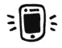

# 帮助你度过学校生活的 25 个最好的应用和网站

> 原文：<https://medium.com/hackernoon/25-of-the-best-apps-and-websites-to-get-you-through-school-and-life-b475af300f3e>

管理学校和保持理智已经够难的了。你在学习一些你相当确定不会马上给你找到工作的东西，你在一个可怕得难以想象的债务洞里爬得更深，你在考虑在墨西哥海滩上卖帽子的生活会简单多少。但不一定非要这样。

有大量的应用程序和网站*旨在帮助你—* 省钱、健身、更聪明地工作、管理时间和学习更多。为什么不利用它们呢？即使你不是 T2 的学生，这些对任何人都有用。

## →为了省钱

*   [*薄荷*](https://www.mint.com/) —在一个地方查看您的所有交易并管理您的预算
*   [*pocket points*](https://pocketpoints.com/)——当你在校园里离开手机时，赢取优惠券
*   [*Google Hangouts*](https://hangouts.google.com/)—通过网络拨打免费或极其便宜的国内和国际电话
*   StudentRate.com，几乎任何东西都有免费的学生折扣
*   [*齐格*](http://www.chegg.com/)——卖掉你的旧课本赚点外快

## →购买更便宜的书籍和教科书

*   [*Scribd*](https://www.scribd.com/)——书与阅读的网飞
*   [*Chegg*](http://www.chegg.com/)——以低于校园商店的价格购买和租赁课本
*   [*亚马逊*](http://www.amazon.ca/)——购买二手或旧版本的昂贵教科书

## →为了更健康的大脑和身体

*   [*睡眠周期*](http://www.sleepcycle.com/)——跟踪你的睡眠，醒来时更加充分休息
*   *——管理焦虑和压力的引导冥想*
*   *[*埃德里安娜瑜伽*](https://www.youtube.com/user/yogawithadriene)——适合任何心情或健身目标的家庭瑜伽*
*   *[*塔巴塔计时器*](http://www.tabatatimer.com/) *+* [*此链接*](http://www.popsugar.com/fitness/Tabata-Workouts-30206750) —你可以在家进行的 4 分钟体重锻炼*

## *→为了更有效地利用时间*

**

*   *[*Flipd*](http://www.flipdapp.co)——阻止自己花太多时间在手机上*
*   **——设定每天或每周的目标，并把它们变成习惯**
*   ***—记录你的上网时间***
*   ***[*袖珍*](https://getpocket.com)——减少网络干扰的离线阅读***
*   ***—在设定的时间段内阻止自己访问某些网站***

## ***→组织你的学习-工作生活***

******

*   ***[*待办事项*](https://en.todoist.com/) —直观的待办事项列表应用程序，可与您的所有设备同步***
*   **[*【my study life】*](https://www.mystudylife.com/)—学术规划师，用于跟踪截止日期和考试**

## **→提高你的创造力和写作技巧**

****

*   ***—学习和记忆 1000 个新单词***
*   ***[*easy bib*](http://www.easybib.com/)——获得 60 多种来源的正确引用***
*   **[*TED 演讲*](https://www.ted.com/)——从任何主题中获得灵感，学习新事物**

## **→为了在团队中更好地工作**

****

*   **[*Google Drive*](https://drive.google.com)—在一个地方协作项目的每个组成部分，并跟踪每个小组成员的参与情况**
*   **[*摄像机*](https://www.camscanner.com/) —给你的笔记拍张照片&把它变成 PDF 文档**
*   **[*Facebook Messenger*](https://www.messenger.com/)—创建群聊，让聊天变得有条理，共享文档，&知道谁看到了你的消息
    (现在是一个单独的应用程序，可以减少聊天的干扰)**

> **如果你喜欢这个帖子，请分享和推荐！**

************

> **[黑客中午](http://bit.ly/Hackernoon)是黑客们下午的开始。我们是 [@AMI](http://bit.ly/atAMIatAMI) 家庭的一员。我们现在[接受投稿](http://bit.ly/hackernoonsubmission)并乐意[讨论广告&赞助](mailto:partners@amipublications.com)机会。**
> 
> **如果你喜欢这个故事，我们推荐你阅读我们的[最新科技故事](http://bit.ly/hackernoonlatestt)和[趋势科技故事](https://hackernoon.com/trending)。直到下一次，不要把世界的现实想当然！**

****