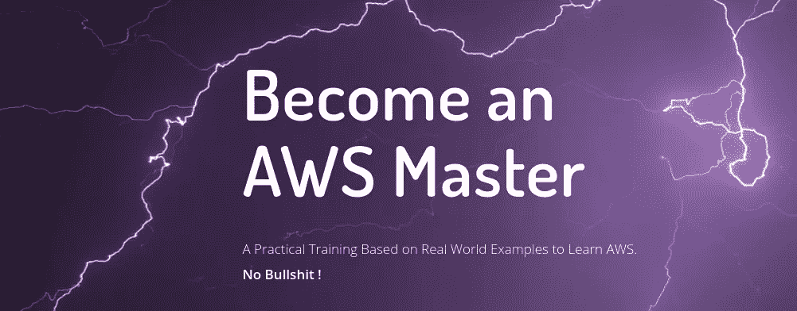

# 关于亚马逊弹性文件系统你应该知道的 25 件事

> 原文：<https://medium.com/hackernoon/25-things-you-should-know-about-amazon-elastic-file-system-2023255303ea>

Photo by [Jorge Rojas](https://unsplash.com/@jorgerojas?utm_source=medium&utm_medium=referral) on [Unsplash](https://unsplash.com?utm_source=medium&utm_medium=referral)

## 放弃

此内容是我们在线课程/培训的一部分/灵感来源。在 2019 年黑色星期五期间，我们对这些材料提供高达 80%的折扣。

您可以在这里享受您的[折扣。](http://bf.eralabs.io)

作为我创建[实用 AWS](http://practicalaws.com) 培训内容工作的一部分，我做了一些关于 EFS 的笔记，我将把它们包括在这次培训中，但我在这里分享其中一些。

> 在这篇博文中，我分享了一些关于亚马逊弹性文件系统(EFS)的观点，其中一些事实是固执己见的，大部分是基于我自己的经验。

**1 —** 当您的应用程序需要多个虚拟机同时访问同一个文件系统时，AWS EFS 是您可以使用的工具。

**2 —** 可以把 EFS 想象成一个托管网络文件系统(NFS)，它可以很容易地与 EC2 或 S3 等其他 AWS 服务集成。

顺便说一下，S3 既不能替代网络文件系统，也不能取代 EFS...S3 不是一个文件系统。

**4 —** 有时，当您考虑使用像 EFS 这样的服务时，您可能也会想到“云锁”及其对您业务的负面影响，但为了缩短上市时间、提高生产率和成本，EFS 可能是一个不错的选择。

**5 —** GlusterFS 是 EFS 的开源替代方案，但当考虑到管理它的工作量、保持它稳定的复杂性以及所有的维护工作时，一些组织更喜欢云锁，而不是花费更多的金钱或时间。

**6 —** 这确实是一项业务和战略选择，每个组织都有自己的选择。

我更喜欢 EFS 的一点是它使用起来极其简单。

8 — 使用控制台或 CLI 可以轻松创建 EFS 文件系统。

**9 —** EFS 使用 NFSv4.x 协议，该协议修复了 v3 的问题，并在引入有状态协议的同时提高了性能和安全性。

**10 —** 一个区域内多个可用性区域之间的文件复制由 EFS 自动保证。

**11 —** 制作 EFS 备份可能会降低生产文件系统的性能；备份使用的吞吐量计入您的文件系统总吞吐量。

**12 —** 您可以决定您的安全性(例如，哪个 EC2 实例可以访问 EFS 文件系统),因为 EFS 支持用户和组读、写和执行权限，与安全组一起工作，并且可以与 AWS IAM 集成。

**13 —** EFS 支持加密。

> 不要忘记下载我们的迷你电子书[学习 AWS 的 8 大技巧](http://8tips.practicalaws.com/8-great-tips-to-learn-aws)。

**14 —** EFS 是基于固态硬盘的存储，其存储容量和价格将根据需要扩展或缩小，因此系统管理员无需执行额外的操作。它可以增长到 Pb 级。

**15 —** 吞吐量和 IOPS(每秒输入/输出操作数)将根据您的存储增长/缩减量进行调整。

**16 —** 您可以从内部数据中心使用 EFS，并使用直连技术将存储直接连接到 EFS

**17 —** EFS 比 EBS 贵(可能比 EBS 贵 10 倍)

**18 —** EFS 并不是所有分布式文件系统问题的神奇解决方案，它在许多情况下会很慢。测试，基准和测量，以确保你的如果 EFS 是一个很好的解决方案，为您的用例。

**19 —** EFS 分布式体系结构导致每个文件读/写操作的延迟开销。

**20 —** 大多数网络文件系统都没有以正确的方式使用。这是必读的:[亚马逊 EFS 性能提示](http://docs.aws.amazon.com/efs/latest/ug/performance.html#performance-tips)。

**21 —** 如果你有可能使用 CDN，不要使用 EFS，只保留不能存储在 CDN 中的文件。

很明显，但是不要使用 EFS 作为缓存系统，有时你可能会无意中这样做。

**23 —** EFS 现在支持 NFSv4 锁升级和降级，所以是的，你可以在 EFS 上使用 SQLite 即使[在](https://stackoverflow.com/a/42492845/2899642)之前有可能做到。

**24 —** EFS 只兼容 Linux，如果你用的是另一个操作系统，那就另找解决方案吧。

**25 —** 最后但同样重要的是，即使 EFS 是一个完全管理的 NFS，在许多情况下您也会面临性能问题，解决这个问题可能需要一些时间和努力，所以做好准备。测量和改善性能的一个好方法是集成 CloudWatch 服务，并选择正确的指标，同时在测试环境中对应用程序进行基准测试。

# 加入我们吧！

我们正在为每个人和每个层次的人建立在线课程:新手，中级和熟练的人。

我们的目标是让人们有机会通过优质的课程和实用的学习途径来学习 DevOps 技术。

> 如果你对[实战 AWS 培训](https://practicalaws.com)感兴趣，可以[下单](http://practicalaws.com)。你也可以下载我们的迷你电子书[学习 AWS 的 8 大技巧](http://8tips.practicalaws.com/8-great-tips-to-learn-aws)。