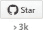
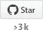
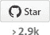
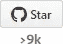
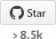

# 2016 年面向 web 开发者的 27 个流行的新 github 存储库

> 原文：<https://medium.com/hackernoon/27-popular-new-github-repositories-for-web-developers-in-2016-27cdcbba9779>

这里有一些流行的新的 github 库，web 开发者可能会感兴趣。他们都在 2016 年获得了他们的第一个 1500 星。

# 依赖性管理

[**纱**](https://github.com/yarnpkg/yarn) —快速、可靠、安全的依赖管理。[https://yarnpkg.com](https://yarnpkg.com/)T8【2016 年 10 月】

# 反应

****—使用 React*(2016 年 7 月)*开发时使用的设计模式/技术列表****

********

## ****反应样板文件****

****[**创建 React 应用**](https://github.com/facebookincubator/create-react-app) —创建不带构建配置的 React 应用*(2016 年 7 月)*****

********

****[**Next.js**](https://github.com/zeit/next.js) —通用服务器渲染 React 应用的极简框架[https://zeit.co/blog/next](https://zeit.co/blog/next)*(2016 年 10 月)*****

********

****[**React slings hot**](https://github.com/coryhouse/react-slingshot)**—React+Redux starter kit/样板带 Babel，热重装，测试，林挺和一个工作示例 app，全部内置*(2016 年 1 月)*******

************

## ******UI 组件******

******[**Draft.js**](https://github.com/facebook/draft-js) —一个构建文本编辑器的 React 框架。[https://facebook.github.io/draft-js/](https://facebook.github.io/draft-js/)(2016 年 3 月)******

********

****[**re charts**](https://github.com/recharts/recharts)**—重新定义了用 React 和 D3[http://recharts.org](http://recharts.org/)*(2016 年 1 月)*******

************

******[**样式化组件**](https://github.com/styled-components/styled-components) —组件时代的视觉原语💅【http://styled-components.com[*(2016 年 9 月)*](http://styled-components.com/)******

********

****[**React-dates**](https://github.com/airbnb/react-dates)——一个易于国际化、移动友好的网络日期选择器库[http://airbnb.io/react-dates](http://airbnb.io/react-dates)*(2016 年 8 月)*****

********

# ****端到端测试****

****[**TestCafe**](https://github.com/DevExpress/testcafe) —现代 web 开发栈的自动化浏览器测试。[https://devexpress.github.io/testcafe](https://devexpress.github.io/testcafe/)T22【2016 年 10 月】****

********

# ****Javascript 框架****

****[**【MJML】**](https://github.com/mjmlio/mjml)—唯一让响应邮件变得简单的框架[https://MJML . io](https://mjml.io/)*(2016 年 2 月)*****

********

****[**Choo**](https://github.com/yoshuawuyts/choo) —🚂🚋🚋🚋—坚固的前端框架[https://bit.ly/choo-handbook](https://bit.ly/choo-handbook)(2016 年 5 月)****

********

******—神奇消失的 UI 框架[https://Svelte . technology](https://svelte.technology/)*(2016 年 11 月)*******

************

# ******UI 小部件、插件、组件******

******[**Flatpickr**](https://github.com/chmln/flatpickr) —轻量级且功能强大的 datetimepicker，无依赖性[https://chmln.github.io/flatpickr](https://chmln.github.io/flatpickr)*(2016 年 4 月)*******

********

****[**阿哥利亚地名**](https://github.com/algolia/places) —🌐将任何<输入>转化为地址自动完成【https://community.algolia.com/places/*【2016 年 4 月】*****

********

****[**Popper.js**](https://github.com/FezVrasta/popper.js) —一个管理你的 poppers 的 kickass 库[https://popper.js.org](https://popper.js.org/)*(2016 年 4 月)*****

********

****[**【bideo . js**](https://github.com/rishabhp/bideo.js)**—网页全屏 HTML5 背景视频。[https://rishabhp.github.io/bideo.js/](https://rishabhp.github.io/bideo.js/)(2016 年 5 月)******

************

******[**anime . js**](https://github.com/juliangarnier/anime)——[Javascript](https://hackernoon.com/tagged/javascript)动画引擎[http://anime-js.com](http://anime-js.com/)(2016 年 6 月)******

********

# ****实用工具，工具****

****[**解析服务器**](https://github.com/ParsePlatform/parse-server) —节点/快捷[https://parse.com](https://parse.com/)的解析兼容 API 服务器模块(2016 年 1 月)****

********

****[**web pack-dashboard**](https://github.com/FormidableLabs/webpack-dashboard)—web pack 开发服务器的 CLI 仪表板(2016 年 8 月)****

********

****[**Lighthouse**](https://github.com/GoogleChrome/lighthouse) —渐进式 Web 应用的审计、性能指标和最佳实践(2016 年 3 月)****

********

****[**日期-fns**](https://github.com/date-fns/date-fns) —⏳https://date-fns.org⌛️[现代 JavaScript 日期实用程序库](https://date-fns.org/)(2016 年 3 月)****

********

****[**【Optimize-js**](https://github.com/nolanlawson/optimize-js)——通过包装急切调用的函数，优化 JavaScript 文件以加快初始加载(2016 年 9 月)****

********

****[**vConsole**](https://github.com/WechatFE/vConsole) —一款轻量级、可扩展的移动网页前端开发工具(2016 年 4 月)****

********

# ****教程****

****[**从零开始的 JavaScript 栈**](https://github.com/verekia/js-stack-from-scratch) —从零开始构建现代 JavaScript 栈的分步教程****

********

****[**ES6-备忘单**](https://github.com/DrkSephy/es6-cheatsheet) — ES2015 [ES6]备忘单，包含提示、技巧、最佳实践和代码片段****

********

****[**2016 年 52 项技术**](https://github.com/shekhargulati/52-technologies-in-2016) —让我们每周学习一项新技术。2016 年每周日的新技术博客****

********

# ****…还有几个****

****这些是在 2015 年底出现的存储库，但在 2016 年开始流行。****

****[**Inferno**](https://github.com/trueadm/inferno)——一个速度极快、反应灵敏的 JavaScript 库，用于构建现代用户界面[http://infernojs.org](http://infernojs.org/)****

********

****[**预测**](https://github.com/developit/preact) —快速 3kb 反应备选方案，具有相同的 ES6 API。组件&虚拟 DOM。[https://preactjs.com](https://preactjs.com/)****

********************************

> ****[黑客中午](http://bit.ly/Hackernoon)是黑客如何开始他们的下午。我们是 [@AMI](http://bit.ly/atAMIatAMI) 家庭的一员。我们现在[接受投稿](http://bit.ly/hackernoonsubmission)并乐意[讨论广告&赞助](mailto:partners@amipublications.com)机会。****
> 
> ****如果你喜欢这个故事，我们推荐你阅读我们的[最新科技故事](http://bit.ly/hackernoonlatestt)和[趋势科技故事](https://hackernoon.com/trending)。直到下一次，不要把世界的现实想当然！****

********