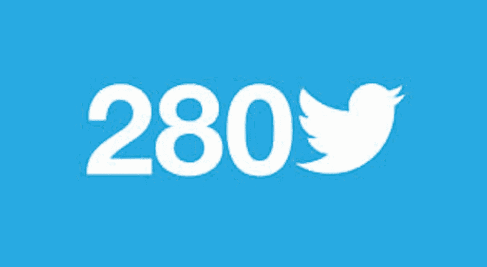
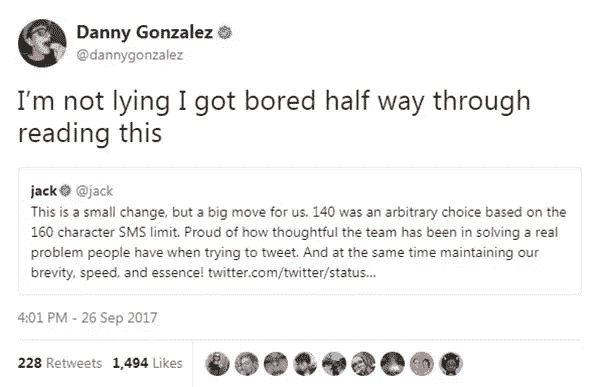
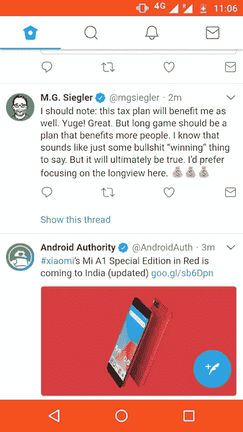
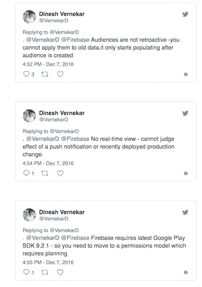

# 我仍然讨厌 280 个字符。原因如下

> 原文：<https://medium.com/hackernoon/280-chars-a-month-later-ca24b25cc2fc>

280 chars — Image courtesy: [http://wersm.com/twitter-expands-character-limit-to-280-in-global-test/](http://wersm.com/twitter-expands-character-limit-to-280-in-global-test/)

当 Twitter 宣布他们计划将推文的字符限制提高一倍时，这似乎是有史以来最愚蠢的想法。为什么会有人想要扼杀让一个平台独一无二的东西？

Twitter 的理由是，即使字符数量增加一倍，许多用户还是会像以前一样继续发微博。创造性地& 140 个字符。

这在一定程度上是真实的。在最初的兴奋之后，我在推特上发布了这个，我通常使用 140 个字符来发布信息。但这只是我。

Only use i could find for 280 chars!

**反对 280 个字符限制的最常见理由是:**

1.  这会扼杀推特的创造力
2.  这使得推文很难扫描/阅读。
3.  如果你想写博客，有媒介。如果你想进行一场深刻的辩论——写一篇文章并分享一个链接。

Twitter 为此受到了一大堆批评。

Ouch!

**赞成 280 个字符的论点:**

1.  更多的字符意味着你的思想更有深度和广度

# 让我们来看看一个月后发生了什么..

许多用户已经习惯了 280 个字符的限制& twitter 已经改变了。最大的采纳者是品牌和新闻出版物。扫描你的订阅变得越来越困难了。

Whoa, am I reading a novel?

然而，这并没有那么糟糕，因为图片在提要中被赋予了很大的重要性，并且经常被破坏。

Images break the feed so it’s not that bad.

旧格式的美妙之处在于，大多数时候你会发简短的想法，易于阅读。当你想发更大的微博时，你可以贴一张照片。这也意味着品牌不张贴完整的新闻稿作为一滴文字！

# 线程曾经是如此有趣

Easy to read!

TD:LR —

一个月后，我仍然讨厌这种变化。你怎么想呢?

如果您觉得这篇文章有用，请点击绿色的“推荐”按钮。并补充评论:)

*你可以在*[*Twitter*](http://www.twitter.com/vernekard)*或者*[*Linkedin*](https://in.linkedin.com/in/vernekardinesh)上关注我