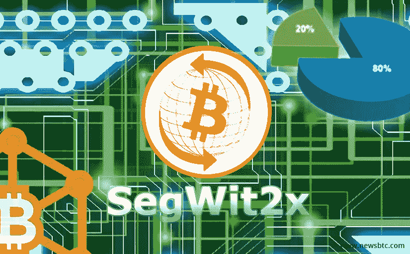

# 重播:2X 还是 No2X？双方进行了辩论——电话会议，美国东部时间 10 月 26 日下午 2 点到 3 点

> 原文：<https://medium.com/hackernoon/2x-or-no2x-the-two-sides-debated-conference-call-oct-26th-2pm-3pm-est-e21274c7b52a>

下面是 10 月 26 日举行的电话会议的回放。

Alex Morcos 的通话记录可以在[这里](https://goo.gl/1zoFRx)找到

三个多月前，[比特币](https://hackernoon.com/tagged/bitcoin)升级版 SegWit 被激活，导致一种替代货币比特币现金的产生，这种货币是作为对 [Segwit](https://hackernoon.com/tagged/segwit) 解决方案的反对而产生的。

作为由 [DCG](http://dcg.co/) 超过 50 个其他行业参与者达成的[纽约协议](/@DCGco/bitcoin-scaling-agreement-at-consensus-2017-133521fe9a77) (NYA)的一部分，Segwit 激活附带了一个条件:在激活的三个月内增加块大小(即硬分叉)。这种硬分叉现在通常被称为 SegWit2x 或“S2X”。S2X 由前核心开发人员和 Bloq 首席执行官 Jeff Garzik 用代码实现为 btc1。计划于 11 月 19 日左右在街区高度 494，784 激活。

虽然增加区块大小的原始优势显而易见，但从各种媒体平台的评论和行动主义来看，NYA 在比特币的一些用户和比特币核心开发者中非常不受欢迎。为了了解支持和反对 S2X 分叉的原因，我们邀请了辩论双方的主要倡导者参加我们的电话会议，并解释他们对 S2X 的利弊的看法:

**Pro 2X:**

Mike bel she——BitGo 的联合创始人兼首席执行官。Mike Belshe 是一位资深技术专家，他发明了 BitGo 使用的多重签名协议。在 BitGo 之前，Mike 在谷歌 Chrome 的创始团队中工作，是 SPDY(现已成为 HTTP/2.0)的共同发明人和背后的驱动力，并共同创立了 Lookout Software，这是一家被微软收购的电子邮件搜索公司。他拥有加州理工学院圣路易斯奥比斯波分校的理学学士学位。

**No2X:**

Alex Morco 是 Chaincode Labs 的联合创始人。Alex 是自动化交易的早期先驱之一，并于 2002 年共同创立了 Hudson River Trading，在那里他花了 10 年时间致力于提高市场效率和改善市场结构。他在 2012 年发现了自己对比特币的热情，2014 年与苏哈斯共同创立了 Chaincode。从那以后，他一直喜欢为比特币核心做贡献，并了解令人兴奋的新兴加密货币领域。

要注册 GoToWebinar，请点击[此处](https://goo.gl/r6mT54)

*如果你从这篇帖子* ***中获得了至少* 0.00000001 比特币*的价值，请在*** *下方“鼓掌”，这样其他人就会看到这篇帖子。*