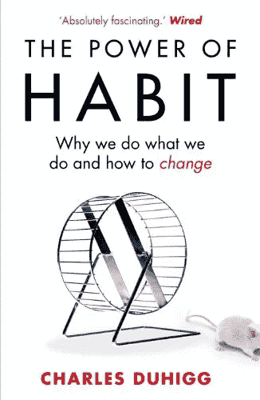
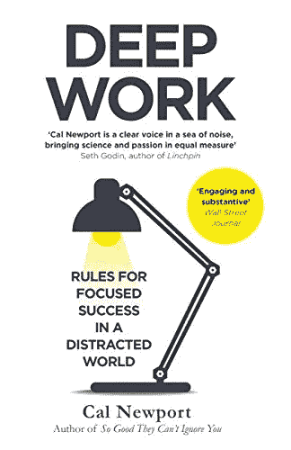
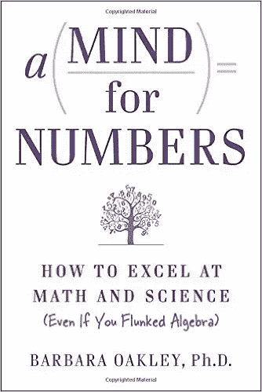

# 3 本书帮助你停止拖延

> 原文：<https://medium.com/hackernoon/3-books-to-help-you-stop-procrastinating-11212fc996df>

[**#1 习惯的力量:我们为什么做我们所做的，以及如何改变**](http://amzn.to/2moLkNw)

这是我最喜欢的。我醒来后做的第一件事就是查看手机。读完这本书后，我能够打破这个习惯，去读一本书的一章。

这本书包含三个部分。

1.)个人的习惯

2.)成功组织的习惯。

3.)社会的习惯。

它解释了线索、常规和奖励的习惯循环。使用书中解释的技巧，你将能够利用习惯循环把你的坏习惯变成好习惯。它包含了从他们的习惯中受益的人和组织的故事。

[亚马逊上的书](http://amzn.to/2moMJDM)

[**#2 深度工作:在纷乱的世界中专注成功的法则**](http://amzn.to/2lHc4Kh)

我们都知道社交媒体的使用会影响我们的工作效率。这本书向我解释了它的成本。明白了代价之后，你下次很可能会约束自己的习惯。一天工作下来，我通常会感到紧张。这本书教会了我如何做好自己的工作。既能享受又能满足。

这位作者解释了为什么深度工作是有效的、令人满意的和有意义的。这可以帮助你度过最好的一天。值得一读。

[亚马逊上的书](http://amzn.to/2nivi5f)

[**#3 数字头脑:如何擅长数学和科学(即使你代数不及格)**](http://amzn.to/2mJYiGB)

尽管这本书是关于学习技巧的。书中很多章节都有停止拖延的技巧。书中解释的番茄工作法是我最喜欢的。

这本书也包含了不同专业领域的人使用的策略。如果你想成为一个积极的学习者，这本书值得一读。

[亚马逊上的书](http://amzn.to/2mJYiGB)

[如果你对开发云应用感兴趣。做检查出我的书云是小菜一碟](http://amzn.to/2n32wJT)

> [黑客中午](http://bit.ly/Hackernoon)是黑客如何开始他们的下午。我们是 [@AMI](http://bit.ly/atAMIatAMI) 家庭的一员。我们现在[接受投稿](http://bit.ly/hackernoonsubmission)，并乐意[讨论广告&赞助](mailto:partners@amipublications.com)机会。
> 
> 如果你喜欢这个故事，我们推荐你阅读我们的[最新科技故事](http://bit.ly/hackernoonlatestt)和[趋势科技故事](https://hackernoon.com/trending)。直到下一次，不要把世界的现实想当然！

