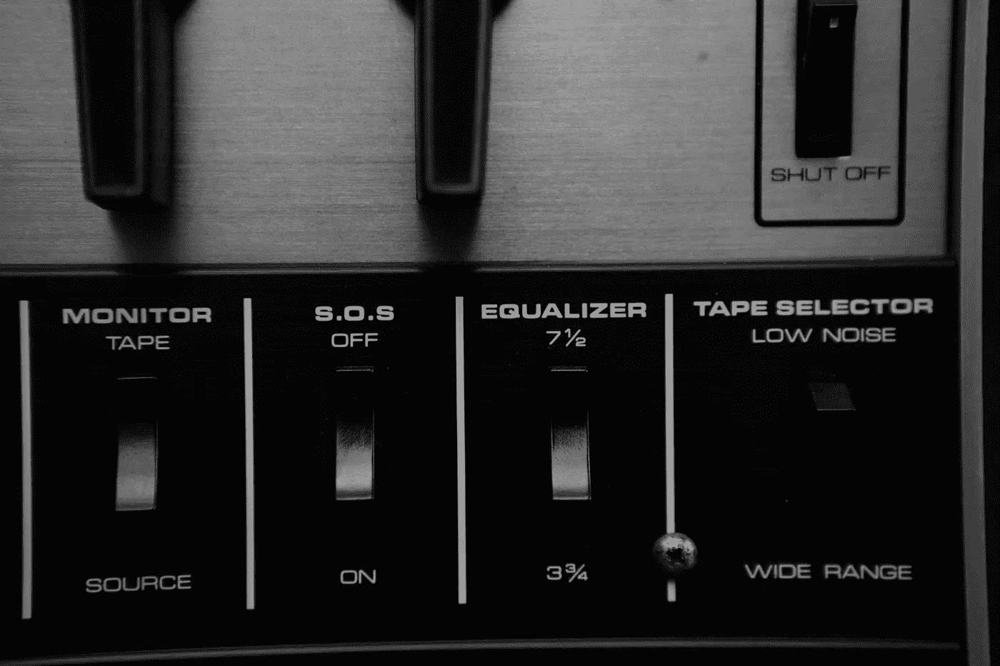

# 欧洲创业公司的三大竞争优势

> 原文：<https://medium.com/hackernoon/3-competitive-advantages-that-set-european-startups-apart-12530c262ed0>

欧洲初创公司[在 2015 年上半年筹集了 69 亿美元 Bln](http://www.rolandberger.com/media/pdf/Roland_Berger_TAB_Digital_Startups_in_Europe_20151022.pdf) ，比去年增加了 86%。BlaBlaCar，Adyen，送货英雄等。通过大规模融资和首次公开募股成为头条新闻。2015 年初，欧洲独角兽的总价值达到 1100 亿欧元。

欧洲正在觉醒。越来越大的公司正以更快的速度诞生。围绕它们，越来越多的孵化器、加速器、生态系统和网络正在发展，尤其是在欧洲各国首都。

换句话说，欧洲正在书写自己的[创业](https://hackernoon.com/tagged/startup)历史，将自己与硅谷区分开来。随着不同的动态、去本地化的网络和不断增长的成功，商业文化正在形成自己的形状，最终退出模仿游戏。

因此，随着支持系统朝着正确的方向发展，是时候讨论一下能够让欧洲初创企业脱颖而出的特征了。

怎样才能在(美国)竞争中坐大？

## **USP #1 —人才、教育和研究**

大量创新源于大学，而欧洲到处都是。顶级教育在几个欧盟城市和首都进行，不仅提供了大量的人才，而且提供了多样化和分散的人才。除了大学之外，还有几个机构。像瑞士欧洲核子研究中心这样的机构是世界上最先进的机构之一，在世界范围内推动创新。教育质量也在创造多样化的专业背景，不仅限于计算机科学，还涉及工程、数据科学和生物学的所有分支。

随着软件越来越容易构建，未来的创新可能不是来自任务的自动化，而是来自其他领域的创新。欧洲多元化的教育体系届时将是一个巨大的竞争优势。

## USP #2 — **降低启动成本**

尤其是在短期内，更便宜的招聘、租金以及一般[公司](https://hackernoon.com/tagged/company)的发展都是竞争优势。较低的估值、所需的资本和类似的全球机会(如果规模[挑战被克服](/@faloppad/the-european-startup-scene-is-still-broken-f56be481993d))已经吸引了红杉和其他著名的美国风投公司。这种价格套利情况可能会在未来几年推动欧洲初创公司的发展，并赋予它们竞争优势。

## USP #3 — **国际化经验**

欧洲初创企业天生(或者应该)就有国际化的想法。他们知道如何在国内扩大产品规模，并很好地应对小市场。看看亚洲和非洲经济体的增长，欧洲初创企业的国际化技能可能是在这些新兴(但巨大)市场上赚钱的有趣能力。

## **结论**

教育、成本和国际化经验是欧洲初创企业特有的特征，这些特征在未来可能会派上用场，并让欧洲企业更上一层楼。

这些力量仍然基于这样的假设，即网络、碎片化和政府的趋势将朝着正确的方向发展，允许而不是阻止公司扩大规模。

其次，它们仍然是基于欧洲公司在一个小的国内市场发现并系统地处理国际增长。我个人认为这些趋势正朝着正确的方向发展。但我们都必须停止在世界其他地方寻找榜样，承认我们的环境是独特的，并学习和创造专门为它设计的战略。

> [黑客中午](http://bit.ly/Hackernoon)是黑客如何开始他们的下午。我们是 [@AMI](http://bit.ly/atAMIatAMI) 家庭的一员。我们现在[接受投稿](http://bit.ly/hackernoonsubmission)并乐意[讨论广告&赞助](mailto:partners@amipublications.com)机会。
> 
> 如果你喜欢这个故事，我们推荐你阅读我们的[最新科技故事](http://bit.ly/hackernoonlatestt)和[趋势科技故事](https://hackernoon.com/trending)。直到下一次，不要把世界的现实想当然！

