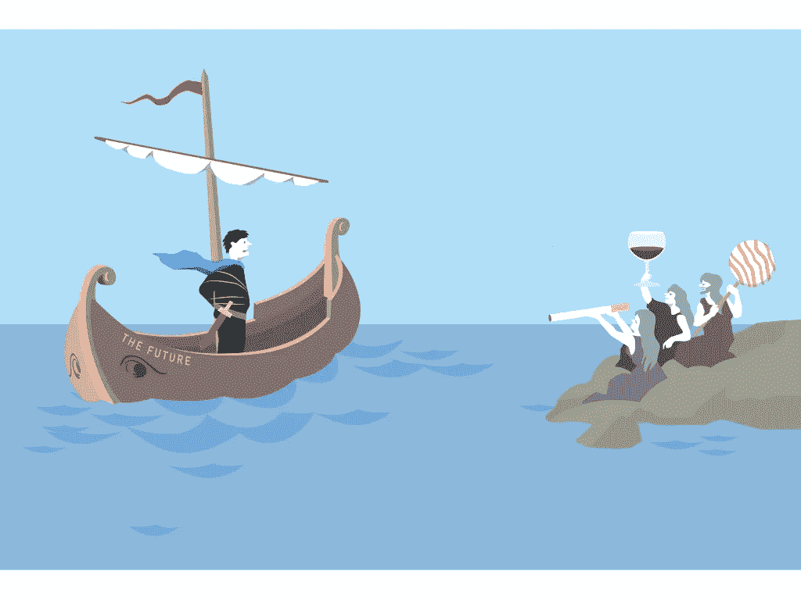
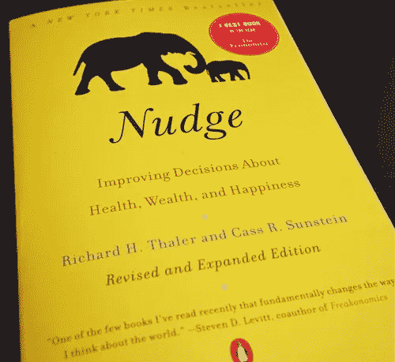
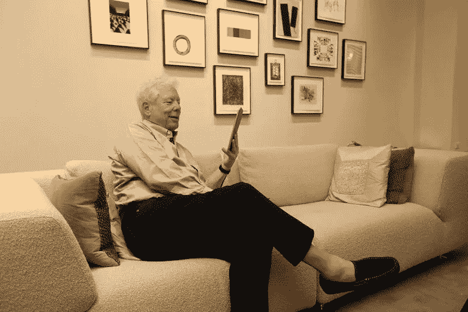

# 理查德·塞勒的三个想法改变了我们的思维方式

> 原文：<https://medium.com/hackernoon/3-ideas-of-richard-thaler-that-changed-the-way-we-think-3e13d0bc3cc0>

2017 年诺贝尔经济学奖授予了美国经济学家理查德·塞勒，他将对人类行为更现实的理解引入了经济学，并通过考虑人类行为来改善公共政策和监管。

现年 72 岁的理查德·塞勒是芝加哥大学的教授。他以*行为经济学*之父而闻名，行为经济学是一个结合人类行为知识来解释决策背后的经济学的研究领域。

诺贝尔奖委员会指出，R. Thaler 在他的研究中成功地展示了各种人类特征如何系统地影响个人决策和市场结果。该奖项显示了 R. Thaler 在将情感和理性方面的重要性引入决策方面做出了多么巨大的贡献，为更有效地制定公共政策和政府奠定了基础。

用诺贝尔奖来表彰泰勒的工作应该被看作是对行为经济学领域的人们的贡献。事实上，R. Thaler 并不是第一个获得这一荣誉的行为经济学家:2002 年，Kahneman 教授是第一个获得诺贝尔奖的行为主义者，Schiller 在 2006 年紧随其后。

然而，虽然之前的行为经济学家奠定了理论基础，但 R. Thaler 做了大部分组织工作，以确保行为经济学获得广泛的认可和公众的尊重。R. Thaler 致力于让研究决策行为方面的学生能够获得博士奖学金，并且这个研究领域能够为建立能够改善人们生活的机构奠定基础。

换句话说，R. Thaler 的目的不是摧毁传统经济学，而是，他想让人们更多地关注人们思考的怪异方式。

> “为了做好经济学，你必须记住，人也是人。”(泰勒)

以下是理查德·塞勒提出的改变我们思考和行为方式的三个观点:有限理性、缺乏自制力和轻推。

# **1。有限理性**

当 R. Thaler 在凯斯西储大学开始他的博士生工作时，主流经济理论很大程度上是基于人们行为理性的假设。理查德·塞勒开始挑战这一观点，许多研究表明人类的行为是非理性的。

> 当经济学在 20 世纪 50 年代开始高度数学化时，理性模型是人们可以解决的模型，这是光明所在。试图把所有复杂的情感、缺乏意志力和显著性放进去，让这些模型变得更加混乱。经济学家喜欢事物整洁。当然，这个世界并不那么整洁。(泰勒)

在他的众多出版物中，泰勒提供了许多例子，表明人类的非理性行为是系统的。此外，泰勒认为非理性行为是可以预测和控制的。

泰勒提出了“心理账户”的概念，这意味着在做决定时，人们倾向于简化事情。换句话说，人们更重视单独的决定，而不是在更广泛的背景下看待它们。

例如，在个人财务中，人们倾向于为日常开支、房租和度假做预算，这常常导致额外的成本，而不是帮助建立长期储蓄。类似地，出租车司机倾向于为驾驶收入设定每日目标(这通常意味着当需求高时，司机更早结束，当需求低时，司机驾驶更长时间)。

此外，泰勒引入了“禀赋效应”的概念，这一概念关注的是人们倾向于如何处理积极和消极的情绪。说到所有权，人们往往更看重自己的所有权。这导致人们不太愿意放弃他们拥有的财产(厌恶损失)。

这有助于 R. Thaler 对人们在购买和销售决策中的行为进行更广泛的观察。例如，投资者持有正在贬值的股票，希望情况会好转；急于出售有价值的股票以收回利润。

# **2。缺乏自我控制**

根据泰勒的说法，人们遭受各种精神错觉的折磨，导致人们犯错误。经典的例子可以被描述为“奥德修斯的困境”,它渗透到我们生活的每一个方面:我们倾向于在此时此地沉浸在消费的快乐中，而不是为在[未来](https://hackernoon.com/tagged/future)更令人兴奋的经历(或租金)存钱。

Illustration ©Johan Jarnestad/The Royal Swedish Academy of Sciences

经典的例子可以被描述为奥德修斯的困境，它渗透到我们生活的每一个方面:我们倾向于在此时此地沉浸在消费的快乐中，而不是为将来更令人兴奋的经历(或租金)存钱。

R.泰勒表明，在时间上接近的经历比那些距离较远的经历占据了我们更多的意识；因此，现在花 100 美元似乎比存起来留到将来更有价值。因此，R. Thaler 设计了“计划者-实干家”模型，其中计划者考虑长期目标，而“实干家”关心此时此地的事情。

由于缺乏自我控制，人们更愿意坚持各种承诺前策略，如饮食或禁烟计划、戒酒协会、药物滥用中心等。

# **3。轻推**

泰勒的研究打开了通向大量挑衅性发现的大门。他表明，人们愿意惩罚不公平的行为，即使这种惩罚对他们没有好处(或者即使他们必须为此付出代价)；或者人们选择不做选择是因为他们害怕后果。

各种现实世界的发现激励 R. Thaler 冒险探索人类决策的可能改进。他开始研究公共机构如何帮助人类做出更理性、更明智的决定。

这使得 R. Thaler 建议政府应该利用*轻推—* 各种工具，政府可以使用这些工具来警告、提醒或温和地警告他们的公民。轻推的内在理念是帮助人们做出好的决定，而不是强迫他们做出任何特定的选择。

> 我在《推动》一书中的主要目标是帮助人们理解我们如何处理像抵押贷款这样高度复杂的事情。(泰勒)

卡斯·桑斯坦(Cass Sunstein)向我介绍了微推的概念——他和 r·泰勒(R. Thaler)与[合著了一本书，书名与此相同](https://www.amazon.com/s/ref=nb_sb_noss?url=search-alias%3Daps&field-keywords=nudge)。当我在 HLS 学习的时候，我参加了 Sunstein 教授教的两门课:行政法和政府内部。在这些课堂上，桑斯坦不断地问一些问题，这些问题涉及政府政策的可能改进，这些改进是基于对非理性人类行为的各种发现，以及寻找提高公共服务效率和质量的方法。

特别是，泰勒和桑斯坦认为轻推是自由家长主义的最佳形式。

一些推动措施相对简单:在超速罚单上加一张照片会提高罚款支付率，因为如果交通违规者看到自己的汽车照片附在罚单上，他们会更愿意支付罚款。

其他形式的推动可能会产生广泛的影响。例如，泰勒提出了“[明天存更多钱](http://faculty.chicagobooth.edu/richard.thaler/research/pdf/smartjpe.pdf)”的想法，这是指员工被问及是否愿意将未来工资增长的一部分用于退休储蓄。这是基于心理学家的发现，这些发现表明(1)人们非常不愿意失去目前的收入，但(2)不太关心未来的储蓄。

所以，如果你现在有工作，并且自动加入了退休储蓄计划，你要感谢 R. Thaler 和他的工作。

R.Thaler 和 C. Sunstein 对轻推和默认规则的作用提出了进一步的见解(例如，在注册驾照时自动登记到捐献者名单中，或在使公民可以访问信息方面的各种轻推)。

**泰勒对发展的宝贵贡献**

德国物理学家马克斯·普朗克曾经说过，“科学是通过一个又一个葬礼来进步的”。这是否意味着行为经济学标志着基于成本收益分析和理性选择模型的当代模型的死亡？当然不是。

Image by Anne Ryan/University of Chicago, via Reuters

泰勒对经济理论的发展以及带来关于人类行为的真实发现的贡献是巨大的。行为经济学已经成为经济学中一个被广泛认可的思路，并刺激了各种各样的计划来使政府更有效率。

事实上，在越来越多的国家，行为科学家被邀请到决策者面前。例如，在英国，建立了一个特殊的政府机构，其任务是根据对人类行为的研究结果提高政府效率。经济合作与发展组织(OECD)已经发布了两份报告，其中列举了多个国家在公共政府中应用行为洞察的典型案例。毫无疑问，行为研究的作用及其应用在未来将会大大增加。

当被问及他将如何使用这笔奖金时，泰勒回答道:*“这是一个非常有趣的问题。…我会尽可能不合理地使用它。”与 D. Kahneman、A. Tversky 和 Cass Sunstein 等其他著名经济学家一样，Thaler 是那些公共思想家之一，他的工作让我们积极地展望未来。*

*感谢你阅读这篇文章！如果你喜欢，点击并按住*👏*在你的左边，或者留下评论。*

我每周发表一个新故事。关注我，你不会错过我对创新、创造力以及硅谷和其他地方的最新趋势的见解。