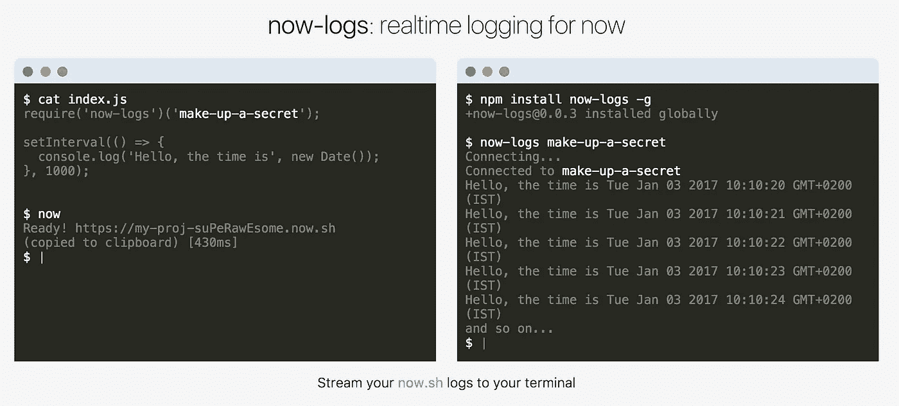

# 从构建“现在日志”中获得的关于 DX 的 3 个教训

> 原文：<https://medium.com/hackernoon/3-lessons-about-dx-from-building-now-logs-ab51698186fc>

我将分享我构建 [now-logs](https://logs.now.sh) 的经验，这是一个针对 node.js 的开源实时日志工具，专门为 [now](https://zeit.co/now) 社区解决一个难题。

# 开发者体验(DX)

我对 DX 的定义很简单:

> **“DX 是开发者在使用你的工具、代码和 API 时的感受”**

与现在的[合作给我留下最深刻印象的是对 DX 的关注以及它给我的感觉。我使用的每一个工具**都让我感到快乐和聪明**。创作者在每一个小细节上都投入了大量的思考，这是显而易见的。](https://zeit.co/now)

我决定将 DX 作为 *now-logs* 的主要特性。我想让它感觉像是**魔法**，快速整合和**超级简单**使用。

最终，三件事成就了 DX 的伟大:

# **1。取消注册过程**

开发者只是想开始使用一个工具，而不是注册一个服务。然而，服务通常要求你注册来获得你的私有 API_KEY。让我们去掉这一步，这样开发者可以直接跳到代码。

为了避免注册步骤，开发者可以提出自己的 API_KEY 并使用它。如果选择明智，应该不会有冲突。

现在你可以开始使用 *now-logs* 和一个神奇的 one liner:

> require(' now-logs ')('**the-API-key-I-upled-with**')；

# 2.没有发明新的工作流程

开发人员正在他们的终端上查看日志，但是所有第三方日志解决方案都要求您登录网站才能查看日志。

让我们修好它，让我们回到属于我们的终点。

幸运的是，在 node.js 中创建命令行工具轻而易举。 *now-logs* 是一个超级简单的命令行工具:

> now-logs**-API-key-I-up-with**

在终端中有了这个，您就可以自由地通过管道(|)将输出引导(>)到其他程序。这让我**有家的感觉**。

# 3.投资网站和文档

一个好的网站可以对工具和开源库的使用产生巨大的影响。

大约 1/2 的构建 *now-logs* 的工作被定向到[网站](https://logs.now.sh)的副本、 [GitHub README.md](https://github.com/berzniz/now-logs) 和 *now-logs* cli 工具的*使用*输出。

该网站既是演示又是教程，所以在 1 分钟内你应该知道你是否应该使用 *now-logs* 。

结账 [now-logs](https://logs.now.sh)
在 Twitter 上找我( [ketacode](https://twitter.com/ketacode) )。

> [黑客中午](http://bit.ly/Hackernoon)是黑客如何开始他们的下午。我们是 [@AMI](http://bit.ly/atAMIatAMI) 家庭的一员。我们现在[接受投稿](http://bit.ly/hackernoonsubmission)并乐意[讨论广告&赞助](mailto:partners@amipublications.com)机会。
> 
> 如果你喜欢这个故事，我们推荐你阅读我们的[最新科技故事](http://bit.ly/hackernoonlatestt)和[趋势科技故事](https://hackernoon.com/trending)。直到下一次，不要把世界的现实想当然！

