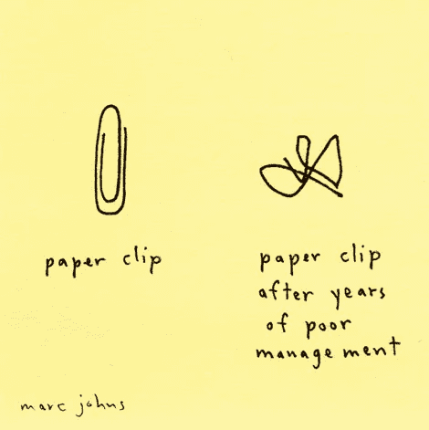

# 当我开始做项目经理时，我希望我知道的 3 个教训

> 原文：<https://medium.com/hackernoon/3-lessons-i-wish-i-knew-when-i-started-as-a-pm-1f9473ba558a>

有很多关于产品[管理](https://hackernoon.com/tagged/management)的[文献](https://hackernoon.com/tagged/literature)，但这仍然是一个相当新的、不断发展的角色。有些话题是公开的，有些是禁忌的。为什么？

我作为项目经理的头几年充满挑战。我的印象是，我是唯一面临这些障碍的人。

*例如，基于故事、推文、Youtube 视频，所有公司似乎都有全面、可靠、随时可用的数据设置。但是我和越多的人交谈，我越发现这离现实还很远。稍后将详细介绍。*

我意识到，尽管我们在每个团队中的角色不同，但我们面临着相似的问题。因此，当我读到那些从事实际工作的人的故事时，我很高兴看到我们都在同一条船上，但也很想知道其他人是如何处理这些问题的。这就是为什么我要分享三个简短而具体的经验。

# 1.不要成为团队的垃圾桶

将项目经理比作填补空白的神奇变形胶，听起来肯定很酷。虽然 PM 确实涵盖了各种各样的任务，并且做了完成工作所需的任何事情，但它很容易成为团队的垃圾桶，每个人都只是把他们不那么有趣的任务扔进去。

QA 就是一个很好的例子。如果资源不足，团队可能需要进行手工测试。我说的不是验收测试，而是那种你打开 3 种不同浏览器并寻找边缘情况的测试。

如果你是一个精力充沛、充满热情的项目经理，你很可能会选择这种类型的任务，并独自完成。这对团队来说是个好消息，对吧？他们可以依靠你，你在做乏味的工作！

不对。

虽然做别人不想做的事情是我们工作的一部分，但如果你不在整个团队中分享非核心任务，你就会成为瓶颈。更糟糕的是，这会减少你花在核心任务上的时间。

> 一个好的团队会将责任分配给所有成员，每个人都有责任去完成那些原本会落在桌面上的任务。

# 2.数据驱动的决策制定

所有公司都变成了数据驱动型。而且是一夜之间发生的。他们雇佣了一名数据科学家，建立了一个数据仓库，启动了一些壁虎板，瞧，大转变发生了。

这是一个危险的地方，尤其是对于产品经理来说，他们是数据的主要消费者。

根据数据做决定是很棒的。如果你有信心它是可靠的，你应该 24/7 都去做。但是有两个常见的问题。

首先，在大多数公司中，收集数据仍然是实验性的。通常没有明确的战略，标记计划总是在进行中*。对所有人来说，很难决定衡量什么和如何衡量。甚至像 Google Analytics 360、Mixpanel、Fabric 或 Hotjar 这样的花哨工具都是新的。它们不再显示“beta”标签，因为我们已经过了 Web 2.0 时代，但它们每隔一天就会改变功能和外观。*

***其次，将数据转化为见解至少和收集数据一样困难。**有太多的事情会影响您的数据！季节性、营销活动、功能发布、错误，数据很容易被歪曲，理解发生了什么变得非常困难。*

*我的建议:改进您的工具和设置(有些人倾向于跳过这一条。不要！)，尝试做出假设，验证它们，考虑几种影响，因果关系与相关性，但在此之前:做一个健全性检查。*

> *根据不正确的数据和错误的假设做出决定比根据健康的直觉做出决定更糟糕。*

# *3.与团队成员一对一*

*作为新任项目经理，你可能会认为双边会议只是直线经理的事情。*

*虽然这些会议的“官方”版本是与他们的直接上级举行的，但你可以也应该与你的每一位同事定期举行双边会谈。*

*通过一对一，你可以给予和接受反馈，以尽早发现可能的问题，并深入了解每个人的生活。*

*目标是多听少说。将这些会议作为私人回顾会，你们一起决定如何改进日常工作。众所周知的“保持、发展、放弃”是一种简单的方式。*

*所以，继续吧，打开你的日历，开始计划吧。我相信你会为这些会议找到一个好的形式，你会从第一天就看到好处。*

> *作为项目经理的第一年，你学到了什么？很高兴听到你的回应。*

******

> *[黑客中午](http://bit.ly/Hackernoon)是黑客如何开始他们的下午。我们是阿妹家庭的一员。我们现在[接受投稿](http://bit.ly/hackernoonsubmission)并乐意[讨论广告&赞助](mailto:partners@amipublications.com)机会。*
> 
> *如果你喜欢这个故事，我们推荐你阅读我们的[最新科技故事](http://bit.ly/hackernoonlatestt)和[趋势科技故事](https://hackernoon.com/trending)。直到下一次，不要把世界的现实想当然！*

**