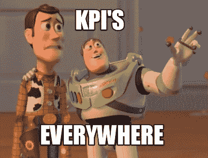

# 统治他们的 3 个标准——SaaS·Seed Ed。

> 原文：<https://medium.com/hackernoon/3-metrics-to-rule-them-all-saas-seed-ed-3d20910ca42d>

SaaS 的投资者很幸运，有大量的指标可以衡量，因为这些指标可以很好地代表重要的商业决策。

你什么时候能找到适合市场的产品？你以后怎么成长？你应该筹集多少资金？您可以查看指标来回答这个问题！

> **关于这一系列** 这一系列文章是根据我们在九点资本(Point Nine Capital)关于早期 SaaS 公司的首要任务的经验起草的。请注意，尽管这与那些首先关注中小企业，然后转向高端市场的初创公司更相关，但这种优先顺序足够普遍，适用于大多数 SaaS 公司。

从上往下看，**对 SaaS 公司来说** **一切都与增长和保持有关**——资本效率也很重要，但对风投资助的公司来说，那次于其他两个。

如果是关于增长和保留，反映的指标是什么？

显然，MRR 的增长和流失才是王道。

但是根据公司所处的阶段，您会面临不同的挑战:

## (1)A 系列+公司

**公司越成熟，可衡量和有意义的指标和子指标的数量就越多。**
你可以将 MRR 的增长视为(a)漏斗顶部的增长，(b)漏斗中的不同转换，(c)不同账户规模的 ARPAs，(d)扩张程度等的结果。

一旦你的漏斗变大，一个明显的小优化可以在底部产生显著的效果。这里的挑战不是获取数据，而是将数据分段并做出正确的归属。

## (2)种子期

**在非常早期的阶段，您没有足够的数据来计算这些指标。** 或者如果你有的话，它们在统计上不相关或者非常不稳定。

但是，即使你不能准确地测量它们，你也可以找到它们的好的替代品。

# 种子阶段的指标

**在早期阶段，你只能衡量你所做的行动和投入**——你可以写博客，可以给潜在客户发电子邮件，等等。—因为**你仍然没有足够的数据对结果、产出** —数量、转化等有所期望。

在这个阶段，当你选择衡量什么时，你应该寻找在短期内可行的东西。

您的输入和输出之间的反馈应该会很快出现，如下例所示:

*   **内容营销:
    *可衡量的投入*** :你可以控制自己写多少博文，付出多少努力去分发。
    ***可测输出:*** 访问量。
    ***反馈循环和不确定性*** :你仍然不知道每篇帖子会产生多少访客，但在发布帖子后的头几天，你会有一个很好的近似值。
*   **冷打:**
    ***可测输入*** :发送多少封邮件
    ***可测输出:*** 回复多少
    ***反馈循环和不确定性*** :你会很快看到打开率并体验到回复率的百分比。然后，您可以开始迭代和 A/B 测试不同的方法。
*   …

> 在这个阶段，你唯一能衡量的就是你付出的努力。有时结果会与此相关，有时不相关。

但是如果你对自己想往什么方向走没有一个清晰的框架，你就可以付出努力，得不到正确的结果。

由于这是一系列关于优先级的文章，我建议衡量以下 3 个关键主题:

## (1)关键产品指标或北极星—您的客户喜欢您的产品吗？

NPS 是当今衡量客户满意度的最佳工具。一旦你有了足够多的客户(10 个)或用户(100 个)，就去争取吧。

但是如果你更小呢？

然后，你需要了解你的**关键产品指标是什么:
告诉你你在为客户提供价值的指标是什么？**

我们产品组合中的三个例子:

*   字体:发布的调查数量
*   Algolia:生产中的部署数量
*   Automile:连接的汽车数量

您如何推动这一指标的增长？

当务之急是在漏斗的不同阶段优化这一指标，这是公司每个人的工作:

*   在漏斗的顶端，你显然需要带来足够的线索。那是负责销售和营销的人的工作。
*   **在入职培训时，尽量缩短新客户体验该指标的时间。这取决于产品、技术、支持和销售。
    需要多少点击量才能让它活起来？**
*   入职后，确保客户不断重复推动该指标的行动。

如果你把重点放在推动这一指标的增长上，你就会发现在你的漏斗的不同阶段，哪些是转化的阻碍因素。如果你去除它们，那么增长就会随之而来。

监控这一指标还能告诉你现有客户有多开心。如果你看到他们减少使用，你会得到一个很好的流失预测。

所有这些的好处是你可以每周衡量自己的进步。将漏斗的一个步骤提高 50%,当它很小时，可能不会产生很大的影响；但后来，50%以上的转换以后会很重要…

如果你想深入了解这一点，我的同事[在这里](https://medium.com/u/1fd8fe407851#.mkxrde1h4)和[Source](https://medium.com/u/7c8bbbb29fe3#FMywZg2RPR3ciWzz.97)

在这个非常早期的阶段，你应该开始衡量成长，但不要沉迷于此。

现在是关于学习，而不是不惜任何代价的成长。

现在是时候定义和测试关于客户问题的假设，测量漏斗的步骤和转换，尝试不同的增长实验等。

直到你看到你可以每个月增加几千个 MRR，或者你成长到大约 1 万个 MRR。

**然后，比赛开始……**

> 你喜欢这篇文章吗？
> 
> **请点击下面的心形**让我知道*💚* **或者联系我**[***@ DecodingVC***](https://twitter.com/DecodingVC)***。***
> 
> ***以防你错过了之前的:*** *1。* [*设定正确的目标*](/point-nine-news/from-launch-to-series-a-10-prios-before-you-reach-10k-mrr-saas-smbs-ed-1-10-e0ca8605553c#.kngzxfs8e)*2。**[*拥有合适的基础设施&监控到位*](/point-nine-news/from-launch-to-series-a-having-the-right-infrastructure-monitoring-in-place-2-10-4c1e9696c831#.dax56unet) *3 .制定正确的财务计划。* [*右队&角色*](/@decodingVC/the-right-team-roles-4-10-bf47196caba2#.63yr7tgyc) *5。* [*投资销售&营销*](/point-nine-news/invest-in-sales-and-marketing-5-10-ae9a2b14f4ef#.td369ccpm) *6。*[*SaaS 定价的注意事项*](/point-nine-news/7-dos-and-donts-for-seed-stage-saas-pricing-911acf88ca2#.5dyz0c8xq) *7。* [*关于雇佣和解雇客户*](/point-nine-news/on-hiring-and-firing-customers-in-saas-63550687b215)*

******

> *[黑客中午](http://bit.ly/Hackernoon)是黑客如何开始他们的下午。我们是 [@AMI](http://bit.ly/atAMIatAMI) 家庭的一员。我们现在[接受投稿](http://bit.ly/hackernoonsubmission)并乐意[讨论广告](mailto:partners@amipublications.com)赞助机会。*
> 
> *如果你喜欢这个故事，我们推荐你阅读我们的[最新科技故事](http://bit.ly/hackernoonlatestt)和[趋势科技故事](https://hackernoon.com/trending)。直到下一次，不要把世界的现实想当然！*

**