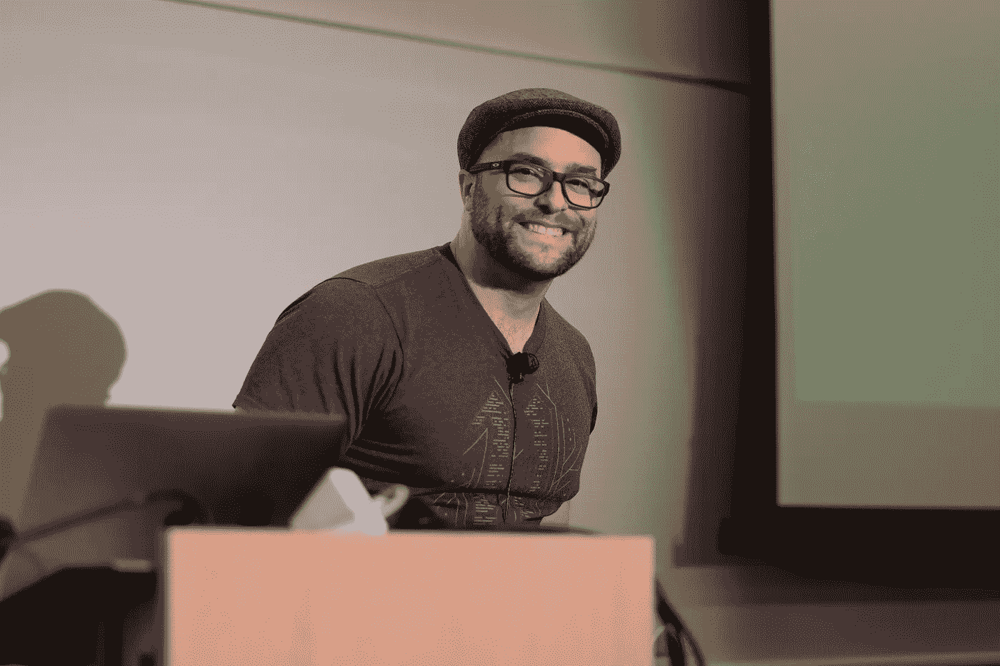

# 自由代码营创始人兼教师昆西·拉森的三个问题

> 原文：<https://medium.com/hackernoon/3-questions-with-freecodecamp-founder-teacher-quincy-larson-1736c68d1a78>

昆西·拉尔森 *在*[*freeCodeCamp*](https://www.freecodecamp.com/)*是老师和“创始人”，人们在那里学习编码并帮助非营利组织。他曾在多家公司担任软件工程师，在多所学校担任教师，但更为人所知的是他平易近人的技术视频和关于技术现状的精彩文章。每月有 50 万人使用 freeCodeCamp 学习编码。迄今为止，他们的社区已经向非营利组织捐赠了超过 140 万美元的编码服务。*

photo credit, [McBilly Sy](https://medium.com/u/da28b6d5f5a4?source=post_page-----1736c68d1a78--------------------------------).

1.这是一个很酷的数字出版时代。我们都与媒体一起成长，成为互联网上发展最快的科技出版物。我在 [freeCodeCamp](https://medium.com/u/8b318225c16a?source=post_page-----1736c68d1a78--------------------------------) 上看过很多很棒的帖子。我喜欢 Medium 清除了阅读和出版体验中的许多噪音。互联网上的大多数网页都太忙了。我想说的是，博客的运作和发展有很多技术。为了开发和发展数字出版物，你对什么样的未来技术或应用现有技术的方式感到兴奋？

> 首先，感觉是相互的。我在[黑客正午](http://hackernoon.com)看过很多优秀的技术博客帖子，也经常和我们的社区分享你的文章。
> 
> 对于像 freeCodeCamp 这样的小型非营利组织来说，Medium 是一个非常棒的平台，因为它没有广告，不需要验证就可以查看文章，具有很棒的社交功能，如推文报价，以及令人愉快的中性设计感受。他们也使得作家通过各种出版物如 freeCodeCamp 和 Hacker Noon 来整合他们的作品变得容易。
> 
> 至于增长技术，这听起来可能很奇怪，但我现在对电子邮件最感兴趣。
> 
> 在所有这些平台上，你必须做广告才能接触到你自己的用户。例如，当我们在 freeCodeCamp 的脸书页面上发布一些东西时，谁知道有多少露营者会看到它呢？它是一个黑盒子。我们可以在我们所有的追随者面前得到它，但是我们必须为此付钱。像我们这样的小型非营利组织没有资源支付这样的费用。
> 
> 但是有了电子邮件，我们可以直接和露营者交流，没有中间人妨碍我们并试图向我们收费。
> 
> 在过去的 6 个月里，我们一直在构建一个名为 [Mail for Good](https://github.com/freeCodeCamp/Mail-for-Good) 的开源电子邮件活动工具。想想 Mailchimp，但只需很小一部分成本。非营利组织和小企业可以将这个工具部署到他们自己的服务器上，然后使用它直接与他们的捐赠者和客户进行交流，而不用担心中介。

2.你是如何想到邀请非营利组织提交项目供学习者编写代码的——这个想法对你的业务有多重要？我必须说，这是一个创造性的方式来连接免费教育和学生为世界增加价值。

> 学习编码的最好方法是通过编码。我坚信体验式学习的价值——不只是从零开始建立项目，而是深入到其他人的项目中并加以扩展。遗留代码。
> 
> 最好的项目是真实世界的项目，人们会真正使用你写的代码。这让你对他们负责。你必须倾听他们的需求，并相应地构建功能。
> 
> 我有很多经营非营利组织的朋友，他们经常面临一个选择:把他们稀缺的钱花在他们今天的使命上，或者把钱花在企业软件上，这将帮助他们明天完成使命，但以一种稍微更有效的方式。我的想法是——让我们免费建立和维护他们需要的软件，这样他们就可以把 100%的钱花在他们的任务上——而不是花在软件上。
> 
> 参加 freeCodeCamp 1200 小时课程的大多数营员都希望在课程结束时帮助非营利组织。他们更愿意为非营利组织做贡献，而不是建立一个很少有人会使用的个人项目。所以真的是双赢。露营者获得真实世界的体验，非营利组织获得软件，非营利组织帮助的人最终得到更好的服务。

3.你在网上见过我，但我们从未见过面。你可以看到我正在做的一些事情，真正专注于发展博客和出版物的网络， [AMI](https://medium.com/u/1fedc8fffada?source=post_page-----1736c68d1a78--------------------------------) 。对于我或者其他对扩大媒体公司感兴趣的人，你有什么建议？

> 我不太了解媒体公司的规模，所以我觉得没有资格给你任何建议。显然你做得很好，因为你的出版物增长迅速。
> 
> freeCodeCamp 确实制作了很多媒体内容，比如媒体文章和 YouTube 视频，但在我们的核心，我们是一个社区。我们是一起自学编码的一百万人。我们正在构建工具来帮助我们更有效地做到这一点，比如 freeCodeCamp 的开源 web 开发课程。
> 
> 作为 freeCodeCamp 的编辑，对我个人有帮助的一件事就是我自己尽可能多地写作。这似乎让作者更容易接受我的编辑。他们知道我和他们在众所周知的竞技场上，尽我所能通过写有用的技术文章来以身作则。因此，当我说一篇文章需要更多的工作，或者当我提出一个替代标题或其他编辑时，他们更有可能相信我的判断。

**加入一个超过 100 万人的社区，他们正在学习编码，帮助非营利组织，并在 freeCodeCamp.com******找到开发人员的工作。****

****跟随昆西上**[**Twitter**](https://twitter.com/intent/follow?screen_name=ossia)**和**[**Medium**](/@quincylarson)**。****

****

**[*3 问题与。美国*](http://3questionswith.us) *是由*[*AMI Publications*](http://amipublications)*原创系列，剖析那些推动商业、科技、艺术向前发展的人。***

************