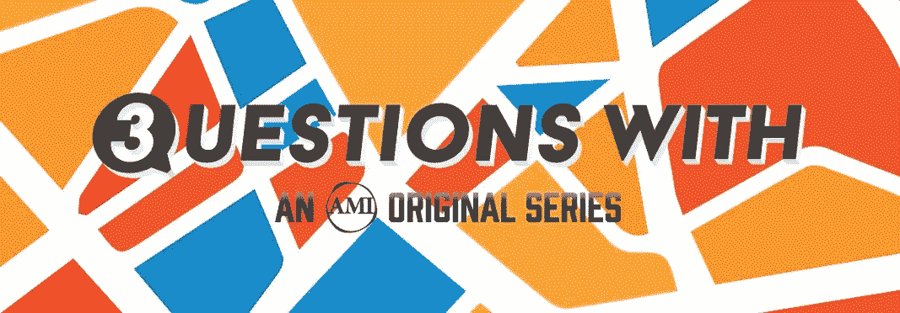

# Pepo 首席执行官杰森·戈德堡的 3 个问题

> 原文：<https://medium.com/hackernoon/3-questions-with-pepo-ceo-jason-goldberg-a2f895133423>

[)我对彭博文章的回应:“如何不掐死你的独角兽——杰森·戈德堡的 Fab.com 在崩溃前估值 10 亿美元。今天的创业公司能从他的失败中学到什么？”](https://medium.com/u/e1698c392e7a#.5cvk9mgsx))。但是仅仅因为我们写了它，并不意味着我们已经和解了。讲和很难。企业的死亡感觉就像人的死亡。当 Fab-Hem 结束时，悲伤的哪个阶段是最难接受的？

> 我没有一天不反思和考虑我过去犯下的错误。
> 
> 对我来说，很难确定哪一个“悲伤阶段”是最艰难的。都很难。

3.我对内容发现的未来很感兴趣。从报纸到搜索引擎，再到社交网络，都是关于如何找到下一个“内容片段”,以正确的组合和融合影响范围、共鸣和相关性。你能分享一下你是如何看待“对话图”塑造内容发现的吗？

> 在 [Pepo](https://pepo.com/?ref=3questionswith) 背后有一个“是的，但是，所以”让我着迷。
> 
> 是的，互联网让我们比以往任何时候都更加紧密地联系在一起，让我们更容易与信息和人联系。
> 
> 但是，仍然很难找到合适的人，与你分享激情，拥有你需要的专业知识。
> 
> 因此，我们正在努力使市场民主化，以实现共同利益和获取专业知识。我们认为这是一个值得研究的问题，也是一个非常有趣的市场机会。

[***Pepo***](https://pepo.com/?ref=3questionswith)***将你与分享你激情的人联系起来。*** [***下载 Pepo。***](https://pepo.com/?ref=3questionswith)

12 月 6 日，Pepo 宣布，它已经从腾讯、Greycroft、Vectr、Correlation、Oriente、Jason Goldberg、Nishith Shah 和其他投资者那里筹集了 2M 美元的种子融资。

[*3 个问题。美国*](http://3questionswith.us) *是由* [*阿美族出版物*](http://amipublications) *原创系列，剖析那些推动商业、科技、艺术向前发展的人。*

> [黑客中午](http://bit.ly/Hackernoon)是黑客如何开始他们的下午。我们是 AMI 家庭的一员。我们现在[接受投稿](http://bit.ly/hackernoonsubmission)并乐意[讨论广告&赞助](mailto:partners@amipublications.com)机会。
> 
> 如果你喜欢这个故事，我们推荐你阅读我们的[最新科技故事](http://bit.ly/hackernoonlatestt)和[趋势科技故事](https://hackernoon.com/trending)。直到下一次，不要把世界的现实想当然！

