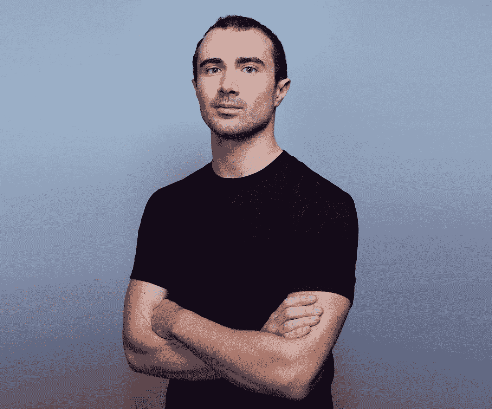
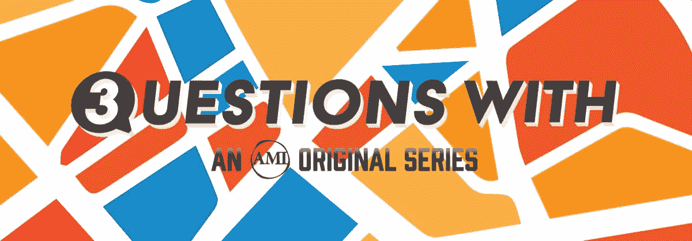

# Y Combinator 营销总监克雷格·坎农的 3 个问题

> 原文：<https://medium.com/hackernoon/3-questions-with-y-combinator-marketing-director-craig-cannon-716440c81af8>

[*克雷格卡农*](http://craigrcannon.com/) *是营销总监* [*Y 组合师*](http://www.ycombinator.com/) *。在此之前，他共同创立了* [*喜剧黑客日*](https://www.youtube.com/watch?v=WoK4_dQbfuU) *并在* [*洋葱*](http://www.theonion.com/) *做头部互换。有时他写旅行，像* [*骑自行车游览越南*](/@craigcannon/biking-the-ho-chi-minh-highway-5d8c798f310d) *和* [*徒步约翰·缪尔小道。*](/@craigcannon/fastpacking-the-john-muir-trail-b44b2469e62d)

1.很高兴本周在博尔德见到你。真的很喜欢谈论创业公司如何获得(和不获得)他们的第一批客户。Y Combinator 可能是年轻公司如何快速成长的最高权威，脸书是他们测试客户角色的最常见渠道。所以。你认为脸书会占据数字营销行业 50%的份额吗？

> 克雷格:很高兴见到你！
> 
> 所以对于那些不知道的人来说， [FB 和 Google 主导数字](https://www.recode.net/2017/5/2/15516674/global-ad-spending-charts)。FB 的份额会增加吗？我也这么认为根据我的经验，他们有最好的目标，如果他们参与国际市场，他们将很难停下来。很难说他们会分多少，但他们已经进行了大量的收购，并且似乎非常愿意复制以取得领先。
> 
> 现在，FB 确实是一个测试人物角色的好地方，但是我认为如果你在开发一个产品，却不知道客户是谁，那你就做错了。你会浪费钱在没有解释为什么有人不想要你的产品的广告上，你会浪费时间在开发上，因为你不知道优先考虑什么。当然，你可以随着时间的推移转换市场，或者最终使用 FB 广告来寻找新类型的客户，但你必须从一个观点开始。
> 
> 对于技术人员来说，我建议花一点时间在你的网站上实现脸书像素。这非常容易做到，而且可以给你带来更好的结果，而不需要把钱花在专门的营销人员身上。

2.你创造了 T2 在 48 小时内攀爬 95623 英尺的世界纪录。在巨大的体力消耗下，一个人会想很多事情……你还记得你给自己的最理智和疯狂的理由是什么，为什么不早点停下自行车？

> 哈哈。说实话，我从没想过停下来。我感觉身体上有所准备，并有一个电子表格来跟踪我的进展以及我需要去的地方，这有助于使努力变得更小。这一点非常重要，因为你是对的，这些愚蠢的耐力挑战大多是心理上的。
> 
> 我不认同围绕耐力项目的整个苦难文化。我喜欢这东西！显然，这并不总是阳光和彩虹，但在大多数情况下，你只是在你的脑海中，向前推动，人与他自己。没有任何好转:)

3.当我遇见你的时候，我把我的女儿放在一个汽车安全座椅里。这就是我今天工作生活平衡的现实。创业是出了名的让人筋疲力尽。你是如何看待第一次创业者在成为更好的商业人士和成为更好的业务以外的人之间取得平衡的？

> 是啊，这是个很好的问题。首先，他们照顾好自己的身体和精神。然后，他们[优先考虑并执行](https://www.amazon.com/Extreme-Ownership-U-S-Navy-SEALs-ebook/dp/B00VE4Y0Z2)重要的事情，这可能意味着发布更新或与他们的伙伴一起做晚餐。换句话说，你的人际关系和健康不会因为你对你的公司超级兴奋而保持不变——你必须继续投入工作，这通常意味着削减一些东西。
> 
> 我不擅长在脑子里对任务进行客观排序，所以我只是把输入和潜在输出写成一个句子。一旦我在纸上看到它们，通常很容易区分什么是重要的工作，什么是不重要的工作。如果你仍然有困难，回顾一下过去的一年，考虑一下 80/20 法则。什么行动带来了最大的收益？什么事花了你最多的时间，却没有为你的企业做任何事情？
> 
> 我发现另一件有帮助的事情是认识到你一天中什么时候最有效率。在 YC 之前，当我为自己工作时，我最初很挣扎，因为我认为我总是可以做得多一点，以完成一笔销售或一个项目。事实上，我在早上效率最高，到了下午 2 点左右，我就坐立不安，有点没用了。现在我计划我的一天。我早上 6 点左右开始工作，下午 2 点左右锻炼，然后结束任何额外的工作或社交活动。
> 
> 有趣的是，我认为成功的人从来不会如此投入，以至于他们不能为朋友腾出时间。他们只是不会在琐碎的事情上浪费时间。
> 
> 哦。还有一件事。我建议关闭每个应用程序上的通知和徽章号码。通知是魔鬼，也是我永远不会拥有苹果手表的原因。如果天要塌下来，会有人给你打电话。

> **申请 YC W18 批次** [**开放**](http://www.ycombinator.com/apply/?ref=hackernoon.com) **。**
> 
> **我的邮箱是**[**Craig@YCombinator.com**](mailto:Craig@YCombinator.com)**。请给我发电子邮件提问，尤其是如果你是一个在技术领域代表性不足的人！**
> 
> **推文**[**@ Craig cannon**](http://twitter.com/craigcannon)**&**[**@ y combinator**](http://twitter.com/ycombinator)**。**

[*3 个问题。Us*](http://3questionswith.us) *是由*[*@ AMI*](http://twitter.com/ami)*原创的系列，剖析那些推动、技术、创作向前的人。*