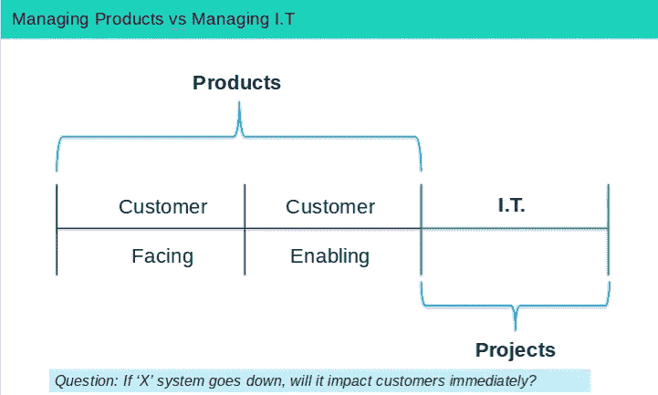
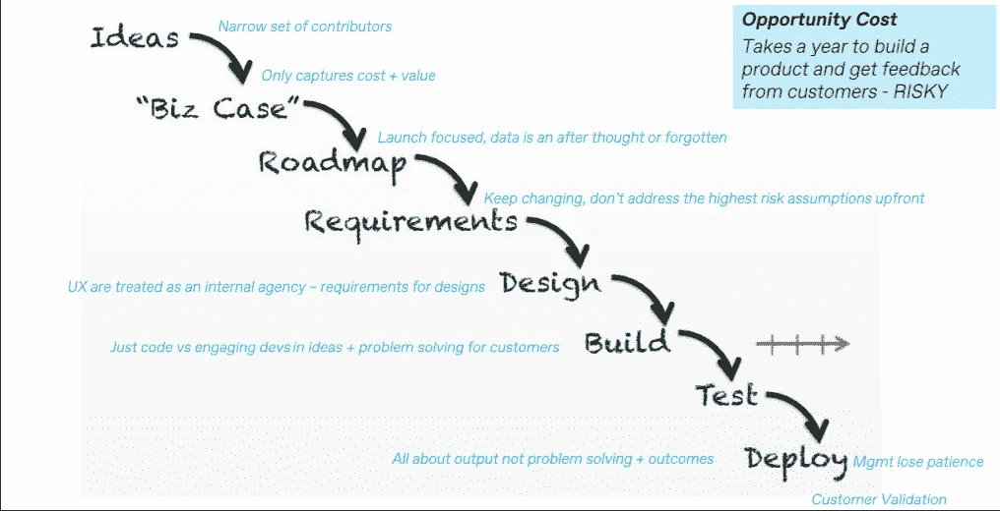

# 项目导向型公司失败的 3 个原因

> 原文：<https://medium.com/hackernoon/3-reasons-why-project-led-companies-are-failing-e5c12bb18036>

The bleak past of incumbents

敏捷已经成为技术领域的一个词汇，它出现在每一份工作描述中，并且每天都被技术专业人员误用。科技公司有三个不同的阶段。

1.  **早期创业:**从想法到产品/市场契合度(PMF)。
2.  **成长期创业公司:**从 PMF 到规模化。
3.  **企业:**向大众介绍新产品。

对于像亚马逊这样以产品为导向的组织来说，情况是这样的:

1.  网上买书和卖书的市场。
2.  网上买卖商品的市场。
3.  亚马逊网络服务和亚马逊 Echo 等新产品。

一路走来，你总会发现以产品为主导的公司闯入企业 ***押下大赌注，并愿意在必要时损失惨重。亚马逊 Fire 智能手机就是一个例子。***

对于以项目为主导的组织来说，在从初创到企业的过程中，敏捷思维往往会被淡化，下面这张由 Marty Cagan 启发的图表描述了失败的根本原因。

## 敏捷瀑布

三个主要原因导致了一种失败状态，即项目主导的企业无法快速创新，并开始落后于新进入者，与他们竞争更具创新性的产品和更好的客户体验。

1.  产品像信息技术一样运行
2.  他们所谓的敏捷实际上只是一个瀑布过程。
3.  没有能力下大赌注。

Problem 1

第一个问题是，以信息技术为主导的组织像管理信息技术一样管理产品。在科技公司，产品和项目之间有着明显的区别。信息技术通常由首席执行官负责，通常管理任何系统，如果系统瘫痪，不会对客户造成影响。比如 Helpdesk，Workday 这样的费用管理软件或者 Halogen 这样的 HR 人才管理软件。产品是任何软件，如果发生故障，会立即对客户产生直接影响，这由首席技术官负责。这包括支持客户的产品，如核心 API，以及面向客户的软件，如移动应用程序。

Problem 2

信息技术领导的组织将产品作为项目进行管理的方式如上图所示，但我将在下面进行更详细的分析。

*   **想法:**在这个阶段，参与者的范围很窄，比如高管团队，而不是产品经理、UX 设计师和工程师。
*   **业务案例:**侧重于预测成本&收入，通常是猜测，很少与实际情况进行比较。精益画布应用于新产品或现有产品新功能的简单机会评估。
*   **路线图:**关注里程碑和交付。通常庆祝发布的成功，而不是有意义的指标，如客户获取或转换百分比。
*   **需求:**项目进行过程中，随着需求的变化，范围、预算和时间几乎总是会受到影响。相反，创意应该针对 4 个关键风险进行验证，即价值风险、可用性风险、可行性风险和商业可行性风险。
*   **设计:** UX 设计师被视为内部设计机构，利益相关者向他们提供设计需求。在产品开发过程中，UX 设计师应该从构思阶段就参与到原型的创建和迭代中。只有经过验证的设计才能进入产品交付阶段，但大多数设计(高达 75%)会被扼杀。
*   **构建:**当工程师真正理解语音和人工智能等技术的限制和机遇时，他们被要求只编写代码。因此，他们应该从想法阶段就参与进来，因为他们是新想法的伟大来源。
*   **部署:**一旦新产品交付，客户确认太少，太迟。一些企业需要长达一年的时间来发布新功能，更不用说产品了。具有讽刺意味的是，当管理层努力理解他们的竞争对手是如何获得市场份额的时候，他们往往是超然的，并且失去了耐心。

最后，我们可以从最近破产的玩具反斗城吸取教训。他们犯了两个致命的错误，他们在 2001 年将履行外包给亚马逊，因为他们不相信创新和适应互联网。第二个战略失败是，他们没有继续为他们的社区增加价值，例如，儿童软游戏或表演。他们没有下大赌注。

> 不要重蹈这些大公司的覆辙。

## 学到了什么？单击并按住👏说“谢谢！”并帮助他人找到这篇文章。