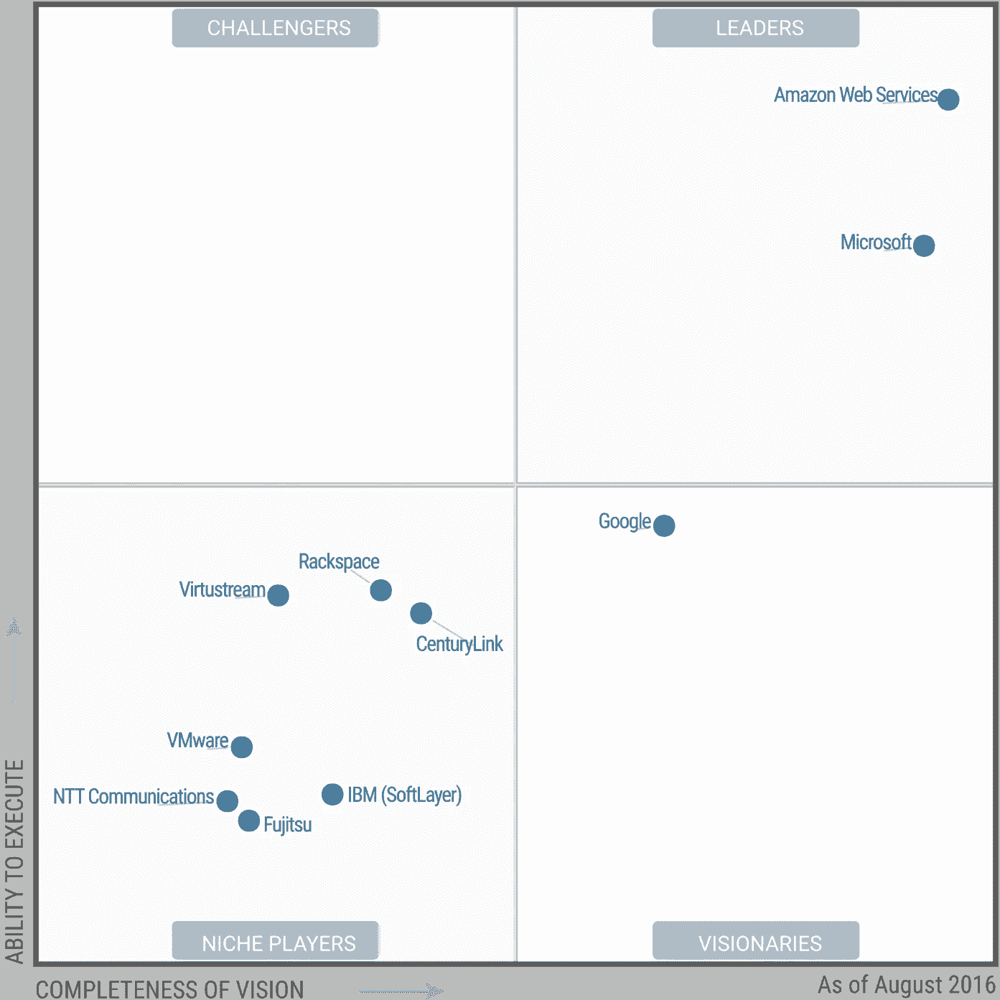

# 今年您应该获得 AWS 认证的 3 个原因

> 原文：<https://medium.com/hackernoon/3-reasons-why-you-should-get-aws-certified-this-year-7e44dbc51519>

## 虽然证书不能代替实际经验，但它们是一个很好的起点

[https://unsplash.com/photos/b5POxb2aL9o](https://unsplash.com/photos/b5POxb2aL9o)

今年(2017 年)早些时候，我决定是时候停止忽视其中最大的玩家: [AWS](https://aws.amazon.com/) (亚马逊网络服务)。

总的来说，我并不热衷于追逐最新的科技潮流，因为“所有酷孩子都在这么做”。是的，一个人需要在这个非常活跃的行业中保持相关性，但是如果一个人一直跟随这些趋势，也有永远成为专家的危险。然而，就 AWS 和云计算而言，这不是一种趋势，而是一种新常态。无知在这里会让你变得无关紧要，非常快。

尽管我在工作中使用了某些 AWS 支持的服务，但我对不同 AWS 服务的了解和经验相当有限。我知道亚马逊提供了一个丰富的存储、计算、自动化和基础设施技术生态系统，所以在做了一些研究后，我决定最好的方法是获得 AWS 解决方案架构师(助理)认证。

认证在 IT 界是一个有争议的话题。一些人认为获得认证会让你更有市场，而另一些人则认为这会产生负面影响，给人一种你在弥补经验不足的印象。不管你在这个问题上的立场如何，在我的职业生涯中，我个人的认证经历一直是非常积极的。这无疑为我打开了许多大门，让我从其他候选人中脱颖而出。

那么，你为什么要追求 AWS 认证呢？

## 1.AWS 正迅速成为云的黄金标准

AWS 几乎在每个方面都处于领先地位。根据 Gartner 的数据，亚马逊的云规模[是其 14 个竞争对手总和](https://techcrunch.com/2016/12/02/aws-shoots-for-total-cloud-domination/)的 10 倍！这对 Azure 和谷歌云平台的人来说是个坏消息，但对你来说却是个好消息。

无论你是 web 开发人员、数据库管理员、系统管理员、物联网开发人员、大数据分析师、人工智能开发人员(名单还在继续)，如果你利用亚马逊的平台，你的生活将变得更加轻松。他们的产品几乎涉及技术的每个方面，讨论它们超出了本文的范围。他们不断增加产品和创新，将竞争对手远远甩在身后。

Gartner 著名的[魔力象限](https://www.gartner.com/doc/reprints?id=1-2G2O5FC&ct=150519)报告中有这张方便的图表，显示了 AWS 在创新和执行的各个方面的领先地位:

source: [Gartner](https://www.gartner.com/doc/reprints?id=1-2G2O5FC&ct=150519)

## 2.AWS 认证是可行的，并且触手可及

与其他供应商不同，亚马逊提供了一个现实的认证途径，不需要高度专业化(且昂贵)的培训就可以开始。我并不是说获得认证非常容易，但是你不必为了获得你的第一个 AWS 认证而辞职并支付昂贵的培训费用。

截至 2017 年初，AWS 提供了 [3 个等级](https://aws.amazon.com/certification/):

1.  关联层:

*   认证解决方案架构师助理
*   认证开发人员助理
*   认证系统运行管理员助理

2.专业层:

*   认证解决方案架构师专家
*   DevOps 专业版

3.专业层:

*   安全性
*   高级网络
*   大数据

最常见的方法是从认证解决方案架构师助理开始。这是熟悉 AWS 生态系统和核心服务的好方法。在参加专业或专业考试之前，你需要有一个助理证书。此外，AWS 要求您在参加解决方案架构师专业测试之前拥有解决方案架构师助理证书，或者在参加 DevOps 专业测试之前拥有开发人员或系统操作员助理证书。

至于培训，目前最好的资源是云专家 T2。主要依靠他们的优秀课程，我通过了三个准证。[Forbes](https://medium.com/u/f3615b3c498e#5fc948e17978)

还需要我多说吗？

话虽如此，请记住，仅仅获得 AWS 解决方案架构师认证并不自动意味着您将获得上表所示的年薪。许多其他因素也在起作用，包括你的其他技能、经验、地理位置等。关键是，向潜在(或现有)雇主证明你有能力使用亚马逊的云产品将对你的职业生涯产生巨大的积极影响。

大约一周前，在通过了解决方案架构师和开发人员考试之后，我通过了 AWS SysOps 管理员考试。我目前正在探索机会，所以这将是对这种努力是否会有回报的真正考验。不管最终结果如何，我觉得我真的获得了一套独特的技能，这对我自己的副业项目以及未来的职业机会肯定非常有用。

# 行动呼吁

在:[https://aws.amazon.com](https://aws.amazon.com)注册一个免费的 AWS 账户。

探索关于 [Udemy](http://udemy.com) 和[云专家](http://acloud.guru)的 AWS 课程。

如果您对如何提高 AWS 技能有任何问题或需要建议，请联系我。

> [黑客中午](http://bit.ly/Hackernoon)是黑客如何开始他们的下午。我们是 [@AMI](http://bit.ly/atAMIatAMI) 家庭的一员。我们现在[接受投稿](http://bit.ly/hackernoonsubmission)并乐意[讨论广告&赞助](mailto:partners@amipublications.com)机会。
> 
> 如果你喜欢这个故事，我们推荐你阅读我们的[最新科技故事](http://bit.ly/hackernoonlatestt)和[趋势科技故事](https://hackernoon.com/trending)。直到下一次，不要把世界的现实想当然！

