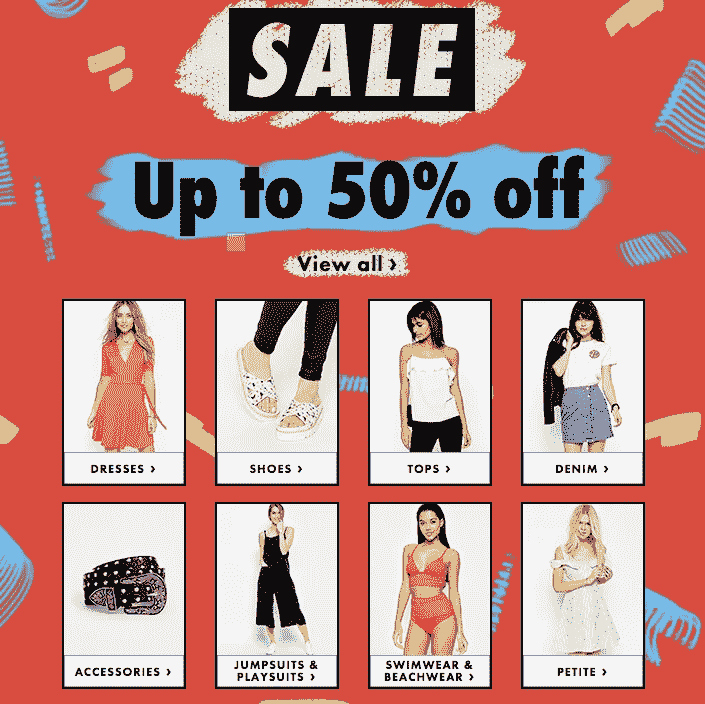
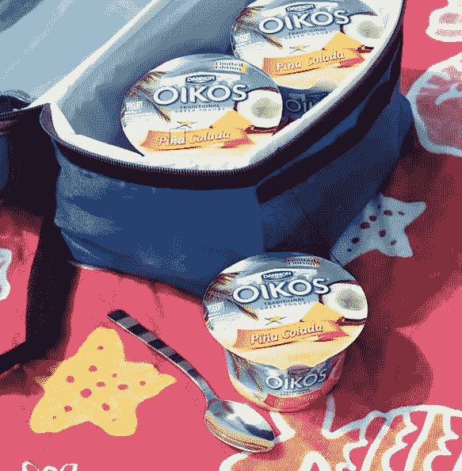
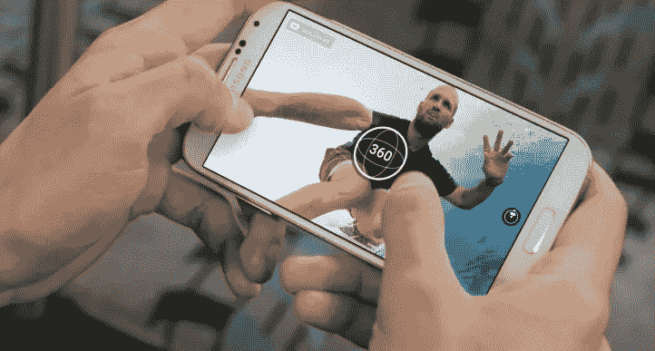

# 三个简单的步骤来“夏天”你的在线内容

> 原文：<https://medium.com/hackernoon/3-simple-steps-to-summer-your-online-content-f68396eb8fd0>

“夏天”这个词通常代表快乐、轻松的时光，人们对工作的兴趣减少了，对度假的兴趣增加了。高温导致的疲劳加上前几个月辛苦工作带来的疲劳，是导致除了娱乐之外对任何事情都缺乏兴趣的原因。

作为一个企业主，事实上，在计划、执行和反应方面，summer 并没有改变太多，但它确实改变了我们消化周围内容的方式，尤其是在涉及到**数字**的时候。

那么，我们都可以做些什么来以一种更加夏日的方式向我们那些不感兴趣的网站访问者展示我们自己呢？我们如何准备一个夏季内容计划来跟上前几个月的成功？记住你的生意和你的访客在夏季的分离，夏季会给你一个机会，最终将娱乐和工作结合起来，因此即使在这个不冷不热的季节也能保持领先。

比其他季节更重要的是，保持简单现在是最重要的。那么，如何*夏天*你的[在线](https://hackernoon.com/tagged/online)内容呢？

## 关键词 1:销售

asos.com

对于**电子商务**行业来说，夏天没有比“**特卖**”更好的关键词了！这个词也是你的夏季社交媒体计划的一个触发器，你可以使用广告、图像和视频来帮助你吸引访客到你的网站。

如果你的企业在食品和饮料行业，那么你会意识到食品成本的上升，以及一些具有成本效益的方式来展示你的品牌。其中一种方法是利用社交媒体与更大的玩家竞争，并创建一个忠实粉丝的社区。

不管你属于哪个行业，制定一个折扣计划和选择打折商品会让你的生活从一开始就变得更轻松。送人不知何故成了每个夏天的关键词。那么，为什么不制定一个夏季内容计划，展示可以在任何地方使用、消费、准备或携带的夏季物品，尤其是去海滩？因此，在户外拍摄的自然照片来传递夏天的感觉、阳光和好天气，是首先要考虑的问题之一。在更新你的网上商店的同时，提供*你附近的*商店地址，在那里你可以买到你的夏季产品，或者简单地给自己动手做的想法，包括你的产品。

Danon.com on Instagram

通过社交媒体、博客、广告和视频，你可以吸引人们的注意力，把访问者带到你的网站上，在那里你只需简单的几步就可以提供产品。时尚爱好者和折扣追逐者在社交媒体上无处不在，无论你使用哪个社交媒体平台，你都不可能错过他们。为您的产品和用您的产品准备的食物/食谱准备高质量和有吸引力的图片。选择 Instagram、Pinterest 等图片平台。

## 关键词 2:颜色

The Logo Company

你可以向你的客户或网站访问者提供的最好的非语言交流方式之一就是用颜色来表达你的能量和意义。

一般来说，[色彩心理学](https://en.wikipedia.org/wiki/Color_psychology)是把色调作为人类行为的决定因素的研究，它包括四个季节:春、夏、秋、冬。每一种季节颜色都有特定的含义，但每一种颜色也包括不同的特征。当你在夏天开始准备你的在线展示时，考虑颜色也是很受欢迎的。事实上，颜色会帮助你吸引注意力，但也能帮助你在夏季以最佳方式传达你的信息、提议和知名度。

> *颜色无处不在，是信息的来源。人们在最初与人或产品互动的 90 秒内就做出了决定。大约 62‐90%的评估仅基于颜色。——*[*色彩在营销研究中的影响*](http://www.emeraldinsight.com/doi/abs/10.1108/00251740610673332)

所以，是时候把你的品牌元素染成夏天的颜色了！

## 关键词三:360 度视频

Facebook 360-degree video

您已经将脸书 360 度视频纳入您的内容战略了吗？如果没有，我会很快写更多关于脸书和你给我们带来的这个奇妙的机会。同时，给你提个醒，截止到今年二月，人们已经在脸书上传了超过 20，000 个 360 度视频！此外，You Tube 上的 360 度视频数量仅在三个月内就翻了一番。查看[迄今为止观看次数最多的 10 个 360 度视频](http://www.adweek.com/news/technology/here-are-10-most-viewed-360-degree-facebook-videos-brands-171372)！

是什么让 360 度视频如此吸引人？

实景体验正是将观众吸引到你的 360 度视频中的东西。浏览这些图片远比简单地浏览张贴的图片更令人兴奋，它激发了人们进一步探索的兴趣。我很快会写更多关于如何为你的在线内容计划使用 360 度视频，但现在，正是这种进一步探索的*兴趣是你在炎热的夏天需要的，并让你的访问者的兴趣回到他们所属的地方——**你的网站**！*

*本文原载于* [*阿瓦隆博客*](http://www.avalon.host/blog/tips-to-prepare-website-for-summer-season/) *。*

> [黑客中午](http://bit.ly/Hackernoon)是黑客如何开始他们的下午。我们是 AMI 家庭的一员。我们现在[接受投稿](http://bit.ly/hackernoonsubmission)并乐意[讨论广告&赞助](mailto:partners@amipublications.com)机会。
> 
> 如果你喜欢这个故事，我们推荐你阅读我们的[最新科技故事](http://bit.ly/hackernoonlatestt)和[趋势科技故事](https://hackernoon.com/trending)。直到下一次，不要把世界的现实想当然！

