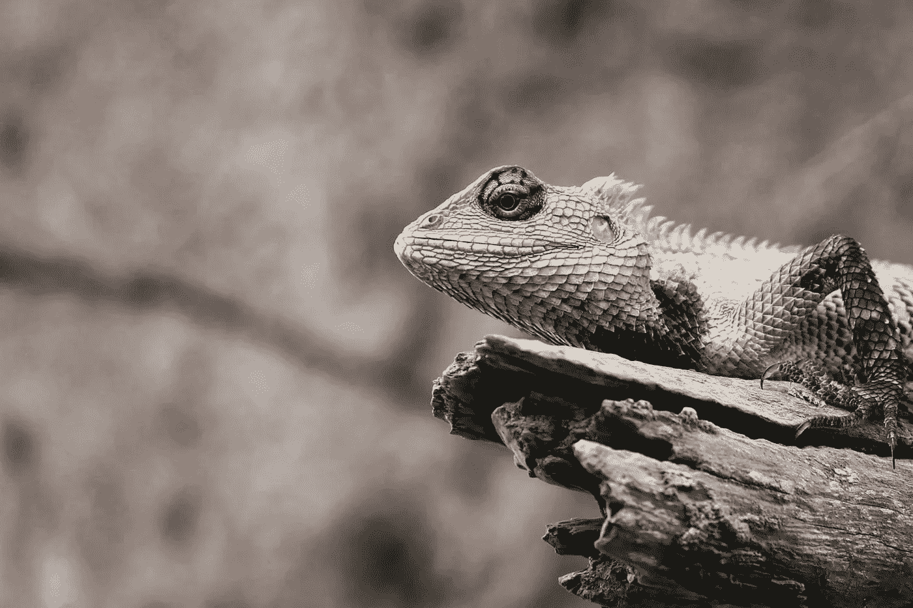

# 在人工智能驱动的未来，我们都需要 3 项技能

> 原文：<https://medium.com/hackernoon/3-skills-you-need-to-thrive-in-the-ai-driven-future-1412e68dee84>

Image Source: Pixabay

我已经说过很多次了。

关于**人工智能**、**机器学习**、**神经网络**，以及其他众多**自动化系统**。

现在摆在我们面前的任务是让我们的下一代拥有打磨他们大脑的方法。这一切都取决于他们从生命的第一天就开始学习的终极技能。信不信由你，*招聘候选人*的*传统方法*早就不存在了。

> “合适的技能组合是企业需要的。
> 没去过合适的大学！”

## 为什么我们都在寻求开放的人才员工？

Image Source: Unsplash

当然，因为我们看到了社交媒体最近带来的巨大变化。就我们经营的不同类型的企业以及人类如何带着巨大的学习热情涌现而言。

我们充满了求知欲，从如何像电视节目中看到的厨师那样烹饪，到如何成为像十几岁的马克那样的人。 我们彬彬有礼，温顺地与一个群体在一起，学习一些东西，以便为我们作为一个社会所面临的问题提出解决方案。

我们只是还没有意识到，尽管我们都在一个非常不同的工作场所做着非常不同的工作，但我们最终都希望登上**火星**，因为我们个人不喜欢看着我们的一部分因为*自然* *灾难*而死亡，这些灾难在最近以惊人的速度开始发生。

> 1.随着**越来越多的自动化机器**随之而来的是自动化的工作岗位，你对未来有什么看法？
> 
> 2.作为一个社会，我们什么时候才能承认这种变化是意料之中的，并且**是进化的一部分**？
> 
> 3.也许，我们变得如此脆弱是因为我们一直拥有这个地球？我们把其他物种赶出了生存联盟，现在我们不喜欢机器来领导我们或者接管我们？

不管我们害怕的原因是什么，就机器跑得比我们快而言，没有一个原因是我们真正应该感到悲伤的。机器人只会处理我们所有的**例行**、**冗余**、**任务**。

由于我们的未来掌握在**公开**和**私人访问数据**的手中，为了关注实际问题并采取有意义的行动，人类将被要求创造性地连接这些点。

而不是必须处理繁琐的工作区。

> 图表显示，
> 
> 更多的机器→快速收益(来自重复性任务)→创造力上升(人类)→创新产品/解决方案/服务。

毫无疑问，很明显，人类需要推动**坚定的创造力**，这可能会帮助我们培育各种创新和有用的项目。

好了，现在，未来幸存者必须具备的 **3 项最高技能**，

*   有意义的
*   社会智力
*   适应性思维

## 有意义的

Image Source: Pixabay

说到有意义，这是一种**能力**为可能出现的各种模糊情况做出不带偏见的/ **客观决策**。

例如，如果网络中立安装，互联网口袋可能会面临死角的情况下，因为每个人都将掌握权力，以访问平等的网络。

速度可能是一个问题，或者企业可能会开始要求一些不同的或额外的东西，以比其他人表现得更出色。在这一点上，意义创造将帮助我们做出上下文相关的行动，并在这些事件中保持自由思维。

## 社会智力

Image Source: Unsplash

社交智能主要是从我们日常生活和交往的社会中获得的。正如一般的智商取决于遗传一样，社会智力被证明是我们通过常规学习获得的品质。每个有社交能力的人都知道如何在房间里工作。

*   做出清晰有效的口头选择。
*   拥有可笑的品质来与同伴和群体进行有意义的对话。
*   将了解社会角色、规则和脚本。
*   他们的倾听技巧将比房间里的任何人都引人注目。
*   他们的角色扮演专长将最具诱惑力，他们的谦逊将经受住任何逼近的“ ***机器将取代人类的*** 威胁。

## 适应性思维

Image Source: Unsplash

> 摆脱那种认为**牺牲**就是适应环境的想法。

适应性是接受我们面临的变化，并通过最大限度地利用这些变化来前进。声称与在特定情况下牺牲事物毫无关系。

做出牺牲意味着失去自己生活的价值，而适应性意味着注意到并适应变化，毫不放松，甚至最终积累巨大的收益。

不仅仅是适应和接受变化的潜力。这是一场游戏，谁将保持韧性，而其他人将被告知他们的出路。无论是个人还是企业，要前进，要生存，就必须与这种适应变化和环境的需求保持一致。

这些 **3 技能**将进一步要求**计算思维**、**设计思维**、**新媒体素养**(在数字媒体之间周旋以消费各种内容的能力)、**跨学科**(能够完全在自己的专业知识之外工作并为全球问题创造解决方案)，等等。

## 拓展自己，获取更多的知识，确保你尝试了所有你学到的知识。因此，当进化的浪潮冲击前门，并计划淘汰不稳定者时，你要把自己定位得与众不同。