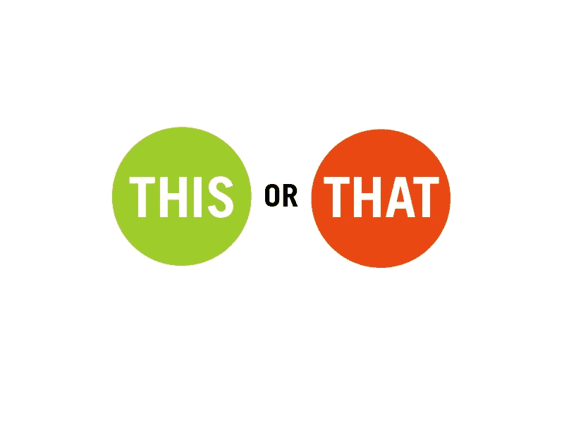

# 您企业的 3 步集客营销漏斗

> 原文：<https://medium.com/hackernoon/3-step-inbound-marketing-funnel-for-your-business-aee1d1e17292>

## 内向和外向营销策略主要是为了让企业在这个数字化转型、消费者需求旺盛的世界里胜过竞争对手。

首先，

我想知道我们大多数人是如何奢侈地生活而对未来没有任何计划的！

撇开这个不谈，作为一个骗子，我们都有自己的短期目标和长期目标。据说，我们的短期目标包含了一系列我们希望在很短的时间内完成的事情。

> 其中一个尝试是，我们每天狼吞虎咽地吃健康食品，并期望第二天就能看到体重大幅下降。而我们的长期目标仍停留在**之外**。

**不是神话**:我们太古怪了，有时我们认为[地球是平的](https://en.wikipedia.org/wiki/Flat_Earth)(对那些仍然相信的人来说)。

关键是，如果我们缺乏计划，就像在黑暗中瞎跑。这只会导致**的致命失败。**

**让我提出一个问题，当我们还没有弄清楚我们需要什么才能达到目标时，我们如何才能实现我们的目标、梦想或获得我们想要的力量呢？**

**这不仅适用于赢得**内在/人际标准**，也适用于设计 [**常青树商业模式**](https://hackernoon.com/build-a-product-that-sells-on-its-own-df01c999672f) 。**

**当你的企业不具备**战略漏斗**(没有能力建立商业企业的非技术人员或普通人称之为‘T26’计划)时，你永远无法发现的是，你的财政投资是多么半生不熟，这将很快变成无法治愈的创伤。**

**结果，你所付出的努力和汗水从未得到认可。渐渐地，你会开始看到 [**收入意外飙升，而**](https://blogs.zarget.com/4-tips-to-improve-landing-page-conversion.html#.WeVTXhOCw6U) **收入下降。****

**当这种情况发生时，很少有企业坚持通过渐进式思考来采取明智的措施。而大多数其他人动作迅速，茁壮成长，更难生存，但在匆忙中，他们都无视**批判分析**和去自我火化放弃。**

> **好难过！看着有人倒下是**心碎**。不是吗？**

**我正在分享我的一些学习和我所知道的关于经营一个稳定的业务和一些 T2 的好的商业策略的事情。**

***我一定会尽量不在这里丢弃不想要的陈词滥调和术语。***

****

**接下来，这些是**有效在线营销**的要素，也是几个顶级品牌已经证实的方法。当我说营销时，它包括入境和出境营销。**

## ****什么属于** [**集客营销？**](https://www.hubspot.com/inbound-marketing) (本博客将具体解释)**

**集客营销主要通过**内容**吸引顾客。它几乎与社交媒体互动、**博客帖子、出色的案例研究、竞争性招标、**在**搜索引擎**中更高的可见性等活动相关。**

## **[出站营销呢？](http://www.marketing-schools.org/types-of-marketing/outbound-marketing.html)(让我在下一篇博客中讨论这个问题)**

**它可能看起来像一个充满狗屎的东西，因为许多企业不像对待他们的集客营销策略那样对待它。但它肯定带有一丝潜在的危险。**

**外向营销包括开展**点滴活动、点击付费、点击率、横幅广告、电话推销**等活动。**

**我不想担保这些策略中的任何一个是最好的，因为我相信如果实施得好，内向和外向策略都将'**摇摆前进**'(灵感来自 **Calvin 的《我的方式》**)。保证。**

**Hit play and refresh yourself :)**

> **就像**加尔文·哈里斯**对 **PopCrush** peeps 说的那样， **My Way** 背后的真相并不像我们想象的那样令人反感，而是，**破局**高飞**

## ****集客营销漏斗的三个关键层****

*   **提高知名度还是出柜(我知道你在想什么)**
*   **吸引用户/访问者**
*   **赢得交易**

**[看看你可能错过的 **6 种最佳营销工具**。](https://blogs.zarget.com/top-marketing-tools.html#.WeVUbBOCw6U)**

**有很多方法可以做到这一点。主要的焦点是让你的 [**目标观众**](https://blogs.zarget.com/divide-your-target-audience-to-get-the-best-out-of-ab-testing.html) 知道你即将大放异彩，他们只是幸运地瞥到了你即将提供给他们的**价值**。**

**看看 [**NSM**](https://growthhackers.com/articles/north-star-metric) 的意思。**

**考虑在 **ProductHunt** 上发布**预发布公告**来开始。这是一个本土的门户网站，它让你可以为你已经准备好但尚未推出的产品制造一些噪音。**

****

**让访问者互动和理解你向他们承诺的价值。对你的品牌和产品有一个强有力的价值主张。**

**[**不确定什么是价值主张？到这里来。**](https://hackernoon.com/build-a-product-that-sells-on-its-own-df01c999672f)**

## **内容的作用**

****

**尽可能多地创造内容。内容的类型可能会因您所在的企业而异。快速浏览**关键词/内容分析**并找出表现最好的内容以供借鉴(这是最有效的 ***营销技巧*** )。**

**建立一个**信息内容** **库**，让读者/访问者/试用者对你的品牌留下印象。**

## **为什么要担心读者呢？**

****

**因为在金钱和时间发挥主要作用的情况下，每个人都会阅读(**评论、产品描述、用例、现有用户的信任徽章**)。**

**相信我，今天的**数字化转型**彻底改变了潜在买家的习惯。网上只有**冲动型买家**。**

****加强**上的**和**下的**页面**的身份指标/关键词用法。进行有力的关键词研究，并持续进行竞争对手分析。把你的大部分时间投入到修复 SEO 上。**

**[列表中的**图片** **SEO 小技巧**](https://blogs.zarget.com/image-seo-tips.html#.WeVVZROCw6U) (以防你需要一些)**

> **“网上的有机内容和有机食品是一样的。
> 人们说他们保持质量，是他们目前唯一的救命选择”**

**对我来说最有效的一件事是利用所有的社交媒体，并根据获得的见解不断优化。每一个**社交媒体**门户，从时尚**脸书**到扣人心弦的 **Pinterest** ，都提供丰富甚至令人震惊的**福利**(原因？我们几乎生活在网络世界之外)。**

**脸书的广告包价格也很便宜 **Twitter** 是你接触更广泛受众的最佳工具**。****

## **数据有魔力**

****

**不要忘记查看**数据**。使用**智能分析工具**了解**用户行为、客户旅程、点击和滚动、参与数据**等等。**

**最后，有大量的**营销工具箱**可供学习适用的策略。使用它们。本质上，你越注重获得有机流量，你的增长就越会保持不变。**

**日复一日，你会被遍布网络的机器人视为**可持续资源**(一两年后会增长到**80 倍**多)，并被推到搜索引擎的顶端(用户光标所在的位置**)。让你的潜在客户更容易找到你，因为你的质量分数已经很高了。****

****我们暂时结束了。****

## ****嘿，如果你从这篇文章中了解到任何关于集客营销的知识，你可以在离开时给我发些东西。****

## ****好吗？用力按那个按钮:)****