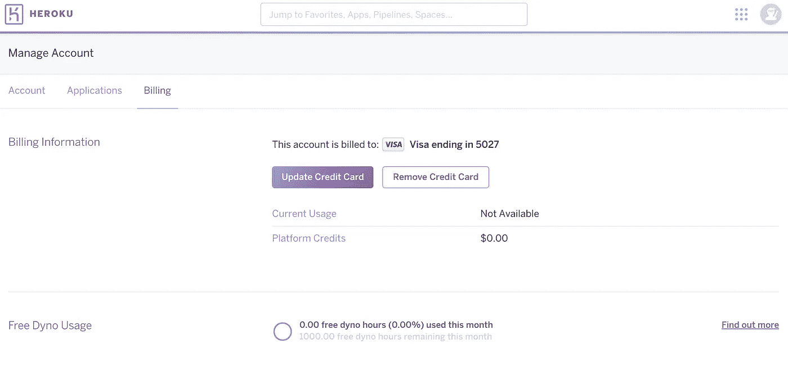
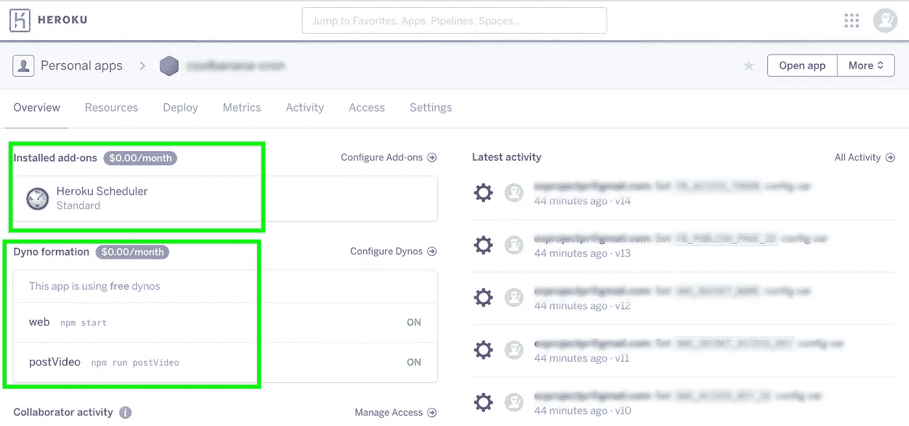
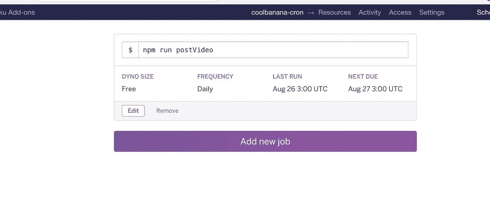

# 设置 Heroku 计划(cron)作业的 3 个步骤

> 原文：<https://medium.com/hackernoon/3-step-setting-up-heroku-schedule-cron-job-example-tutorial-set-up-node-dyno-14d1d8ccfe4f>


# 1-在 heroku 中设置您的信用卡信息



# 2-安装附加计划程序

在项目目录下安装插件调度程序，为这个特定的项目激活服务

```
$ heroku addons:create scheduler:standard
```

# 3-安装脚本

点击顶部绿色框的`install add-ons`



设置您想要运行的脚本

```
npm run postVideo
```



# 参考

[https://devcenter.heroku.com/articles/scheduler](https://devcenter.heroku.com/articles/scheduler)

[https://dev center . heroku . com/articles/scheduled-jobs-custom-clock-processes](https://devcenter.heroku.com/articles/scheduled-jobs-custom-clock-processes)