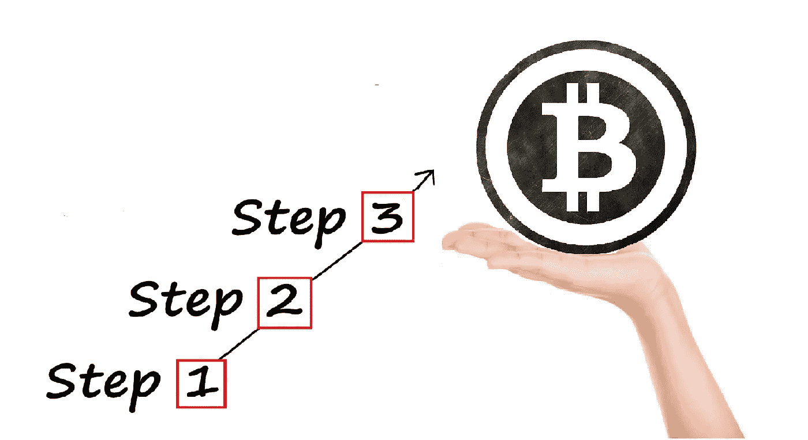
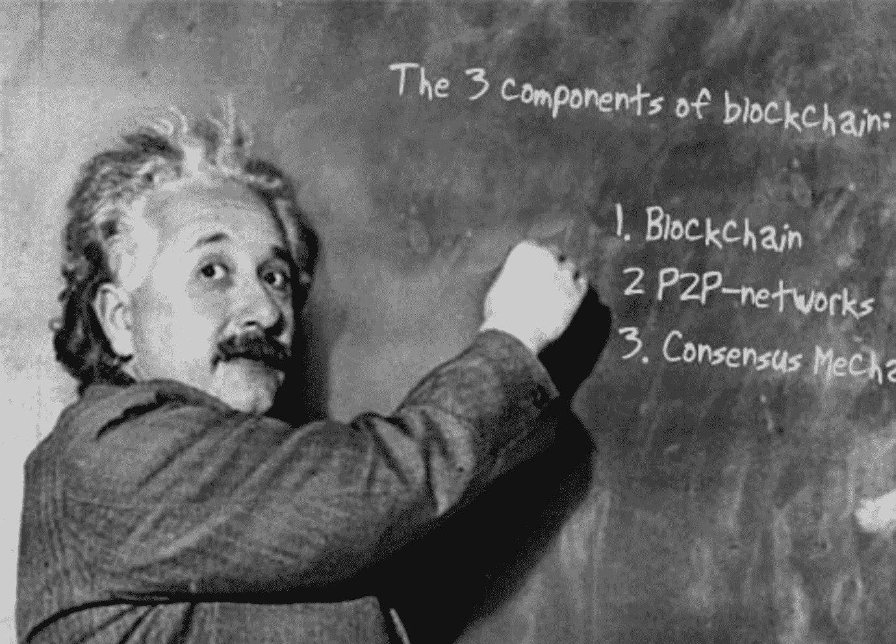
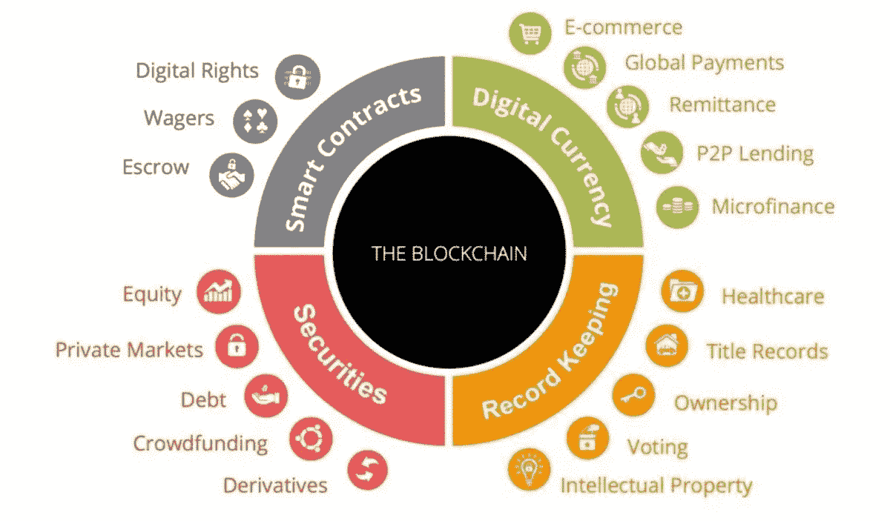
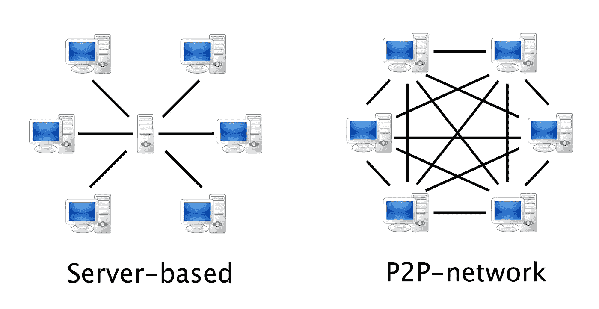
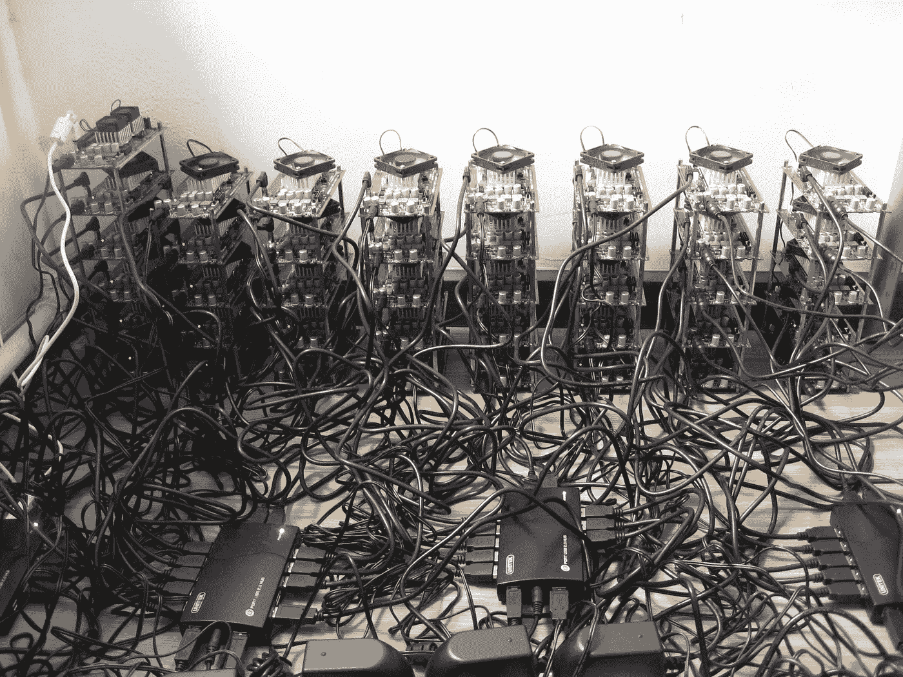
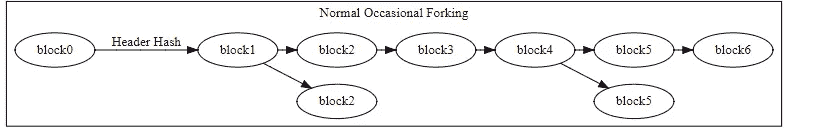
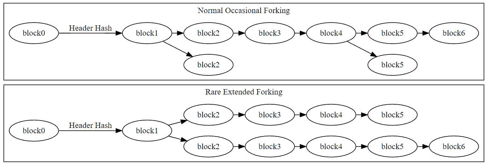

# 区块链技术快速 3 步指南。

> 原文：<https://medium.com/hackernoon/3-steps-to-understanding-blockchain-8a285572daa3>

## 理解比特币背后的 3 项基本技术。

问 10 个人“什么是区块链科技？”你会得到 10 个不同的答案——即使是在加密场景中。形成真正理解区块链的最佳方法是逐步理解底层技术。

因此，在这篇文章中，我将介绍区块链技术的三个主要组成部分:区块链本身、对等网络和共识机制。如果这些组成部分中的任何一个都不存在，比特币就不可能存在。让我们从区块链开始。

> 如果不能简单的解释，说明你理解的不够好。——阿尔伯特·爱因斯坦

Einstein explaining blockchain technology, 1422 B.C.

# 1.了解区块链本身

简而言之，区块链只是一种结构化数据的方式。这就是事情的全部。它是一个分类账:一个记录会计记录的档案。

这个文件堪比一本永远读不完的书。

书的每一页都写有信息，底部有页码。因为有了这个页码，你马上就能知道这一页在书中的位置。第 49 页显然在第 48 页和第 50 页之间。

就像页面一样，块中充满了信息。虽然数据块没有精确的编号，但是它们有一个时间戳，可以实现完全相同的功能。新块总是添加在时间戳最近的块之后。这样，就形成了一个链条。

区块链很酷的一点是，他们使用[密码术](https://blockgeeks.com/guides/what-is-hashing/)来确保当书中任何一页的任何信息发生变化时，我们都能注意到。这个属性使它成为跟踪任何有价值的记录的良好数据结构。

Use cases for blockchains.

在比特币的区块链，这些区块包含比特币交易的信息。该块说明了*谁*发送*哪些*比特币给*谁*。

由于区块链从一开始就被用来跟踪所有比特币的动向，因此可以通过检查账本来准确了解任何时候谁拥有哪个比特币。这个'*在任何时候谁*拥有*什么'*，就是我们所说的**区块链**当前的‘状态’。

事务只有在被包含在块中并被添加到链中时才会发生。因此，当块被添加到链中时，区块链的状态被更新。毕竟比特币动了。

这意味着，如果我想验证某人是否真的对我进行了交易，我必须能够检查区块链的状态。要做到这一点，账本必须公开。这就是对等网络的用武之地。

# 2.了解对等网络的作用

要使用区块链作为交易数据的分类帐，我必须能够在区块链中检查是否有人确实对我的地址或钱包进行了交易。

如果区块链只存储在一台电脑上，而且碰巧关机了，至少可以说这很烦人。因此，区块链的现状由世界各地的大量计算机下载、同步和提供。

这些计算机被称为“节点”，它们在对等网络中一起工作，以确保区块链是安全的和最新的。这些节点中的每一个都存储区块链的完整更新版本。每次添加新数据块时，所有节点都会更新它们的区块链。使用对等网络具有某些优势:

*   我可以使用区块链浏览器亲自检查区块链的状态。
*   我不必依靠*一方*来了解区块链的真实状况。
*   我不需要依赖一台服务器的安全性就能知道区块链是安全的。
*   恶意的一方将不得不同时攻击数千台计算机，而不是一台服务器。
*   我可以放心，区块链永远不会被删除，因为它必须被所有节点删除。

A server-based model vs. a peer-to-peer network

这些都非常重要，但以上并不意味着区块链现在突然变得足够安全，可以实际用于存储或交易价值。

例如，我如何知道区块链中的(交易)数据是正确的？我如何知道块中没有无效的事务？如果外面有不同版本的区块链，我怎么知道哪个才是区块链的真实状态？

共识机制以一种非常巧妙的方式处理了所有这些问题，这种机制的使用首先是由对等网络实现的。

# 3.了解共识机制

Napster 在 1999 年就已经使用了点对点机制。

区块链也一样，[在比特币之前就已经存在了](https://queue.acm.org/detail.cfm?id=3136559)。

神秘、匿名的比特币创始人中本聪的白皮书的巧妙之处在于，它将两者结合起来，建立了一个基于密码学的共识机制。共识机制是真正神奇的地方:它允许对等网络中的节点一起工作*，而不必知道或信任彼此*。

> “一致性算法的目的是允许根据一些特定的状态转换规则安全地更新状态，其中执行状态转换的权利在(……)用户之间分配，这些用户有权通过算法集体执行转换。”——Vitalik buter in

现在，如果你还不太明白，共识机制只是一套规则，由网络中的节点通过运行网络软件达成一致。这些规则确保网络按预期工作并保持同步。

共识协议在以下方面设定了规则:

*   如何将块添加到链中，
*   当块被认为是有效的，并且
*   真理的冲突是如何解决的。

## 向链中添加块

不同的区块链以不同的方式向它们的链中添加块。最著名的共识机制是比特币的工作证明(PoW)。

工作证明的第一条规则是，平均每 10 分钟，应该向区块链添加一个块。

促进这一过程被称为“挖掘”。试图向链中添加块的节点(称为“矿工”)使用其计算机的计算能力来尝试和解决密码“难题”。规则规定，只有当这个难题被解决时，才能将一个方块添加到链中。

解决谜题的矿工，因此“挖掘”新的区块添加到链中，由网络奖励。创建预定数量的新硬币并给他，连同包含在该块中的所有交易的交易成本。

随后，所有矿工将开始开采下一个区块。

A bitcoin mining rig. To have enough processing power to mine, you need a lot of GPU’s.

比特币的工作证明并不是唯一的共识机制。股权证明(PoS)也常用于分布式分类账。在基于赌注的机制的证明中，一个人可以“下注”他的硬币，以获得被挑选来添加下一个块的机会。从某种意义上说，一个赌注者说:“我用我的硬币打赌，我把这块积木加对了”。如果他撒谎，他就会失去他的硬币。

关于哪种共识机制是最好的，有一个更大的争论。然而，不管该块是如何创建的，网络中的其他节点仍然必须能够决定该块是否有效。

## **封锁的有效性**

当挖掘者解决难题并挖掘该块时，网络中的所有节点将检查该块是否有效，并将其添加到它们的链副本中。节点首先需要就有效性达成共识。只有这样，网络才会同步，区块链的状态才会更新。

如果新挖掘的块遵循共识机制所规定的规则，则节点仅将该新挖掘的块添加到链中。他们运行的软件检查一个块是否有效。无效的块将被简单地拒绝。

自然，一个块只和其中包含的事务一样有效。以比特币为例，该协议的规则规定，任何人都不能发送不是首先从其他人或开采区块获得的比特币。

换句话说，如果发送者收到足够的比特币进行交易，节点的软件会检查一个区块中的所有交易。为此，他们检查网络的*状态*。

现在，假设我收到了 1 个比特币，我后来把它发给了爱丽丝。然后我试着把同样的比特币发给鲍勃。一旦包含我的第一笔交易的块被添加到链中，所有节点都会更新区块链，以反映我不再拥有该比特币。任何包含我对 Bob 的事务的新挖掘的块都会被节点拒绝。节点的软件发现该块不符合规则，因此，它们不会更新该块的区块链。

这些规则还规定，交易只有在得到比特币所有者的数字签名后才有效。只有控制发送比特币的钱包或地址的人才能在交易中签字。所以，只有*你*可以花你的比特币。

## 真理的冲突是如何解决的

可能发生的情况是，偶然地，两个矿工同时将有效块添加到链中。假设一部分节点接受了一个有效块，而另一部分接受了另一个块。第一组包括我对 Alice 的事务，另一组包括我对 Bob 的事务。现在我们突然同时拥有了区块链的两个不同的州！

我们称之为(无意的)“分叉”:区块链分叉成两条不同的链。爱丽丝或者鲍勃有我的比特币吗？两条链子中哪一条是“真正的”区块链？

一般来说，所有的共识协议都用一个简单的规则来解决这个问题:最长的链获胜。

Visualisation of blockchain fork.

当我们有一个无意的分叉时，一些矿工会在一条链上开始采矿，另一些矿工会在另一条链上开始采矿。不可避免的是，一条链会比另一条链拥有更多的矿工，因此，会更快地向链中添加新的区块。其余的矿工将转换到更长的链条上，分叉的链条将永远消失。主链没有受到损坏。

为什么我们知道这总是会发生？

因为矿工是为自身利益而行动的经济行为者。一个矿工没有兴趣在分叉的链条上采矿，知道它会消亡。分叉链*上的所有事务(状态事务)从未在主链上发生过*，这意味着在分叉链上开采区块的矿工不会因他们的工作而获得奖励。矿工开采不会被纳入主链的区块的机会成本简直太高了。

在极少数情况下，可能会出现分叉链具有相当大的挖掘力。在这种情况下，可能需要一段时间才能确定哪个链是主链。传统智慧表明，因此等待 6 个区块来真正确认交易是明智的。

Visualisation of an extended blockchain fork. This almost never happens for more than 5 blocks.

最长的链获胜的规则，加上需要巨大的处理能力来向链中添加块的事实，使得区块链非常安全。几乎攻击网络的唯一方法是回到区块链的某个区块，分叉链并从那里开始开采新区块。然而，要做到这一点，攻击者必须从这一点开始重新做矿工所做的所有工作，并赶上主链。如果没有比整个矿工网络加起来还要多的计算能力，这是根本不可能的。简单地说，这种操作所需的电力和 GPU 将会非常昂贵。

# 结论

以上应该被看作是对分布式分类帐如何工作的非常简要的介绍。你现在可能明白为什么“区块链”对于我们今天看到的分布式分类账来说有点用词不当。

然而，下次有人在聚会上提到区块链时，请不要像我刚才那样说:“嘿，T2，区块链只是一种构造数据的方式。我想你指的是用于记录的分布式分类账，它托管在参与节点和矿工的对等网络上，这些节点和矿工的合作由规定网络规则的共识协议来实现和管理。”

相反，可能是时候接受这个术语已经发展成为一个支配性的概念，以表明使分布式分类账成为可能的技术的综合。

在我的下一篇文章中，我将深入研究现代密码学在区块链和共识机制中扮演的角色。

如果这不是一个令人兴奋的前景，那么我不知道什么是…

## 关于作者:

*Thijs Maas 是一名法律系学生，他对分布式账本技术带来的创新浪潮所带来的法律挑战有着浓厚的兴趣。他最近创建了一个网站，作为这个主题的信息、见解和学术研究的中心。*