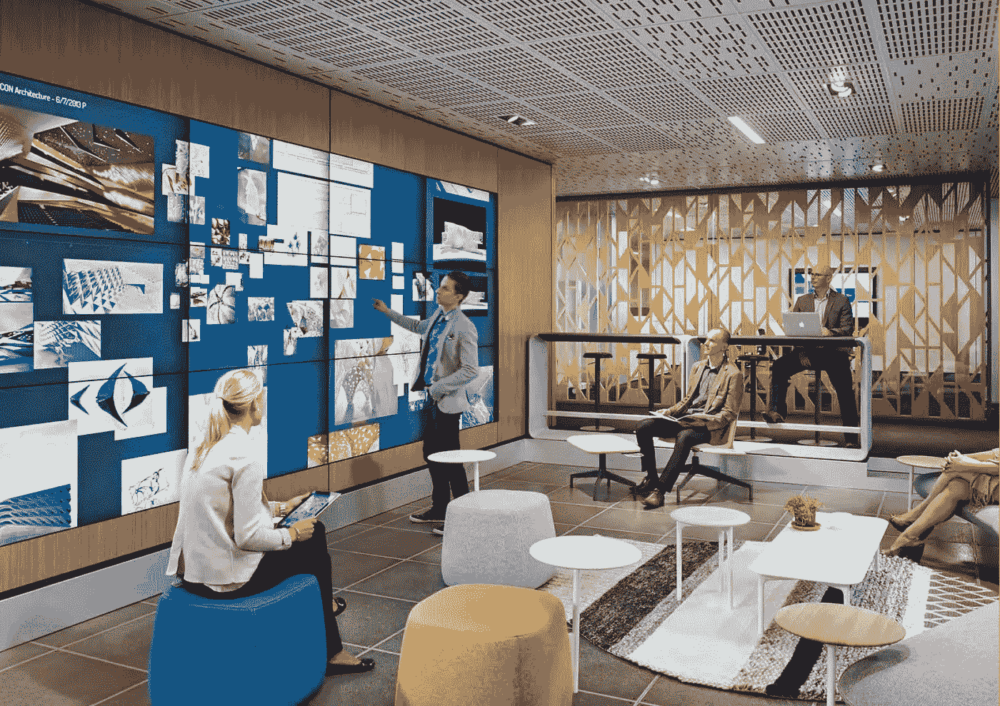
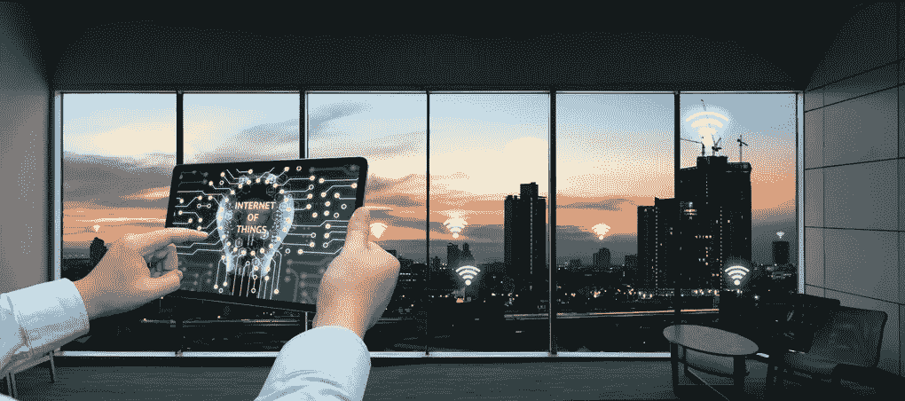
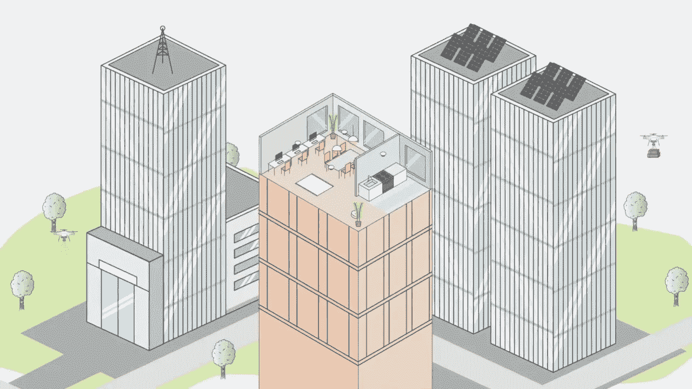

# 这三项技术可以改变你的工作场所

> 原文：<https://medium.com/hackernoon/3-technologies-to-transform-your-workplace-8b56353fd806>

Image Source: eOffice

每个行业都在适应某种技术进步，不管成本和能耗有多高。仔细观察，设施管理在这场竞赛中处于领先地位。

因为**设施经理**承担着无数的责任，所以他们需要一系列工具的帮助。也许，那些紧跟新兴技术的人会给运营和整体业务带来更大的好处。

根据最近的研究，每个设施管理团队必须快速采用的技术主要是这些，

*   物联网
*   人工智能
*   个人分析

# 物联网

Image Source: SO FM Ltd

说到打造**的凝聚力环境**，每一个独立的实体，像 ***暖通*** ， ***制冷*** ， ***安防*** ， ***供暖*** ， ***通风*** 都在被每一个集成商和经销商牵线搭桥。此外，帮助创建无缝建筑运营的公司主要被要求接管能源管理和自动化的集成方法。

纯粹的想法是通过在建筑物内部实施一些自动化系统来节省管理费用。为什么？因为只有一个控制台的管理系统比有多个控制面板的管理系统效率高得多。

业主迅速适应这一行业的另一个原因是不想显得过时。

> 此外，根据行业专家所做的几项调查，接收和利用数据集来控制设备的系统/计算机肯定会经受住供应商的支持。

# 人工智能

Image Source: YouTube

**AI** 逐渐繁荣，其侵入**设施管理**意味着，建筑物能够…

… **借助**预测性**和**预防性**维护和自动化建筑控制，优化**建筑运营**的**特定方面。

> 首先，UGR(西班牙格拉纳达大学)的科学家最近制造了一个人工智能驱动的计算机系统，有可能实时检测出制造枪支的个人。

这将成为世界范围内的开创性努力，其结果将是改善办公场所、机场以及每个零售商店的安全。在实施时，该系统不需要大量的费用，只需将**摄像机**和**报警器**合并即可投入使用，而不需要直接监控。

> 通过实施人工智能，设施管理人员将能够与他们所有的建筑居住者互动，并设计预防和预测系统。

**例如**，将设施管理系统与人工智能相结合的公司可能会展示一个传感器系统，该系统能够检测垃圾桶的包装情况以及在哪一层。

# 个人分析

Image Source: yukaichou.com

每个公司的未来都掌握在员工手中。为了让他们的生活变得更加轻松，帮助他们提高工作效率，公司正在他们的办公场所引入人工智能。这个机构可能是一个令人难以置信的有益的灵丹妙药，它已经显示出这样的迹象。

> 一般来说，跟踪员工健康记录、团队合作、参与度和 F2F 互动的公司看到他们公司的增长翻了两番。

通过获取这些数据，公司可以用它来令人信服地组织团队，铺设更有效的沟通渠道，并监督每个人的成功。这对**工厂经理**来说是个很大的帮助，但前提是员工的隐私不受侵犯。也必须通过**精心策划的政策**和**健康的公司文化**来解决。

Image Source: The Brain of Chintu

随着这一切的推进，工厂经理必须知道实施新技术和创新将如何在社会、财务和技术层面上影响他们的工作场所和员工。

此外，考虑这些因素还有助于 FM 团队分析和投资智能工作场所技术，为每个人创造更好的工作环境。