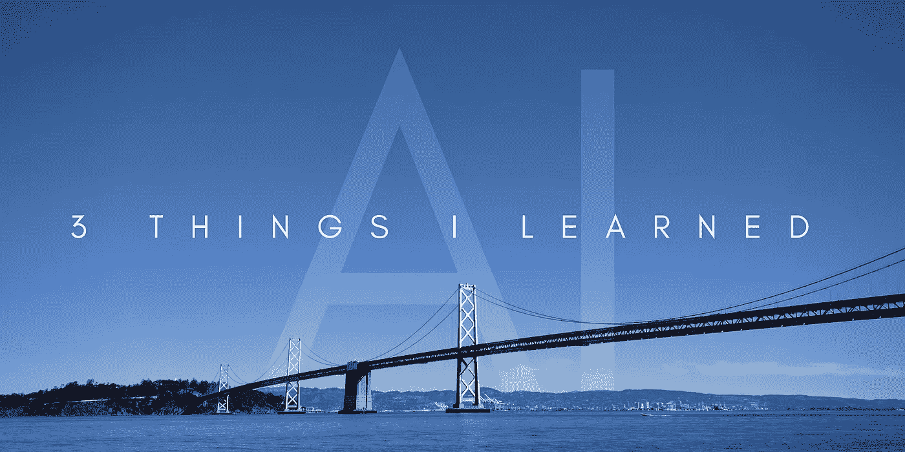

# 我在 Y Combinator 的人工智能创业公司学到的 3 件事

> 原文：<https://medium.com/hackernoon/3-things-i-learned-working-at-an-ai-startup-in-y-combinator-5ed5265c6547>

我认为自己很幸运。在研究了推荐算法(FinTech chatbot 平台)并创建了布达佩斯机器人会议小组(Budapest Bots Meetup group)之后，我最终加入了硅谷最负盛名的孵化器之一，拥有[自行车人工智能](http://bit.ly/2mrtv0p)。我们正在为客户服务开发一个人类+人工智能的混合解决方案。

这几个月让我从人工智能和聊天机器人的炒作中清醒过来。海湾可能是一个艰难的地方。他们会告诉你这是怎么回事，你会因此变得更好。以下是我在硅谷一家对话式人工智能初创公司学到的 3 条最重要的经验。只是把事情放在上下文中，我有心理学背景。

# 1.如果不是，就不要叫它 AI

那么 AI 到底是什么？我有心理学背景，在公司里我们也不能就此达成一致。说到定义:

> “人工智能是机器模仿人类智能行为的能力”

那么,[对肺部潜在癌性病变的分类](https://techcrunch.com/2017/01/12/kaggle-hosting-1m-competition-to-improve-lung-cancer-detection-with-machine-learning/)是在模仿人类的智能行为吗？理解一个客户的问题，并从一个庞大的数据集中提出准确的答案，这就是我们所说的 AI 吗？我们离[人工智能(AGI)](http://www.techworld.com/big-data/what-is-artificial-general-intelligence-3645268/) 和[技术奇点](https://mitpress.mit.edu/books/technological-singularity)还很远，但我们能用今天的人工智能做的事情非常惊人。

那我们该怎么称呼 AI 呢？人工智能确实已经成为一个时髦词，今年在 CES 上我们看到了[的爆炸式增长，将“人工智能”融入到每一个可以想象的消费电子产品中](http://www.theverge.com/2017/1/4/14152004/toothbrush-artificial-intelligence-smart-gadgets-ces-2017)，从牙刷到洗衣机。请不要称这个为 AI。我也不会称人工智能使用一刀切的第三方算法，如 NLP 引擎和云视觉 API。去寻找开源的替代品，调整它们，测试它们，让它们最适合你的特定用例。

from api.ai

那么，为什么我说开箱即用的解决方案不足以构建您的业务呢？首先，它们是通用的解决方案，所以适当调整的专有模型总是比它们更好。对我们来说也是如此。我们从 IBM 的 Watson 开始，然后构建我们自己的解决方案，并行运行一段时间，一旦我们表现得更好，我们就完全转换。你基本上无法控制你能得到什么。在 NLP APIs 的情况下，你发送一个字符串并得到一个片段，这很好，但在大多数用例中还远远不够。这些服务现在是免费的或价格有竞争力的，这是有原因的，他们需要数据，你的数据。我认为从第三方服务开始很好，但是要快速构建以取代它们。如果你的团队没有这个能力，雇佣一个有这个能力并且速度快的人。

当谈到在人工智能领域开创自己的事业时，我建议你在声称自己已经有了一家公司之前，先浏览一下 Y Combinator 的博客文章。基本上，当一个风险投资合伙人问起这些话题时，那篇文章中没有一个话题会让你不舒服。相信我，他们会的。

# 2.不要为了 AI 而做 AI

人工智能是最新的流行语，尽管它自 50 年代以来就一直存在，并享受着周期性的炒作周期。[解决实际问题的全栈人工智能公司将蓬勃发展，其他人将乘风破浪，获得资金，烧掉它，然后死去，](http://venturebeat.com/2017/03/08/ai-startups-will-fail-for-the-same-reasons-other-startups-do/)侵蚀风投的信任。

[有些人称人工智能为当今的清洁技术，这是有充分理由的。你可以拥有最好的人工智能算法，但如果你不能以解决实际问题的方式使用它，那还有什么意义？诚实地说，以一种有用的方式应用伟大的人工智能是关键，就像任何其他技术创新一样。只要看看谷歌照片，它使用谷歌强大的](http://www.bradfordcross.com/blog/2017/3/3/five-ai-startup-predictions-for-2017)[云视觉 API](https://cloud.google.com/vision/)效果很好，但你不会每次都看到它被吹捧。

我从事对话式人工智能的工作，对许多人来说，人工智能意味着助手，比如 Alexa 或谷歌助手。今天，有了 Messenger 平台上的聊天机器人，比以往任何时候都更容易将类似于对话式人工智能代理的东西放在一起。然而，即使它拥有世界级的人工智能，建造第十个餐馆搜索聊天机器人值得吗？将人工智能应用到他们能够产生真正价值的领域，就像已经提到的肺癌诊断一样，你也可以赢得一百万美元，这没有坏处。

# 3.你将需要人类

这是我最大的收获。除非你已经是一家拥有大量数据的巨型公司，或者正在处理现有的、公开的数据集，否则你将需要大量的人力。我说的人类指的是用户，他们生成专门的数据集，然后你的算法可以对其进行处理。

HealthTap 就是一个很好的例子。在过去的 7 年里，他们与 10.7 万名医生建立了一个非常成功的平台，允许他们访问大量的专有数据。是的，[他们在去年年底推出了人工智能私人医生 AI 医生。](/@HealthTap/dr-a-i-80b4cf06be30#.1mc94z6ip)

特斯拉的自动驾驶程序是另一个很好的例子，说明[如何利用现有的用户群来生成进入下一阶段所需的数据。](https://www.tesla.com/blog/master-plan-part-deux)自动驾驶人工智能不是最终目标，而是达到不需要拥有自己的特斯拉来利用技术的阶段的手段。凭借真正的自动驾驶能力，特斯拉可以进入交通共享业务。这是一个垂直市场，如今优步占据着主导地位，也在研究自动驾驶技术，尽管采用了不同的方法，[一种处于严重危险之中的方法。](http://www.theverge.com/2017/3/10/14884666/alphabet-waymo-google-uber-lawsuit-testimony-block)

然后我们甚至没有提到教算法的人类劳动力。毕竟，即使你有大量的训练数据，你仍然需要监督学习过程来微调模型。这就是 [x.ai 正在做的事情](https://www.hakkalabs.co/articles/building-amy-email-based-virtual-assistant-x-ai)，如果你走上人工智能的道路，无论是用户、你自己的员工，还是来自 Upwork 和 Crowdflower 等公司的众包劳动力，你都必须做好准备。是的，随着模型的进展，人工监督的必要性必然会下降，但取决于你选择的领域，这可能需要几年时间。[你的错误率越低，就越难改进](https://kevinzakka.github.io/2016/09/26/applying-deep-learning/)，这也取决于你所在的领域能否成就你的事业。

# 结论

2017 年 Q1 的人工智能刚刚过了膨胀预期的峰值，[脸书削减了它的雄心](https://www.theregister.co.uk/2017/02/22/facebook_ai_fail/)， [Alexa 领先](https://www.wired.com/2017/01/ces-alexa-in-everything/)和[据报道苹果在人工智能方面落后了，](http://appletoolbox.com/2017/01/siri-apples-artificial-intelligence-effort-falling-behind/)今年对于我们正在研究的混合方法来说将非常有趣。

那么这些学习如何与我正在做的事情相结合呢？我们在做适当的人工智能吗？我们应该吗？人类是如何进入画面的？

我们在 [Bicycle AI](http://bit.ly/2mrtv0p) 使用 AI aim 来解决一种不同的问题。对任何公司来说，客户服务都是一个非常重要的方面，仅在美国就有 260 万人在这个岗位上工作(离岸公司更多)，这是劳动密集型行业之一。而且客服还是很慢。各部门以小时来衡量他们的周转时间。如果你是一个小公司，扩展你的 CS 团队来满足不断变化的需求几乎是不可能的。

我们在 [Bicycle AI](http://bit.ly/2mrtv0p) 为我们的客户提供虚拟客户服务代表，帮助他们解决 1 级案例。我们的虚拟代表由人工智能和人工监督相结合来提供动力。我们全天候为您服务，并有极快的回复速度。通过这种方式，我们可以处理大多数案件，这样我们的客户就可以专注于高价值的客户和复杂的案件。

我们通过吸收以前的客户服务对话、知识库、产品文档和任何其他可用资源来做到这一点。我们使用我们专有的 NLU 引擎来理解传入的消息，并基于这个组合的数据集，我们的人工智能提供建议的响应。我们有自己经验丰富的客户服务代理来批准、个性化和发送每个回复。每一次互动，我们的机器学习算法都在教我们的人工智能在未来给出更相关的答案。

> [黑客中午](http://bit.ly/Hackernoon)是黑客如何开始他们的下午。我们是 [@AMI](http://bit.ly/atAMIatAMI) 家庭的一员。我们现在[接受投稿](http://bit.ly/hackernoonsubmission)，并乐意[讨论广告&赞助](mailto:partners@amipublications.com)机会。
> 
> 如果你喜欢这个故事，我们推荐你阅读我们的[最新科技故事](http://bit.ly/hackernoonlatestt)和[趋势科技故事](https://hackernoon.com/trending)。直到下一次，不要把世界的现实想当然！

