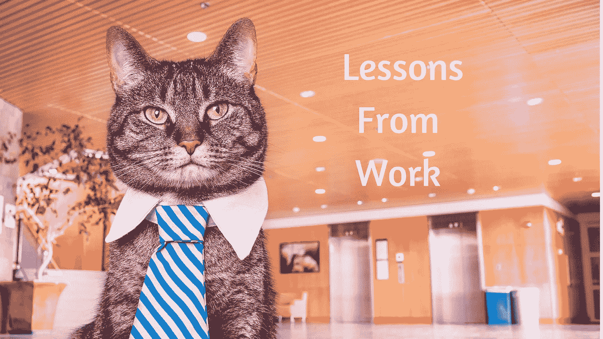
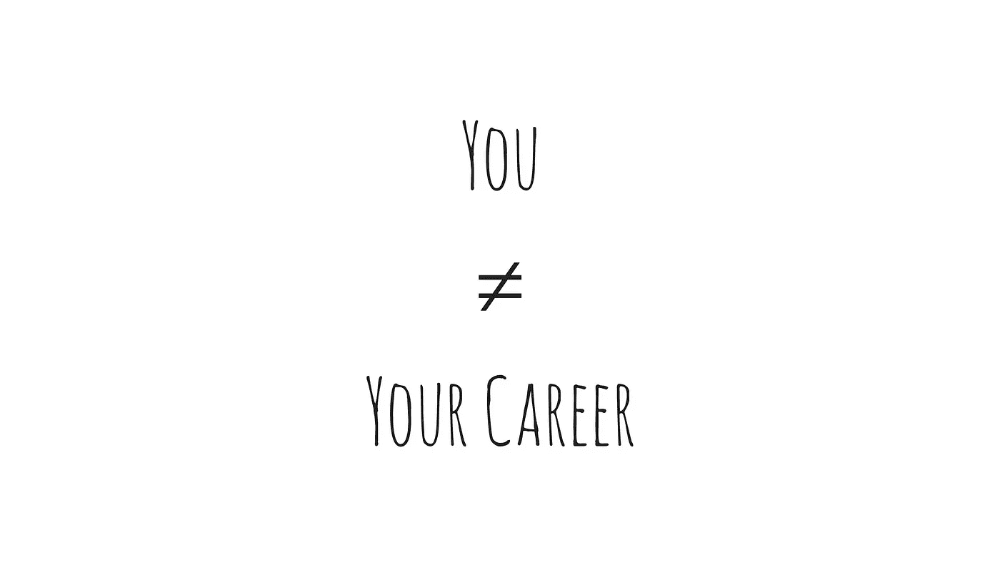

# 我在创业公司工作时学到的 3 件事

> 原文：<https://medium.com/hackernoon/3-things-ive-learned-by-working-in-a-startup-5ffacd492520>

我在一家初创公司失败了，然后我去了一家朝九晚五的公司工作。最终，我选择回去为另一家创业公司工作。

在做了三年专业工作者后，我学到了一些关于生活的重要经验。

首先，我会直言不讳:

> 我认为为工作而工作糟透了。我相信为我不在乎的事情工作叫做压力。

# **1。人生是一次旅行**

当你在创业公司工作时，不确定性无处不在。你会适应冒险策略，你会经常失败，但你会继续下去。

我意识到生活、工作成就和人际关系都是旅程。我有耐心和时间去接受它。这是一个挑战，每个人都必须面对。

我们都想在这个世界上有所作为，并迅速提升，但有一个梯子要爬。

有些人倾向于遵守规则，呆在自己的车道上，不去碰盒子，他们可能会活着出去。他们没有。

> 我意识到我不是我的职业。我有事业。

我们年轻人倾向于辞职，因为我们没有产生影响。产生影响需要时间，而影响创造革命。

革命是不可能的，直到他们不是，然后他们看起来完全正常。

在公司工作让我想要更多。如果冒险尽力工作意味着被解雇，那么是时候离开那里了。所以我必须找到重要的东西。我需要最好的自己。工作只是让我在旅程中走得更远的动力。

# 2.时间是你的头号资源

别浪费了。好好享受吧。活下去。

不要关注截止日期。几乎没有时间去做真正重要的事情。

如果错过了，截止日期不是致命的，但有时我们说服自己，这几乎是一回事。

在启动语言中，你有一个所谓的重要度量标准(OMTM)。在现实生活中，它可以是朋友、网络、工作或任何对你来说重要的东西。

> 无论你当前的 OMTM 是什么，期待它的改变。并期望这种变化揭示出你需要做得更好的下一个数据。为变化做好准备。

时间在流逝，你感到迫切想成为你决定成为的人，并有所作为。我们都需要时间去爬山。即使我们乘直升机到达山顶。时间让你勇敢的继续旅程。

用时间去学习。

当我们把自己推到现有技能和经验的绝对边缘时，我们就学会了。当我们接受一个能让我们激发最大潜能的项目时，学习部分就开始了。学习不舒服。我们做的每一件值得追求的事情都需要艰难的选择。

# 我学会了说谢谢*！*

感恩让我们更加亲密。我们生活在最好的世界里。在我们生活的世界里，我们允许自己变得慷慨，变得脆弱，拥有自己的行为。

感谢你所做的一切，最重要的是，感谢你大声说出你的梦想。谢谢你，因为你给你的工作带来了慷慨、洞察力和影响力。感谢你有耐心继续你的旅程。

我们需要的东西都有了。我们面前有时间，我们有机会。走走走。

**感谢您的阅读！如果你喜欢这个故事，请分享和推荐它，让其他人知道这件事。**

> [黑客中午](http://bit.ly/Hackernoon)是黑客如何开始他们的下午。我们是 [@AMI](http://bit.ly/atAMIatAMI) 家庭的一员。我们现在[接受投稿](http://bit.ly/hackernoonsubmission)并乐意[讨论广告&赞助](mailto:partners@amipublications.com)机会。
> 
> 如果你喜欢这个故事，我们推荐你阅读我们的[最新科技故事](http://bit.ly/hackernoonlatestt)和[趋势科技故事](https://hackernoon.com/trending)。直到下一次，不要把世界的现实想当然！

