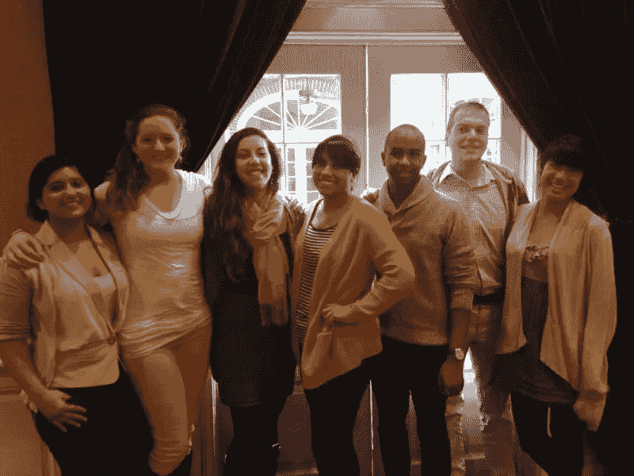

# 如果你想提升你的团队，要忘记三件事:合作的魔力

> 原文：<https://medium.com/hackernoon/3-things-to-forget-if-you-want-to-level-up-your-team-magic-of-collaboration-9f8b66f1e1d1>

当谈到团队合作时，桌子上有如此多的变量和元素，以至于要弄清楚魔法是如何发生的是极其困难的。虽然有些团队在起飞前就已经崩溃了，但有些团队不费吹灰之力就令人振奋——灵感变成了合作，变成了行动。我希望你们都有过后一种体验，在那里一切都运转得令人惊讶，想法源源不断，每个人都带着激情离开。当这种情况发生时，它真的是一种特殊的魔法。

我最喜欢的一次发生在 2013 年塞拉俱乐部学徒计划期间。我不认识任何其他组织者，我们都位于全国不同的城市，但我们的活力确实是惊人的。我们甚至问过招聘团队，他们是如何把我们聚在一起的，他们自己也没有一个好的答案。我们的协同作用和我们相互补充能量的方式感觉就像魔法一样。虽然我们都热爱这项工作，但我们更喜欢一起做这件事。

Sierra Club Apprentices, Class of 2014: New Orleans Coal Export Project

在协作过程中有一些独特的特殊和令人满足的东西，当你能与一个与你同步并与你的激情保持一致的团队一起做到这一点时，它会产生一场创造力和行动的完美风暴。难道这不是我们都可以利用的东西吗？这就是为什么我有一些建议可以帮助你提升你的团队——无论是在黑客马拉松，学校项目，还是在办公室——并带来魔力。

**当其他团队成员在说话时，忘记你在想什么**

主动倾听是另一回事，不是吗？我们通常都能分辨出别人在听我们说话和桌子对面的人面无表情地看着我们之间的区别。除此之外，让某人全神贯注，不打断你的思路是非常重要的。这对许多人来说可能很难——我不得不一次又一次地在这方面训练自己——但全神贯注的好处完全超过了你(或我)在别人说话时打断或“计划”我们要说什么的需要。全神贯注建立关系，它有助于创造更强的想法(因为当你加入一个完整的想法比加入一个部分的想法好得多)，它给团队中的每个人一个提供投入和感受价值的机会。即使你最终没有使用团队产生的大部分想法，允许每个人都参与进来也会产生认同，并建立融洽的关系。一个更有凝聚力的团队会更加努力、更加热情地工作，他们最终更有可能成为工作的大使。好处真的很突出。

**您正在收听的是**

除非我在车管所或者在餐馆点菜(即使有时)，否则我会和别人交谈，因为我正努力学习一些东西。无论是项目的下一步，更多关于团队成员，培养新技能，还是了解我周围的世界——我们总是在倾听，这样我们才能学到一些东西。如果你没有学习…那么伙计们，你没有在听。在我们快节奏的生活中，时间是最重要的，效率是如此重要，但这使得在混乱中让每一次对话和每一刻都有价值变得比以往任何时候都重要。

好消息是很容易判断你是否是一个好的倾听者。当然，你可以向你的同事寻求反馈，但我也鼓励通过写笔记和挑战自己来测试自己，看看你从一次会议或对话中保留了什么——这真的很有启发性。

你的队友是人类…惊喜！

有时，当一个新的陌生人进入你的空间，你面临着生理和智力上的“陌生人”反应时，所有的神经元都会消失。但是，通过一些基本的人类共性，如幽默、闲聊或不唐突的问题，克服这些障碍是相当容易的，这可以帮助你们更快地达成共识。

我发现最人性化的例子可以帮助房间里的人放松，开始有意义的对话。你不必成为闲聊大师来减轻负担，让房间朝着有趣、好玩的方向移动。微笑和呼吸——你能行的。当工作开始时，你需要注意每个人都很开心，每个人都带来了不同的技能和经验。我喜欢和不同的人一起工作的挑战。最终，它可以归结为你的反应和你如何控制自己。我和一些非常热情的人一起做过一些项目，他们中的一些人缺乏筛选(不，没有指名道姓)，但是我参加过的最好的团队总是包括具有广泛个性和心态的成员。

当团队中的事情变得太紧张时，给你的一个建议是:如果你觉得你的按钮被按下了，去散散步。听一些音乐(也许是一些[辣妹](https://www.youtube.com/watch?v=gJLIiF15wjQ))。我保证几分钟冷静下来会让你头脑清醒，不会对团队中的其他人发火。

概述:

1.练习积极倾听。

2.准备好学习每一个声音片段。

3.关注人与人之间的互动。

因为我总是在学习，所以我很乐意向你学习。如果你正试图发展更深层次的承诺来加强你的团队游戏，请通过 [experimentalcivics.io](https://www.experimentalcivics.io/) 联系我，我们来谈谈吧！我总是在这里提供帮助，尤其是那些正在举办黑客马拉松的组织者。