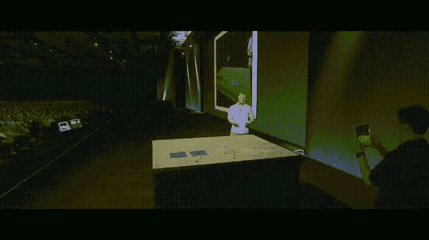
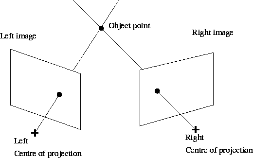

# 关于苹果 ARKit 要知道的 3 件事

> 原文：<https://medium.com/hackernoon/3-things-to-know-about-apples-arkit-e87c1b80099b>

“真心激动”。也许这就是我要找的词。但是等等，我不应该想得太多。当[我们](http://www.tenqyu.com)在 2014 年做【阴影中的 时，这是一个增强现实 iBeacon 支持的捉人游戏的概念。世界第一！在当时是革命性的。可能太革命了。尽管在新加坡和东京进行了试点，它还是以惊人的失败告终。

这款应用因为[很多原因](/@thisTenqyuLife/what-i-learned-from-building-in-shadows-in-asia-e69b2dfced2b)而失败，如果不是因为我们使用了 Metaio SDK 和 Metaio，这家德国公司在我们发布后不久就被苹果收购了，我们就会重启这款应用。从那以后，SDK 就消失了，当苹果将它整合到他们的生态系统中时，我被蒙在鼓里。现在随着 iOS11 的即将发布，这一时刻似乎已经到来。ARKit 可能会做的承诺让我真的很兴奋。

当然还有不真实的 Wingnut AR 演示。但不仅仅是这样。

Wingnut Demo ; source [https://www.youtube.com/watch?v=S14AVwaBF-Y](https://www.youtube.com/watch?v=S14AVwaBF-Y)

## 双摄像头

终于说得通了。随着 iOS11 的推迟发布，几乎一夜之间数百万台设备将演变成世界上最大的增强现实平台。嘣！我终于明白为什么苹果在 iPhone 7 之后推出的每一款 iDevice 上都安装了双摄像头；即使我仍然相信苹果在耳机插孔上犯了错误。

双摄像头有利于更好的变焦能力和更好的深度感测。如果您有两个不同的视点，并且您知道这两个视点之间的距离，则可以对给定对象点的距离进行三角测量。这意味着对于相机捕捉的每个像素，手机可以计算相机所见的深度图。我们的大脑以类似的方式工作，让我们能够感知三维世界。这个效果叫做[立体视觉](https://en.wikipedia.org/wiki/Stereopsis)。这项技术的好处是，软件可以了解哪些对象在前台，哪些文档在后台。物体之间的相对位置。然后可以做的一个例子是背景可以模糊。一种被称为“散景”的效果。

[source: http://digital-photography-school.com/wp-content/uploads/2016/01/Title-Emmet-with-Bokeh-717x478.jpg](http://digital-photography-school.com/wp-content/uploads/2016/01/Title-Emmet-with-Bokeh-717x478.jpg)

不考虑视觉美感，这项技术为 ARKit 提供了关于带有数字信息的[真实世界物体的信息。](http://www.patentlyapple.com/patently-apple/2016/08/apple-wins-a-patent-for-next-gen-indoor-mapping-technology-based-on-visual-inertial-navigation.html)

## 又名世界追踪

世界跟踪旨在创造一种虚拟世界是真实世界的一部分的错觉。这包括正确的阴影，改变比例和视角，以及在平面上点击测试数字道具。世界跟踪并不试图创建一个世界的表示，而是通过一种称为视觉惯性里程计(VIO)的技术来工作。VIO 将对象固定在一个点上，并通过这个点在视频信号的图像中跟踪这些点。ARKit 通过三维射影几何估计这些点之间的关系。

这里要采取的步骤通常是

1.  在多幅图像中查找匹配点
2.  计算图像对之间的'[本质矩阵](https://www.researchgate.net/publication/229704949_Properties_of_essential_matrices) ' (E)
3.  分解 E 以获得相对姿态，
4.  并且最后执行“束调整”(BA)以进一步改进估计。

显然，关系估计得越好，ARKit 就能越准确地通过 iDevice 的摄像头和运动传感器跟踪环境中的点。

当然，现有的技术，如手势识别，加速度计，蓝牙 LE，以及 GPS 与 ARKit 的结合，为我们的应用程序开发者提供了一个充满机会的宝箱。

## 相关技术的获取

当然，我们都知道苹果公司，尽管不断有负面报道，但他们来到这里并非偶然。除了前面提到的 Metaio，苹果还收购了 [*Linx*](https://techcrunch.com/2015/04/14/apple-buys-linx-a-camera-module-maker-promising-dslr-like-mobile-performance/) 一家为多光圈相机模型开发移动技术的公司，这些相机模型可以实现背景焦点模糊、视差图像和 3D 图片捕捉等效果。还记得散景吗？此外，2013 年，苹果收购了 PrimeSense 公司，该公司将他们的 3D 传感技术授权给微软用于 Kinect。去想想。

我真的相信我们正在寻找第一个数百万规模的增强现实平台，使这些应用程序再次可行。魔术跳跃就此结束了吗？时间会证明一切。我们在[tenqyu](http://www.tenqyu.com)；但是，将重新访问我们的 AR 应用程序，并肯定会重新推出我们以前启用 ARKit 的一些概念。伟大的时代即将到来。

顺便说一句，这是以前的预告片，供你欣赏。

> [黑客中午](http://bit.ly/Hackernoon)是黑客如何开始他们的下午。我们是 [@AMI](http://bit.ly/atAMIatAMI) 家庭的一员。我们现在[接受投稿](http://bit.ly/hackernoonsubmission)，并乐意[讨论广告&赞助](mailto:partners@amipublications.com)机会。
> 
> 如果你喜欢这个故事，我们推荐你阅读我们的[最新科技故事](http://bit.ly/hackernoonlatestt)和[趋势科技故事](https://hackernoon.com/trending)。直到下一次，不要把世界的现实想当然！

