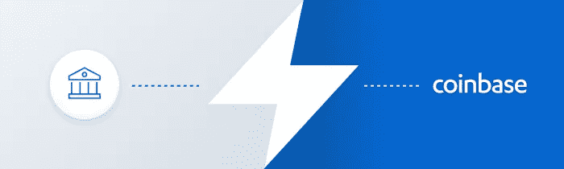
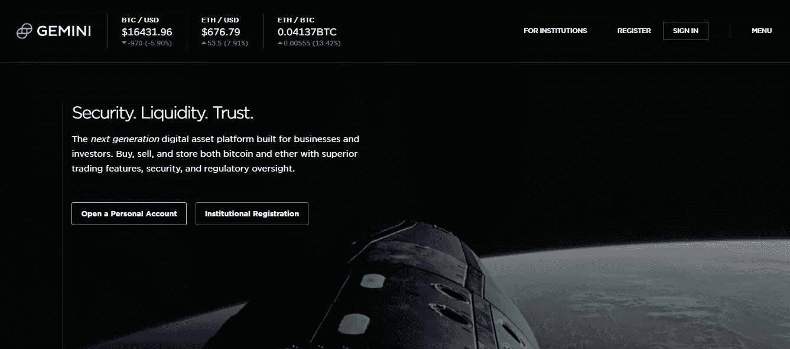

# 避免比特币损失的 3 个技巧

> 原文：<https://medium.com/hackernoon/3-tips-avoid-bitcoin-ethereum-cryptocurrency-losses-e01fa939a9ca>

## 密码交易所的每一笔买卖都是由 FOMO 为初学者设计的。这里有几个简单的步骤来避免它，并成为一个耐心和专业的密码交易者。

## 日常场景

> 我在 17200 的时候用 2000 美元买了比特币。糟糕的是，它要到周四才会打到我的账户上，因为我和比特币基地进行了银行转账。所以，在周四我的账户被存入之前，我都受市场的支配。祝我好运吧 lol！！！

这是一种常见的情况，如果你已经开始在[比特币基地](https://www.coinbase.com/join/5922da0103b62e7e9e6b9df8)购买比特币、以太币或莱特币，你肯定至少面临过一次。这是一个纯粹的在错误的时间购买的案例，原因是一种叫做 FOMO 的东西——害怕错过。比特币在特定的一天涨到 17200 美元，你不想错过它，点击购买按钮。下一秒，就是上面这句在你脑子里跑的名言！

# 你如何避免这种情况？

## *先加基金，后买。你不会错过任何东西。*

在 coinbase 中，您可以将您的银行账户和存款资金链接到您的美元钱包。如您所知，由于是 ACH 转账，可能需要 4-5 天才能清算并显示您钱包中的确认存款。当你的美元钱包里有金额时，你可以即时买卖比特币/莱特币/以太坊。

这让你为加密货币的看涨和看跌趋势做好充分准备，并避免上述情况。

## *使用比特币基地瞬间*

[***比特币基地即时***](https://blog.coinbase.com/announcing-instant-bitcoin-ethereum-and-litecoin-purchases-on-coinbase-c29d8a94e152)***—***这是 [coinbase](https://www.coinbase.com/join/5922da0103b62e7e9e6b9df8) 推出的另一个功能，旨在完全避免我们之前谈到的情况。比特币基地速食是美国用户目前可以买到的东西，最高限额为 25，000 美元

有了这个，你可以立即购买最大价值为 25000 美元的加密货币。这意味着，你不需要等待存款清算或等待比特币在周四得到确认。你用 Instant 购买，它可以立即交易。

这大大增加了 coinbase 的风险——但考虑到他们的数量和身份验证过程，他们应该对此有信心。对于一个普通人来说，如果你觉得价格会下跌，这是一个有趣的买卖机会。

## 利用双子座进行即时传送

Gemini.com 是 coinbase 的另一个选择，在那里你可以买卖比特币和以太坊。这个网站几乎没有额外津贴和挑战。

1.  你可以存钱并立即购买比特币——你也可以立即卖出并再次买入。然而，这里的问题是，在你的资金通过 ACH 清算之前，你不能从双子座取出比特币或以太币，即 4-6 天。因此，在某种程度上，它给了你在价格下跌时卖出和逢低买入的自由——但你不能转移到其他交易所。
2.  作为个人，您每 24 小时只能存入 500 美元。咄！

> 在你学习购买加密货币的同时，你也需要对加密货币交易**负责并纳税**。这里有一篇文章试图**减少混乱，并澄清**关于加密交易收益税的问题。

 [## 如何使用 BearTax 对加密货币收益征税

### 比特币基地、GDAX、Gemini 等地的密码交易员迫切需要计算他们从比特币中获得的收益

hackernoon.com](https://hackernoon.com/how-to-pay-bitcoin-cryptocurrency-tax-reliable-tools-beartax-bfce8bbb81bc)