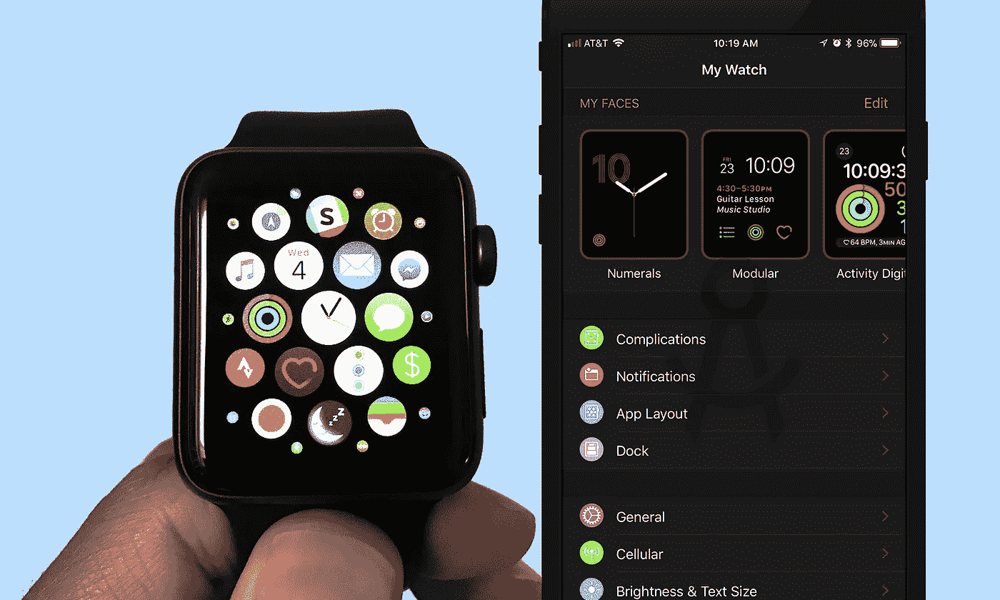
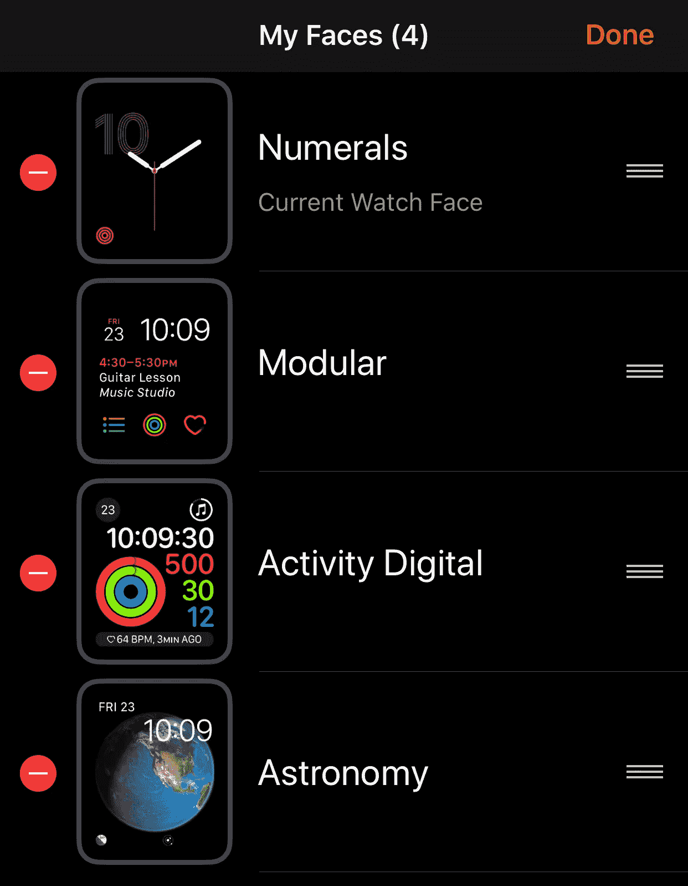
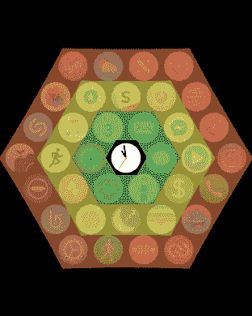
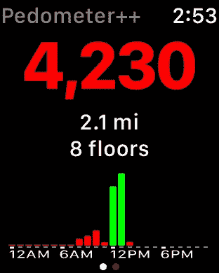
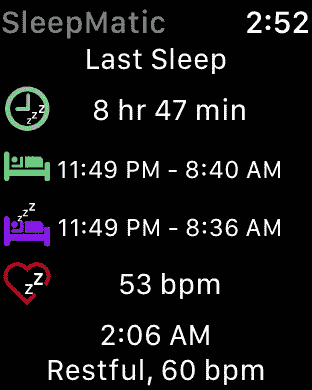

# 设置新 Apple Watch 的 3 个技巧

> 原文：<https://medium.com/hackernoon/3-tips-for-setting-up-your-new-apple-watch-e418733d3c46>

A watch face for every occasion + space.

# 1.自定义您的手表表盘

默认情况下，你的手表会附带一堆随时可用的表盘。大多数情况下，你都不会用到它们。定制面部的最简单方法是通过手机上的[手表应用](https://itunes.apple.com/us/app/watch/id1069511734?mt=8)。我建议你浏览人脸库，找到最适合你的需求和个性的人脸。对我来说，我的主要表盘是数字，因为我喜欢它的简约外观。随后是模块化的表盘，允许更多我最常用的复杂功能。然后我有一个运动用的数字脸，还有一个天文脸，因为我喜欢太空🚀。

# 2.组织您的应用

当你第一次设置 Apple Watch 时，系统会询问你是否要下载当前所有支持手表的应用程序。我建议不要这么做。你会发现你的许多 [iPhone](https://hackernoon.com/tagged/iphone) 应用程序都有你永远不会使用的手表应用程序。相反，只安装默认应用程序来设置手表，并使用手机上的手表应用程序来添加其他应用程序。

安装好应用程序后，你可以通过手机上手表应用程序的应用程序布局部分来移动它们。要记住的关键一点是，你手表的时间应用程序总是居中。这意味着在整理应用程序时，您希望将最常用的应用程序放在离时间应用程序最近的地方。下面你可以看到与时间应用程序相关的突出显示的同心六边形应用程序。

Organize your apps from the center time app out. Green is the most accessible, yellow fairly accessible, red you will need to scroll to access.

# 3.设置您的手表进行健康跟踪

拥有智能手表的一个更大的好处是能够跟踪你的健康和健身情况。你要做的第一件事是确保你已经设置并填写了健康应用程序。你需要输入你的生日、体重和身高。添加后，您将启用基本追踪。这包括锻炼活动、一天中站立的频率、一天中的步数和心率。

要完善健康追踪体验，有几件事情要做，有几个应用要获得。首先，我推荐[计步器 app](https://itunes.apple.com/us/app/pedometer/id712286167?mt=8) 。虽然你的手表(在某种程度上，你的手机)会默认跟踪步数，但这个应用程序给了你更多的权力。它让你设定你的步骤目标，并给你图表来查看你每天和每周的进展。它还有一个很好的功能，可以自动合并您的手机和手表步骤数据。如果你没有这个，那么你会得到双倍的步数，因为你的两个设备都跟踪你的运动。

你需要的另一个应用是[睡眠追踪器](https://itunes.apple.com/us/app/sleep-tracker-auto-sleep-tracking-watch-monitor/id1179236591?mt=8)。如果你在买苹果手表之前就有一个 Fitbit，你很可能会戴着它睡觉来跟踪你的睡眠质量。开箱后，你的新手表就不会这样了。有了睡眠追踪器，你或多或少可以获得与 Fitbit 相同的功能。虽然它不会试图跟踪快速眼动睡眠，但它会跟踪床上清醒、浅睡和深度睡眠。

Left: Pedometer, Right: Sleep Tracker (it was renamed from SleepMatic)

# 你有设置 Apple Watch 的技巧吗？请在下面的回复中告诉我，或者给我发推文到 [@ianhirschfeld](https://twitter.com/ianhirschfeld) ！

你也可以像在 iPhone 上移动应用程序一样，在 Apple Watch 上移动应用程序。长按图标，直到它开始摆动，然后将它拖到您想要的位置。

可惜 Fitbit **默认不** 与健康 app 同步。这意味着如果你不把它添加到健康中，你收集的所有数据都将被丢弃。为此，你需要一个名为[同步解算器](https://itunes.apple.com/us/app/sync-solver-for-fitbit/id935306292?mt=8)的第三方应用的帮助。在这篇文章中，它的价格是 2.99 美元，如果你不想丢失几个月或几年的数据，这个价格还不算太贵。

伊恩·希施菲尔德是一名 iOS/虚拟现实顾问和开发人员。他每周都为那些对学习感兴趣的人提供办公时间，或者想聊聊虚拟现实、增强现实和其他 r。在**安排视频聊天。**