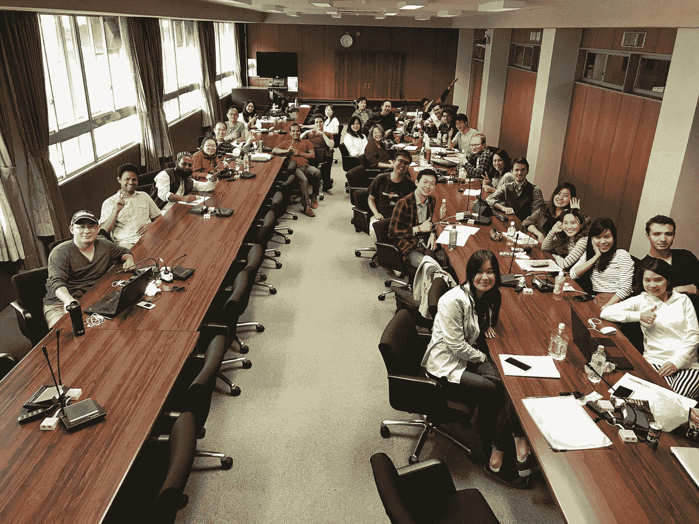

# 定义我们未来的 3 大趋势

> 原文：<https://medium.com/hackernoon/3-trends-that-will-define-our-future-c3133e5a3d75>

## **生活路线图&与机器人一起工作**

本周，我在日本讲授数字世界中的商业和法律课程。为了让下一代为未来做好准备，有必要思考一下技术的最新发展。我们无法避免它。

但如今我们很少听到来自日本的消息(与 80 年代末相比，当时索尼、尼康、东芝和其他令人惊叹的日本企业占据主导地位)。

然而，对于各种技术，日本的公司仍然是创新和重要的。

以机器人为例。

日本对待机器人技术的方式与硅谷等其他科技地区不同。重点不是“**人对机器**”，而是“**人对机器**”。日本的机器人都有围绕它们的故事；机器人技术与日常生活的无缝融合。

 [## 日本痴迷的机器人发明家正在创造未来

### 从下午 2 点左右，当猪濑俊之到达我们在东京市中心的公司总部开会时…

www.bloomberg.com](https://www.bloomberg.com/features/2016-hello-world-japan/) 

这是本课程的完美起点:

> 为了迎接一个我们必须与智能机器共存的世界，我们应该做些什么？
> 
> 我们怎样才能与这些机器“和谐”相处？
> 
> 作为教育工作者，我们应该教给学生什么，才能给他们未来最大的成功机会？

# **当今经历的世界**

但是在我们开始预测未来之前，想想我们今天所经历的世界。让人觉得卡住了，很迷茫。我们正处于十字路口。

原因如下。

## ***新技术的指数增长***

这是今天的世界和我童年的世界之间最大的区别。我们总是经历技术创新，但最近这些创新似乎在相互加速:人工智能、大数据、机器人等。

所有这些新技术让生活变得更轻松、更高效，并创造了新的机会。

但是，技术的加速发展经常被视为威胁和巨大不确定性的来源。人们担心它的影响。

首先，有人担心失去隐私和控制。

人们还担心他们是否会被机器“取代”。例如，律师看到许多简单的任务正在自动化，这使他们想知道什么将留给“未来的律师”去做。

对于班上的学生来说尤其如此。他们可能会发现在工作中学习更加困难，因为大多数基本的法律任务都外包给了机器。

埃隆·马斯克、比尔·盖茨和斯蒂芬·霍金关于传统工作消失的警告是真实的。

 [## 来自比尔·盖茨、埃隆·马斯克和斯蒂芬·霍金的警告

### “工厂的自动化已经大量减少了传统制造业的工作岗位，人工智能的兴起……

medium.freecodecamp.com](https://medium.freecodecamp.com/bill-gates-and-elon-musk-just-warned-us-about-the-one-thing-politicians-are-too-scared-to-talk-8db9815fd398) 

## ***危机感和不信任感***

对技术的焦虑与更普遍的危机感有关。

我们社会中的传统权威来源——公司、大众媒体和金融机构——被广泛认为是失败的。他们没有达到预期。随着我们的机构在一场又一场危机中蹒跚前行，这种失败感与日俱增，助长了不确定感和焦虑感。

## ***大家现在都是企业家***

人们不满。他们觉得不能再依赖机构了。他们想要控制权和做自己事情的自由。随着我们活得越来越长，越来越健康，我们看到的越来越多，经历的也越来越多。每个人都需要更有创业精神。

但是，传统的工作和机会正在消失。所以，在快速变化的社会中，很难知道如何发展自己和表达自己。

# **那么，什么将定义我们的未来？**

我们被困住了。嗯，我们需要了解以下三个趋势来定义我们的未来:

## ***1。*** ***现实的数字化***

技术正在融入日常生活的方方面面。这包括商业和工作生活。

物联网连接了物理世界和数字世界。一个连接传感器的全球网络记录了一切。生成的信息用于各种目的，包括提高性能。这些信息将全部采用数字形式，并通过软件、预测算法和区块链进行管理。

结果呢？数字现实产生信任和真相，让我们能够非常精确地知道已经发生了什么和可能会发生什么。

## **②*。*** ***数据驱动决策***

传感器生成的数据有助于更快、更准确地做出决策。至关重要的是，这些决定是由机器做出的，因为只有机器才有能力处理产生的大量信息。

自动化算法决策更快、更快、更准确。

## ***3。*** ***【对等文化】与“民主化”***

随着我们的世界变得数字化，数据驱动的决策变得更加普遍，许多以前控制和处理信息的“中介”变得不那么重要了。想想律师、银行家、顾问。

例如，我们将会看到更多的全民公决(“直接”民主，在这种民主中，中间人——人民的代表——被绕过)。此外，更加重视鼓励公司中的“积极”股东。

在这两种情况下，重点都是促进直接控制。

新技术越来越多地结合了这三种趋势。或许最明显的例子是总部位于区块链的智能合约，这种合约目前正在以太坊(Ethereum)进行测试，用于所有经济领域的多种用途。

# **结果**

这三个趋势意味着什么？嗯，它们将改变我们生活和工作方式的方方面面。

举个法律上的例子，想想合同和合同纠纷会如何转变。想象一下未来的汽车事故，汽车直接与保险公司通信，根据汽车与事故发生时生成的传感器数据之间“商定”的“事实”自行执行条款。

律师的角色是什么？这种情况下的“智能契约”存在于“代码”中。当然，它仍然需要“起草”，但这将通过代码而不是文字来完成。除此之外，律师与执行和实施有关的传统职能将“消失”。

# **那么，下一步是什么？**

我们需要接受一种不同的、更加开放的心态，能够发现机遇，解决数字世界的新问题。

对机器人、大数据和人工智能的日益依赖意味着我们所有的生活都将被打乱。但是，这也意味着我们将有更多的时间和自由。

技术已经到了我们需要创造新现实的阶段。我们将不必处理现在占据我们的许多日常事务——如果你愿意，也可以说是日常生活中的“无意义”的事情。相反，我们需要构建新的知识，并在永无止境的转型过程中应用这些知识。

回想一下，比尔·盖茨、埃隆·马斯克和斯蒂芬·霍金的警告。我们现在必须考虑机器人和自动化。我们必须采取行动。也许，通过这样做，我们会变得更加强大。

只有拥抱新的现实，我们才会避免被“机器人”和“机器”接管。既然更聪明、更先进的机器人就在眼前，我们可以变得更聪明。或许，甚至更人性化一点。

作为教育工作者，我们有义务为学生的未来做好准备。我们需要鼓励*所有*学生——包括法律专业学生、商科学生和其他社会科学专业的学生——接触新技术，并思考这对他们的生活和他们希望从事的不同职业意味着什么。

这是我对自己在日本角色的看法。

*感谢您的阅读！请按下“心脏按钮”或留下评论。*

每周三都有新故事。因此，如果你关注我，你不会错过我关于颠覆性技术的指数增长如何改变我们生活和工作方式的最新见解。

> [黑客中午](http://bit.ly/Hackernoon)是黑客如何开始他们的下午。我们是 [@AMI](http://bit.ly/atAMIatAMI) 家庭的一员。我们现在[接受投稿](http://bit.ly/hackernoonsubmission)，并乐意[讨论广告&赞助](mailto:partners@amipublications.com)机会。
> 
> 如果你喜欢这个故事，我们推荐你阅读我们的[最新科技故事](http://bit.ly/hackernoonlatestt)和[趋势科技故事](https://hackernoon.com/trending)。直到下一次，不要把世界的现实想当然！

