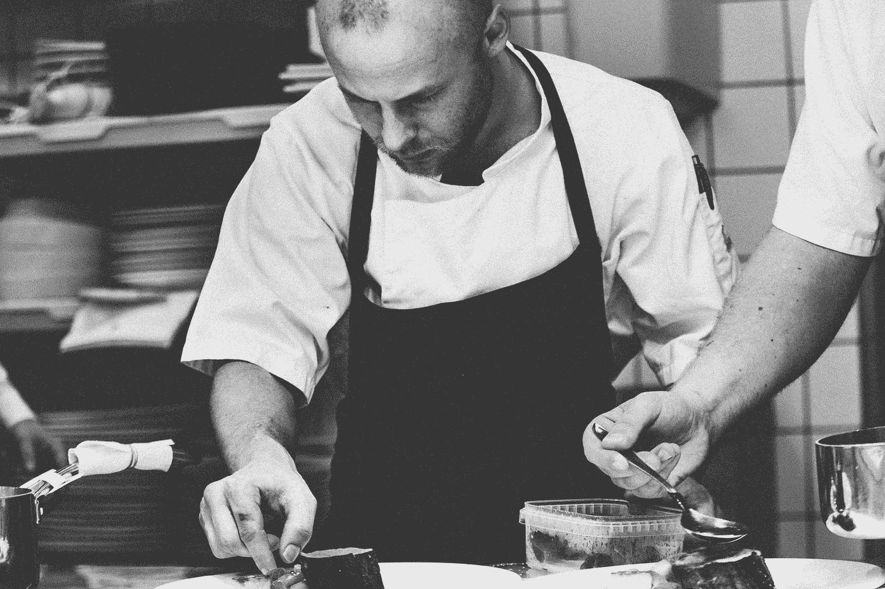

# 在厨师柜台过夜的 3 个宝贵秘密

> 原文：<https://medium.com/hackernoon/3-valuable-secrets-from-a-night-out-at-the-chefs-counter-4a603fb56310>

Photo by [Nick Karvounis](https://unsplash.com/photos/nvsHAsuFC54?utm_source=unsplash&utm_medium=referral&utm_content=creditCopyText) on [Unsplash](https://unsplash.com/?utm_source=unsplash&utm_medium=referral&utm_content=creditCopyText)

这是俄勒冈州波特兰的一个星期五晚上。

在 PDX 没有预约的晚餐可能是一次冒险。对我和我的妻子来说，值得庆幸的是，有几十家餐馆都留有无电梯的空间。我们去了波特兰东南部，去看看那只乡村猫。这位时髦的女主人给我们提供了一个厨师柜台的座位。

这不是我第一次坐在厨师柜台前。作为一名波特兰美食家，我曾坐过属于我的厨师柜台。不过这次我观察到了一些关于成功团队如何运作的事情。

在开始之前，我想先谈谈我的开发团队哲学。

开发团队的生死取决于他们各个部分的总和。一个不能像团队一样运作的开发团队注定会失败。

我的妻子和我坐在厨师柜台前被迷住了。一个由四名厨师组成的团队轻松地完成了疯狂的周五晚餐服务。我们开始怀疑这怎么可能。我甚至不能同时煮意大利面和做调味汁。更别说做另外三顿饭和我的朋友聊天了，好像这没什么大不了的。

从我们坐的地方，我们推断出了关于我们前面的车队的以下三件事。

Photo by [“My Life Through A Lens”](https://unsplash.com/photos/bq31L0jQAjU?utm_source=unsplash&utm_medium=referral&utm_content=creditCopyText) on [Unsplash](https://unsplash.com/?utm_source=unsplash&utm_medium=referral&utm_content=creditCopyText)

## 1.沟通和信任将功能和功能障碍分开

厨师从左到右。炸鸡和开胃菜站由一个人管理，就叫他里克吧。肉站是卡尔。加里拥有的海鲜蔬菜站。那个在柜台边的家伙，主厨，混乱的导演，也是甜点的创造者是鲍勃。

典型的订单是这样的。

1.  服务员走上前把票递给鲍勃。
2.  鲍勃向生产线上的其他三个人宣读了整个订单。
3.  炸鸡或开胃菜，里克回答说“听到了”。
4.  肉类主菜，卡尔回答说“听到了”。
5.  海鲜或蔬菜主菜，加里回答说“听到了”。
6.  Bob 将订单添加到运行行中。

每个厨师，Rick、Carl 和 Gary 都在听他们负责的那部分订单。他们**必须**向厨师长反馈他们听到了他们负责的事情。鲍勃从不怀疑他们，他相信每个厨师都知道他们的职责。

在烹饪时，厨师长会询问每位厨师他们的工作进展如何。厨师们告知他们的菜肴还剩多少时间。然后，主厨 Bob 协调厨师，确保订单中的所有东西同时准备好。通过不断地用一个碟形天线交流他们的位置，鲍勃能够驾驶这艘船。他能够让每个人都保持同步，因此订单可以一起完成。

厨师们都相信鲍勃会让他们保持同步。他们还必须相互信任，相信他们会对自己在秩序中的角色负责。他们不会站在一旁互相猜测，因为这样做会导致延迟。

在开发团队中，沟通不一定是开发人员的首要任务。它需要在前五名，最好是前三名。零沟通导致缺乏可见性，这是不信任的快车道。

当缺乏信任时，开发团队就会崩溃。没有什么比紧张和小心翼翼更能破坏发展文化了。因此，一个团队的成员必须能够互相信任去做正确的事情。如果你想让你的开发团队停滞不前，引入紧张和不信任。

持续的交流让每个人都保持一致。允许每个人在对话中发表意见。交流想法、问题和疑问可以让每个人都认同团队文化。这增加了团队的知识，产生了更好的过程，并建立了健康的创新文化。

开发团队成员之间的交流不会停止。通常情况下，外部利益相关者也需要沟通。不要忘记他们。你希望他们也能认同团队文化。

Photo by [rawpixel.com](https://unsplash.com/photos/v1VB91uuyaE?utm_source=unsplash&utm_medium=referral&utm_content=creditCopyText) on [Unsplash](https://unsplash.com/?utm_source=unsplash&utm_medium=referral&utm_content=creditCopyText)

## 2.小型和连接=内聚

厨师们不仅在工作上有联系，甚至在工作之外也有联系。很明显，他们已经建立了一种有凝聚力的文化，在这种文化中，他们都知道彼此的长处和短处。如果这是一个由 10 名厨师组成的团队，他们很难保持这种凝聚力和同志情谊。

坐在柜台边吃我的炸鸡，毫不犹豫。鲍勃问加里关于开拓者赛季的开始。加里和史蒂夫谈论晚餐服务后做什么。我注意到厨师们很可能在工作之外闲逛。闲聊家庭和运动是常见的。

团队的规模是这里的关键，因为我发现如果有十个厨师在生产线上，他们很难有这种凝聚力。他们彼此认识，不介意每晚一起为晚餐服务工作。他们喜欢一起工作是很重要的。我可不想让我的土豆泥里有在厨房打架的血。

用更少的人更容易建立有凝聚力的、自我管理的、紧密结合的团队。理想的团队规模在 4-6 人之间。保持团队的小规模会使沟通更容易。知识分享更简单。因此，培养了一种更紧密的文化。

较小的团队更有可能自我管理并让彼此负责。团队中的一个成员并不凌驾于另一个成员之上。他们相信彼此的成功，互相掩护以保持机器运转。这有助于团队在健康的水平上成长和运作。仍然允许个人开发者对他们的工作感到自豪。

以我自己的经验来看，这让我的职业生涯得到了极大的发展。在更小的团队中工作，你必须对你舒适区之外的事情负责。这将我自己的界限和理解推到了一个新的高度。可怕但同时也是值得的。

## 3.自我管理问责制

每个厨师都有自己的位置。他们负责管理每份订单，并负责为其制作菜肴。这使得每个厨师都是自己领域的管理者。即使厨师长鲍勃不在，他们也必须能够自我管理。

当鲍勃在晚宴服务中走开时，其他人站出来带头。周围没有政治，有人就这么做了。协调其他人，确保团队仍在交付每一份订单。他们是一群自我管理的合作者，他们认识到他们的努力的总和就是他们的价值。

开发团队中总要有一个领导者。对团队的交付负责的人。团队还必须对彼此负责。这种级别的责任通常使团队能够自我管理。

## 结论

作为一名开发人员和软件工程经理，很容易陷入科技泡沫。他们有其他可以应用的过程和可以学习的经验。退一步讲，摆脱[技术](https://hackernoon.com/tagged/technology)给了我一个不一样的视角。有时候你需要一个新的视角来看待你所面临的问题。

不是所有的餐厅厨师柜台都是同步的。事实上，即使是乡下的猫也可能时不时会有一个不在状态的夜晚。因此，如果开发团队休息一天也没关系。只要发展文化的支柱存在，休息日就很容易恢复。

下次你在自己的团队中遇到问题时，考虑观察一下其他人是如何处理他们自己领域中的类似问题的。

# 渴望了解更多信息？

如果你喜欢这篇文章，并且渴望开始[学习](https://hackernoon.com/tagged/learning)亚马逊网络服务，我已经开始整理一本小书了！通过使用 Amazon Web Services 托管、交付和保护静态网站的实际例子，您可以了解 AWS 服务和技术。点击这里，了解《T4》一书的最新进展。

## 如果你喜欢这个，别忘了鼓掌以示支持！